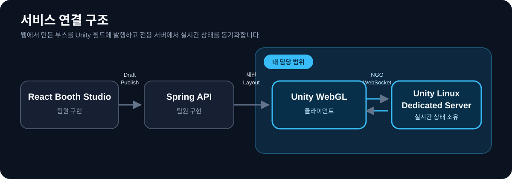

# SSAFESTA

6인 팀에서 **Unity WebGL 클라이언트와 Linux Dedicated Server**를 맡았습니다. 웹에서 만든 부스를 월드에 생성하고, 아바타와 접속 상태를 동기화하는 기능을 AI 에이전트와 함께 구현했습니다. 각 파트의 연결을 확인하고 접속 실패와 프레임 저하를 수정했습니다.

SSAFESTA는 사용자가 웹에서 부스를 꾸미고 Unity 월드에 접속해 서로의 부스를 방문하는 프로젝트입니다.

<table>
  <tr>
    <td width="50%"></td>
    <td width="50%"></td>
  </tr>
  <tr>
    <td align="center">Unity WebGL 월드</td>
    <td align="center">Published Layout 기반 부스 생성</td>
  </tr>
</table>

## 프로젝트 정보

| 구분 | 내용 |
|---|---|
| 기간 | 2026.08.10 – 2026.09.06 |
| 인원 | 6명 |
| 담당 | Unity Client · Netcode for GameObjects · Linux Dedicated Server |
| 구현 언어 | C# |
| 실행 환경 | Unity 6 · WebGL · Linux Server · Docker |

## 제가 맡은 범위

- 웹에서 발행한 부스 배치를 Unity가 읽어 런타임에 생성하는 흐름
- 캐릭터 조립, 외형 저장·동기화, 원격 아바타 표시
- Netcode for GameObjects 기반 접속 승인, 플레이어 상태 복제, 재접속
- Unity–React 메시지 브리지와 Spring API 계약 연결
- WebGL 빌드, 부하 봇, FPS·드로우콜·GC·트래픽 계측

Spring, React, AI 서버의 내부 구현은 팀원이 맡았습니다. 저는 Unity가 각 파트와 주고받는 계약과 통합 검증을 담당했습니다.

## 구조

영구 데이터는 Spring이 소유하고, 전용 서버는 접속 승인과 실시간 상태를 맡습니다. 정적 부스 오브젝트는 서버에서 하나씩 복제하지 않고 같은 Published Layout을 받은 각 클라이언트가 생성합니다.

## 문제 해결

### 1. 서버 승인은 끝났는데 25번째 이후 클라이언트가 월드에 들어오지 못했습니다

**Unity Transport의 클라이언트 수신 큐를 늘려 접속을 완료했습니다.** 서버는 접속을 승인했지만 클라이언트는 월드에 들어오지 못했습니다. 양쪽 로그를 대조해 `receive queue is full (128)` 경고를 확인했습니다.

수신 큐를 `128 → 1,024`로 조정한 뒤 26개 플레이어가 생성되는 것을 확인했습니다. 이어 `NetworkTransform`에서 쓰지 않는 X/Z 회전 동기화를 끄고 위치·회전 임계값을 조정해 11인 조건 수신량을 `4,529 → 3,290~3,505 KB/s`로 약 25% 줄였습니다. Half Float는 오히려 트래픽이 16% 늘어 되돌렸습니다.

26명은 한 PC에서 서버·에디터·봇을 실행해 초기 생성과 렌더링을 확인한 수치입니다. 이후 에디터 멈춤으로 접속이 끊겨 장시간 접속 유지까지 검증하지는 못했습니다.

### 2. 해상도를 9분의 1로 낮춰도 프레임은 12%만 변했습니다

해상도를 낮춘 만큼 프레임이 변하지 않아 렌더러와 애니메이션 비용을 확인했습니다. 부스 벽과 천장이 뒤쪽 물체를 가리도록 오클루전 설정을 바꿔 부스 내부 시점의 드로우콜을 `1,088 → 231`로 줄였습니다. 아바타는 같은 재질과 골격을 쓰는 파츠를 결합해 `SkinnedMeshRenderer`를 `11 → 7`로 줄였습니다.

별도로 아바타 40기를 표시한 WebGL 빌드에서는 변경 전후 드로우콜이 31.7%, 프레임 시간이 7.7% 줄었습니다. 드로우콜만으로 프레임 저하를 설명하기 어려워 Animator 갱신 주기도 시험했습니다. 처음에는 효과가 있다고 봤지만 조건을 번갈아 재측정하니 차이가 사라졌습니다. 이 수치는 성과에서 제외하고, 이후에는 워밍업 뒤 같은 조건을 반복 측정하도록 기준을 바꿨습니다.

### 3. 아바타 텍스처가 WebGL 메모리를 차지했습니다

텍스처 최대 해상도를 조정해 아바타 카탈로그 메모리를 `490.3 → 194.3 MB`로 줄였습니다. 카탈로그를 확인하니 2048px 텍스처가 50종 있었고, 화면에서 보이는 크기를 기준으로 Import 설정의 상한을 1024px로 낮췄습니다.

목록에서 작게 보이는 UI 이미지는 표시 크기에 맞춰 별도 상한을 적용했습니다. UI 텍스처는 `65.70 → 4.32 MB`, 전체 WebGL 빌드는 8.0MB 줄었습니다. 해상도 변경 뒤에는 아바타 외형을 캡처로 비교했습니다.

### 4. 파트별 구현은 끝났지만 Unity 통합에서 계약이 어긋났습니다

Unity 요청과 응답 형식을 Spring 계약에 맞추고, 부스 조회부터 월드 생성까지 이어서 검증했습니다. 팀은 구현 전에 SDD 방식으로 기능과 API 계약을 정하고 AI 에이전트로 코드를 작성했습니다. 하지만 통합해 보니 문서와 코드에 부스 조회 경로가 `/layout/published`와 `/layouts/published`, 오브젝트 식별자가 `id`와 `objectId`로 나뉘어 있었습니다.

AI와 문서·코드의 차이를 확인하며 Unity DTO와 요청 경로를 수정했습니다. 이후 Spring 응답, Unity의 데이터 변환과 오브젝트 생성, WebGL 브리지, 전용 서버 접속을 이어서 확인한 뒤 완료 처리했습니다.

측정 환경과 되돌린 시도는 [문제 해결 기록](docs/portfolio/technical-notes.md)에 적었습니다.

## 기술

| 기술 | 사용한 곳 |
|---|---|
| Unity 6 · C# · URP | 월드, 부스 런타임, 아바타, UI, 계측 도구 |
| Netcode for GameObjects · Unity Transport | 접속 승인, 상태 복제, 재접속, 부하 시험 |
| WebGL · JavaScript Bridge | React 임베드, 런타임 API 주소 주입, 상호작용 전달 |
| Linux Dedicated Server · Docker | 그래픽 없는 월드 서버 빌드와 로컬 통합 검증 |
| SDD · MCP · Jira · GitLab | 계약, 완료 조건, 작업 기록, 트러블 공유 |

## 코드에서 확인할 곳

| 범위 | 경로 |
|---|---|
| 네트워크·접속 승인 | [`festa-unity/Assets/_Project/Scripts/Network`](festa-unity/Assets/_Project/Scripts/Network) |
| 부스 런타임·Spring 연동 | [`festa-unity/Assets/_Project/Scripts/Booth`](festa-unity/Assets/_Project/Scripts/Booth) · [`Integration`](festa-unity/Assets/_Project/Scripts/Integration) |
| 아바타 조립·동기화 | [`festa-unity/Assets/_Project/Scripts/World/Avatar`](festa-unity/Assets/_Project/Scripts/World/Avatar) |
| 성능 측정 도구 | [`festa-unity/Assets/_Project/Scripts/Diagnostics`](festa-unity/Assets/_Project/Scripts/Diagnostics) · [`Editor`](festa-unity/Assets/_Project/Scripts/Editor) |
| Unity 테스트 코드 | [`festa-unity/Assets/_Project/Tests`](festa-unity/Assets/_Project/Tests) |

> 외부 에셋과 인증정보를 제외한 코드 검토용 사본입니다. 일부 Scene·Prefab은 에셋 없이 실행할 수 없습니다. 작성자 권리와 제거 항목은 [공개 저장소 안내](ASSET_NOTICE.md)에 적었습니다.
