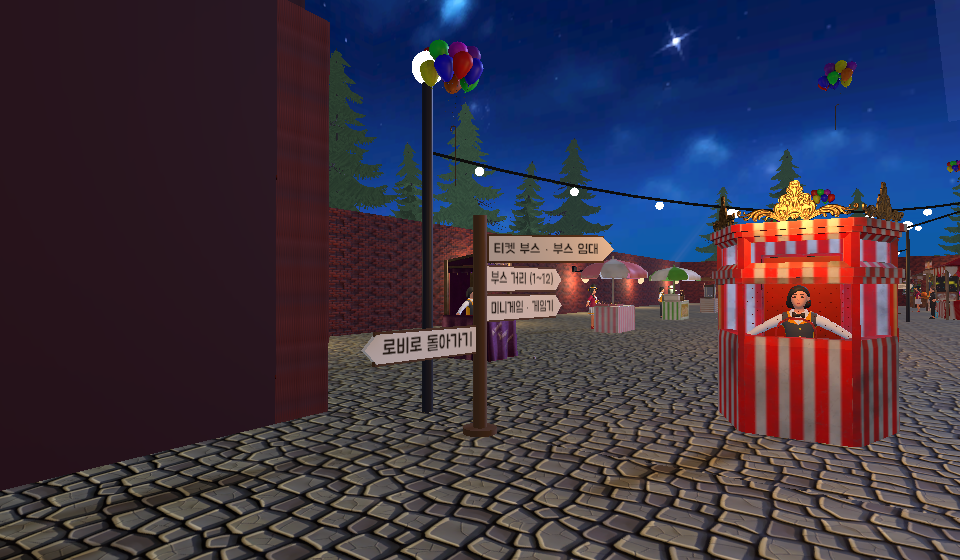
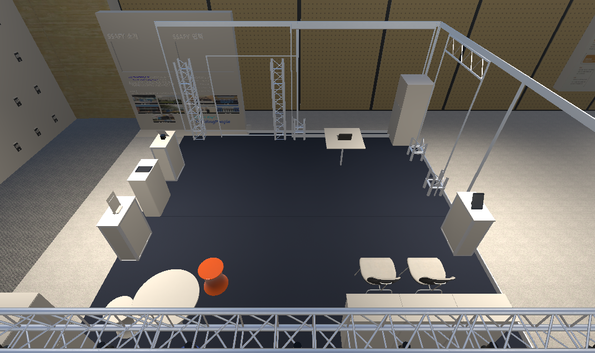
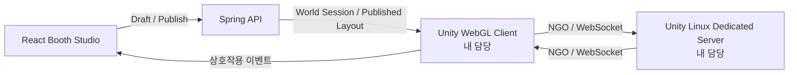
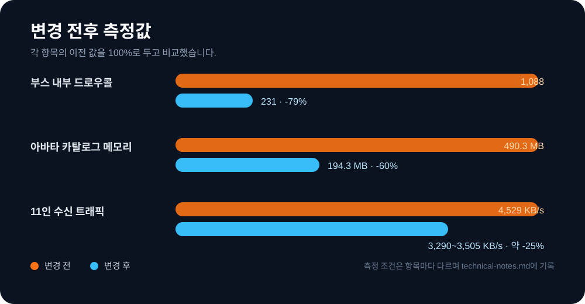

# SSAFESTA

사용자가 웹에서 만든 부스를 Unity WebGL 월드에 발행하고, 다른 사용자가 전용 서버에 접속해 방문하는 6인 팀 프로젝트입니다.

저는 **Unity WebGL 클라이언트와 Linux Dedicated Server**를 맡았습니다. 부스 런타임, 아바타 조립·동기화, WebGL–React 브리지, 멀티플레이 접속과 성능 측정까지 담당했습니다.

<table>
  <tr>
    <td width="50%"></td>
    <td width="50%"></td>
  </tr>
  <tr>
    <td align="center">Unity WebGL 월드</td>
    <td align="center">Published Layout 기반 부스 생성</td>
  </tr>
</table>

## 프로젝트 정보

| 구분 | 내용 |
|---|---|
| 기간 | 2026.08.10 – 2026.09.06 |
| 인원 | 6명 |
| 담당 | Unity Client · Netcode for GameObjects · Linux Dedicated Server |
| 구현 언어 | C# |
| 실행 환경 | Unity 6 · WebGL · Linux Server · Docker |

## 제가 맡은 범위

- 웹에서 발행한 부스 배치를 Unity가 읽어 런타임에 생성하는 흐름
- 캐릭터 조립, 외형 저장·동기화, 원격 아바타 표시
- Netcode for GameObjects 기반 접속 승인, 플레이어 상태 복제, 재접속
- Unity–React 메시지 브리지와 Spring API 계약 연결
- WebGL 빌드, 부하 봇, FPS·드로우콜·GC·트래픽 계측

Spring, React, AI 서버의 내부 구현은 팀원이 맡았습니다. 저는 Unity가 각 파트와 주고받는 계약과 통합 검증을 담당했습니다.

## 구조

영구 데이터는 Spring이 소유하고, 전용 서버는 접속 승인과 실시간 상태를 맡습니다. 정적 부스 오브젝트는 서버에서 하나씩 복제하지 않고 같은 Published Layout을 받은 각 클라이언트가 생성합니다.

## 문제 해결

### 1. 서버 승인은 끝났는데 25번째 이후 클라이언트가 월드에 들어오지 못했습니다

서버 CPU가 아니라 **Unity Transport 수신 큐가 먼저 찼습니다.** 서버 승인 로그와 클라이언트 상태를 대조하고 `receive queue is full (128)` 로그를 확인했습니다.

수신 큐를 `128 → 1,024`로 조정한 뒤 26개 플레이어가 생성되는 것을 확인했습니다. 이어 `NetworkTransform`에서 쓰지 않는 X/Z 회전 동기화를 끄고 위치·회전 임계값을 조정해 11인 조건 수신량을 `4,529 → 3,290~3,505 KB/s`로 약 25% 줄였습니다. Half Float는 오히려 트래픽이 16% 늘어 되돌렸습니다.

같은 PC에서 서버·에디터·봇을 함께 실행한 장기 시험은 20.5초 에디터 스톨로 연결이 끊겼습니다. 따라서 **26명은 생성·렌더링 확인 수치이고 장기 유지 수치는 아닙니다. 40명은 목표였지만 검증 결과로 쓰지 않았습니다.**

### 2. 해상도를 9분의 1로 낮춰도 프레임은 12%만 변했습니다

픽셀 처리보다 CPU 쪽 비용을 먼저 확인했습니다. 축제 구역에 오클루더를 배치해 드로우콜을 `1,088 → 231`로 줄였고, 아바타의 `SkinnedMeshRenderer`는 같은 재질과 골격을 기준으로 결합해 `11 → 7`로 줄였습니다.

이후 드로우콜을 31.7% 더 줄여도 프레임 시간은 7.7%만 줄었습니다. 병목을 다시 나눠 보니 스키닝과 Animator 갱신 비중이 더 컸습니다. 거리별 Animator 갱신 주기를 적용한 A/B 측정에서는 프레임 시간이 17% 줄었습니다. 가까운 아바타 40기가 모인 조건에서는 효과가 없다는 제한도 기록했습니다.

### 3. 아바타 텍스처가 WebGL 메모리를 차지했습니다

카탈로그를 전수 조사해 고유 텍스처 124종, 259.8M 픽셀, 런타임 메모리 490.3MB를 확인했습니다. 2048px 텍스처 50종을 포함한 Import 설정을 1024px로 제한해 `490.3 → 194.3 MB`로 줄였습니다.

목록에서 작게 보이는 UI 이미지는 표시 크기에 맞춰 별도 상한을 적용했습니다. UI 텍스처는 `65.70 → 4.32 MB`, 전체 WebGL 빌드는 8.0MB 줄었습니다. 해상도 변경 뒤에는 아바타 외형을 캡처로 비교했습니다.

### 4. 파트별 구현은 끝났지만 Unity 통합에서 계약이 어긋났습니다

초기 문서와 코드에 Published Layout 경로가 `/layout/published`와 `/layouts/published`, 오브젝트 식별자가 `id`와 `objectId`로 나뉘어 있었습니다. Unity DTO와 요청 경로를 Spring 계약에 맞추고, 기존 데이터는 `id` fallback으로만 읽도록 정리했습니다.

그 뒤 완료 기준을 코드 병합에서 실행 결과로 바꿨습니다. Spring 응답, Unity 역직렬화, 런타임 오브젝트 생성, WebGL 브리지, 전용 서버 로그를 한 흐름에서 확인했습니다. AI 에이전트는 문서와 코드 차이를 찾는 데 사용했고, 완료 여부는 직접 실행한 결과로 판단했습니다.

측정 환경과 되돌린 시도는 [문제 해결 기록](docs/portfolio/technical-notes.md)에 적었습니다.

## 기술

| 기술 | 사용한 곳 |
|---|---|
| Unity 6 · C# · URP | 월드, 부스 런타임, 아바타, UI, 계측 도구 |
| Netcode for GameObjects · Unity Transport | 접속 승인, 상태 복제, 재접속, 부하 시험 |
| WebGL · JavaScript Bridge | React 임베드, 런타임 API 주소 주입, 상호작용 전달 |
| Linux Dedicated Server · Docker | 그래픽 없는 월드 서버 빌드와 로컬 통합 검증 |
| SDD · MCP · Jira · GitLab | 계약, 완료 조건, 작업 기록, 트러블 공유 |

## 코드에서 확인할 곳

| 범위 | 경로 |
|---|---|
| 네트워크·접속 승인 | [`festa-unity/Assets/_Project/Scripts/Network`](festa-unity/Assets/_Project/Scripts/Network) |
| 부스 런타임·Spring 연동 | [`festa-unity/Assets/_Project/Scripts/Booth`](festa-unity/Assets/_Project/Scripts/Booth) · [`Integration`](festa-unity/Assets/_Project/Scripts/Integration) |
| 아바타 조립·동기화 | [`festa-unity/Assets/_Project/Scripts/World/Avatar`](festa-unity/Assets/_Project/Scripts/World/Avatar) |
| 성능 측정 도구 | [`festa-unity/Assets/_Project/Scripts/Diagnostics`](festa-unity/Assets/_Project/Scripts/Diagnostics) · [`Editor`](festa-unity/Assets/_Project/Scripts/Editor) |
| Unity 테스트 코드 | [`festa-unity/Assets/_Project/Tests`](festa-unity/Assets/_Project/Tests) |

## 공개 범위

이 저장소는 코드 검토용 포트폴리오입니다. 구매·배포 조건이 있는 Unity 에셋, 빌드 산출물, 개인 작업 파일, 인증정보는 전체 Git 이력에서 제거했습니다. 해당 에셋을 다시 받지 않으면 일부 Scene과 Prefab의 참조가 끊겨 프로젝트 화면을 그대로 실행할 수 없습니다.

팀원의 커밋과 작성자 이름은 유지했고 개인 이메일은 비공개 주소로 바꿨습니다. 코드의 권리는 각 작성자에게 있으며 별도 오픈소스 라이선스를 부여하지 않습니다. 제거 항목은 [공개 저장소 안내](ASSET_NOTICE.md)에 적었습니다.
