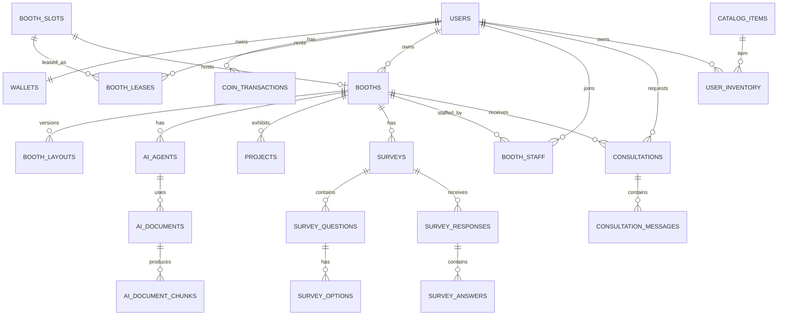

# SSAFY FESTA DB ERD + DB 설계서

> **DB**: PostgreSQL  
> **Vector Search**: pgvector  
> **상태**: Draft — 기획을 구현 가능한 데이터 모델로 구체화한 제안안  
> Redis의 Presence/Channel 상태는 영구 ERD에서 제외한다.

---

## 1. 설계 원칙

1. 영구 서비스 상태는 PostgreSQL을 Source of Truth로 한다.
2. 코인 변동은 `wallets.balance`와 `coin_transactions`를 함께 관리한다.
3. Booth의 현재 물리 슬롯과 사용자가 만든 콘텐츠를 분리한다.
4. Draft / Published Layout은 버전 관리 가능해야 한다.
5. AI Agent Config와 AI Chunk/Embedding 책임을 분리한다.
6. 중복 지급·임대·투표·응답은 DB Constraint로도 최대한 방어한다.
7. 실시간 Presence, Channel Assignment, Lock은 Redis 사용을 우선한다.

---

## 2. 핵심 ERD



---

## 3. users

```text
users
- id PK BIGINT
- email / login_identifier UNIQUE
- password_hash
- nickname
- status
- created_at
- updated_at
```

정확한 회원 필드는 인증 정책 확정 후 조정한다.

### Index

- UNIQUE(login_identifier)
- nickname 검색이 필요하면 별도 Index 검토

---

## 4. wallets

```text
wallets
- user_id PK/FK -> users.id
- balance BIGINT NOT NULL DEFAULT 0
- version BIGINT NOT NULL DEFAULT 0
- updated_at
```

`version`은 낙관적 Lock 사용 시 활용할 수 있다.

---

## 5. coin_transactions

기획에서 명시된 Coin Ledger를 구현한다.

```text
coin_transactions
- id PK BIGINT
- user_id FK
- amount BIGINT NOT NULL
- balance_after BIGINT NOT NULL
- type VARCHAR NOT NULL
- reference_type VARCHAR NULL
- reference_id VARCHAR NULL
- idempotency_key VARCHAR NULL
- created_at
```

### Type 후보

```text
SIGNUP_REWARD
DAILY_REWARD
BOOTH_LEASE
AI_SERVICE_PAYMENT
AI_SERVICE_REVENUE
SURVEY_REWARD
ITEM_PURCHASE
MINIGAME_REWARD
EVENT_REWARD
REFUND
```

### Constraint / Index

- UNIQUE(user_id, idempotency_key) where idempotency_key is not null
- INDEX(user_id, created_at desc)
- amount = 0 거래는 특별한 이유가 없으면 금지

---

## 6. booth_slots

물리적인 12개 슬롯을 표현한다.

```text
booth_slots
- id PK
- slot_no UNIQUE
- slot_type
- status
- created_at
```

`slot_no`는 Unity의 고정 `ExteriorSlot`과 `InteriorAnchor`를 매핑하는 안정 식별자다. 내부 월드 좌표 자체는 Unity Scene 설정이 소유하며 DB에 저장하지 않는다.

### slot_type

```text
ADMIN
USER_RENTAL
COMPETITION
EVENT
```

USER_RENTAL만 일반 Lease 대상이다.

---

## 7. booths

사용자가 만든 논리 Booth 데이터다.

```text
booths
- id PK BIGINT
- owner_user_id FK
- current_slot_id FK NULL
- name
- description
- facade_theme_code NOT NULL DEFAULT 'DEFAULT'
- facade_primary_color NULL
- facade_sign_text NULL
- facade_logo_url NULL
- status
- published_layout_version NULL
- created_at
- updated_at
```

임대 만료 시 `current_slot_id`를 해제해도 Booth 콘텐츠 자체는 유지할 수 있다.

Facade 설정은 논리 Booth의 소유 데이터다. Lease가 없을 때도 보존하지만 외부 물리 슬롯에는 표시하지 않으며, 새 임차인에게 이전 Booth의 Facade를 승계하지 않는다.

---

## 8. booth_leases

```text
booth_leases
- id PK BIGINT
- booth_id FK
- slot_id FK
- user_id FK
- starts_at
- ends_at
- status
- cost_coin
- coin_transaction_id FK
- created_at
```

### 동시성

한 시점에 같은 `slot_id`에 ACTIVE Lease가 하나만 존재해야 한다.

PostgreSQL Partial Unique Index 또는 Transaction Lock을 검토한다.

```text
UNIQUE ACTIVE lease by slot_id
```

구현 방식은 JPA/DB 제약 설계에서 최종 확정한다.

만료 트랜잭션은 `booth_leases.status=EXPIRED`, `booths.current_slot_id=NULL`, `booth_slots.status=AVAILABLE`을 함께 반영한다. `booth_layouts`, AI, 문서, 설문, 프로젝트 데이터는 삭제하지 않는다.

---

## 9. Booth Layout — 실물 스키마 (2026-08-20 정정)

> **이 절은 원래 단일 `booth_layouts` + `state` 테이블을 권장안으로 적고 있었으나, V1 실물은 처음부터
> 2테이블이었다.** spec 005 착수 시 불일치를 확인하고 **실물을 유지하고 문서를 고치는 쪽**으로 확정했다
> (`specs/005-booth-studio-layout/research.md` R-01).

```text
booth_layout_drafts                     booth_layout_published_versions
- booth_id PK FK  ← 작업본은 부스당 1개   - id PK BIGINT
- schema_version                        - booth_id FK
- layout_json JSONB                     - version_no          ← UNIQUE(booth_id, version_no)
- revision        ← 낙관적 잠금            - schema_version
- updated_by_user_id FK                 - layout_json JSONB
- updated_at                            - published_by_user_id FK
                                        - published_at
```

### 왜 2테이블인가

작업본은 부스당 **하나**여야 하고(FR-005) 공개본은 **여럿**이어야 이력이 남는다(C-07). 요구가 다르므로
테이블이 둘인 게 자연스럽다.

결정적인 차이는 강제력이다. `booth_layout_drafts`의 **PK가 `booth_id`**이므로 "작업본은 하나"가 규칙이 아니라
**스키마**다. 단일 테이블 + `state`는 DRAFT 행이 둘 생기는 것을 막지 못하고, 막으려면 부분 UNIQUE 인덱스를
따로 얹어야 하는데 그러면 표현력이 같아지면서 상태 전이 코드만 늘어난다.

### 공개본 포인터 (V8)

`booths.published_layout_version`은 **NULL 허용**이며 `(id, published_layout_version) →
booth_layout_published_versions(booth_id, version_no)` 복합 FK를 갖는다.

- `NULL` = 공개된 것이 없음. MATCH SIMPLE 규칙으로 FK 검사가 면제된다
- 이 표현이 있어야 **FR-011/FR-017**(재임대 시 자동 공개 금지)이 데이터로 성립한다. `MAX(version_no)`로
  유도하면 이전 소유자의 마지막 공개본이 되살아난다
- `ON DELETE SET NULL (published_layout_version)` — 컬럼 목록이 **필수**다. 목록이 없으면 PostgreSQL이
  `booths.id`까지 NULL로 만들려다 실패하고, **회원 탈퇴가 깨진다**(삭제 순서상 공개본이 먼저 지워진다)

JSONB 선택은 그대로 유효하다 — Layout 구조 변경에 유연하고 Unity DTO와 계약하기 쉽다. 개별 Object 질의는
불편하지만 MVP에 그런 질의가 없다.

### Constraint

- UNIQUE(booth_id, version)
- Booth당 Published current version은 booths.published_layout_version으로 명확히 가리킨다.

---

## 10. Layout JSON Schema

```json
{
  "template": "PROJECT_EXHIBITION",
  "objects": [
    {
      "objectId": "ai-1",
      "type": "AI_AGENT",
      "position": {"x": 1.2, "y": 0.0, "z": 1.5},
      "rotationY": 0.0,
      "configId": 78
    }
  ]
}
```

필수:

- `objectId`: Layout 내 unique
- `type`: Registry에 존재하는 타입
- Transform
- 기능 Object면 `configId`
- 장식·가구 Object면 `assetCode`

신규 Layout의 canonical 기능 타입은 `AI_AGENT`, `VIDEO_SCREEN`, `PROJECT_PANEL`, `SURVEY_KIOSK`, `RECRUITMENT_BOARD`, `CONSULTATION_DESK`, `LAPTOP`, `LIKE_VOTE`다. Unity의 과거 POC 별칭은 읽기 호환용일 뿐 DB 신규 저장값으로 사용하지 않는다.

---

## 11. ai_agents

```text
ai_agents
- id PK BIGINT
- booth_id FK
- name
- avatar_code NULL
- role_code
- tone_code
- specialty NULL
- system_prompt TEXT
- response_length
- service_price BIGINT DEFAULT 0
- handoff_enabled BOOLEAN
- forbidden_topics JSONB
- status
- created_at
- updated_at
```

Agent Config Source of Truth는 Spring DB다.

---

## 12. ai_documents

Spring이 관리하는 파일 메타데이터.

```text
ai_documents
- id PK BIGINT
- booth_id FK
- agent_id FK
- original_name
- s3_key UNIQUE
- content_type
- size_bytes
- status
- processing_job_id NULL
- created_at
- processed_at NULL
```

### status

```text
UPLOADING
QUEUED
PROCESSING
READY
FAILED
DISABLED
```

---

## 13. ai_document_chunks

AI 시스템의 pgvector 테이블 후보.

```text
ai_document_chunks
- id PK UUID/BIGINT
- document_id FK or logical id
- booth_id
- agent_id
- chunk_index
- content TEXT
- metadata JSONB
- embedding VECTOR(<dimension TBD>)
- created_at
```

### 필수 검색 Filter

- booth_id
- agent_id
- document active status

Embedding dimension은 모델 결정 전 확정하지 않는다.

---

## 14. projects

```text
projects
- id PK BIGINT
- booth_id FK
- name
- description TEXT
- thumbnail_url NULL
- video_url NULL
- deploy_url NULL
- git_url NULL
- portfolio_url NULL
- created_at
- updated_at
```

링크 개수 정책이 확정되면 별도 `project_links` 테이블로 분리할 수 있다.

---

## 15. surveys

```text
surveys
- id PK BIGINT
- booth_id FK
- title
- description
- anonymous BOOLEAN
- one_response_per_user BOOLEAN
- reward_coin BIGINT DEFAULT 0
- closes_at NULL
- status
- created_at
- updated_at
```

---

## 16. survey_questions

```text
survey_questions
- id PK BIGINT
- survey_id FK
- type
- title
- description NULL
- required BOOLEAN
- order_no INT
```

### type

```text
SINGLE_CHOICE
MULTIPLE_CHOICE
RATING
SHORT_TEXT
LONG_TEXT
APPLICATION
```

`찬반`은 SINGLE_CHOICE로 표현 가능하다.

---

## 17. survey_options

```text
survey_options
- id PK BIGINT
- question_id FK
- label
- order_no
```

---

## 18. survey_responses / survey_answers

```text
survey_responses
- id PK BIGINT
- survey_id FK
- user_id FK NULL  # 익명 정책에 따라 실제 저장 방식 검토
- submitted_at
- reward_transaction_id FK NULL
```

```text
survey_answers
- id PK BIGINT
- response_id FK
- question_id FK
- text_value NULL
- numeric_value NULL
- selected_option_ids JSONB NULL
```

### 1인 1응답

비익명일 경우 UNIQUE(survey_id, user_id) 후보. 익명 Survey도 보상/중복 방지를 위해 별도 participation key가 필요할 수 있으므로 정책 확정이 필요하다.

---

## 19. booth_staff

```text
booth_staff
- id PK BIGINT
- booth_id FK
- user_id FK
- role
- status
- joined_at
- updated_at
```

### Constraint

- UNIQUE(booth_id, user_id)

실시간 `AVAILABLE/BUSY/AWAY/OFFLINE`은 Redis에 두고 DB에는 장기 저장이 필요한 설정만 저장하는 구조가 적절하다.

---

## 20. staff_invitations

```text
staff_invitations
- id PK BIGINT
- booth_id FK
- inviter_user_id FK
- invitee_user_id FK
- role
- status PENDING/ACCEPTED/REJECTED/EXPIRED
- expires_at
- created_at
```

---

## 21. consultations

```text
consultations
- id PK BIGINT
- booth_id FK
- visitor_user_id FK
- staff_user_id FK NULL
- agent_id FK NULL
- ai_conversation_id VARCHAR NULL
- summary TEXT NULL
- status
- requested_at
- accepted_at NULL
- ended_at NULL
```

### status

```text
REQUESTED
ACCEPTED
ACTIVE
ENDED
REJECTED
EXPIRED
```

동시 Accept 시 한 Staff만 성공하도록 Transaction 조건을 둔다.

---

## 22. consultation_messages

대화 저장 정책이 허용되는 경우.

```text
consultation_messages
- id PK BIGINT
- consultation_id FK
- sender_user_id FK
- content TEXT
- created_at
```

원문 보존 기간은 정책 확정 전 장기 저장을 가정하지 않는다.

---

## 23. catalog_items / user_inventory

```text
catalog_items
- id PK BIGINT
- code UNIQUE
- name
- category
- price_coin
- active
```

```text
user_inventory
- id PK BIGINT
- user_id FK
- item_id FK
- quantity
- acquired_at
```

Unique(user_id, item_id) + quantity 구조 또는 소유 인스턴스형 구조는 아이템 특성에 따라 결정한다.

---

## 24. minigame_results

```text
minigame_results
- id PK BIGINT
- user_id FK
- game_type
- score
- elapsed_ms NULL
- reward_coin
- reward_transaction_id FK NULL
- played_at
```

일일 보상 상한 계산에 활용할 수 있다.

---

## 25. P2 테이블 후보

### events / event_rewards / event_coupons / event_redemptions

실물 교환 시:

- 재고
- 1인 제한
- QR token hash
- redeemed_at
- redeemed_by/admin

를 관리한다.

### competitions / competition_entries / votes / hall_of_fame

필수 Constraint:

- 동일 계정 중복 투표 방지
- 본인 프로젝트 투표 제한은 Service Layer + DB 관계 검증

---

## 26. Redis Key 설계 후보

영구 ERD는 아니지만 시스템 일관성을 위해 함께 정의한다.

```text
presence:user:{userId}
channel:user:{userId}
channel:{channelId}:players
staff:booth:{boothId}:{userId}
world:instance:{instanceId}
lock:booth-slot:{slotId}
lock:consultation:{consultationId}
```

TTL과 값 구조는 Realtime/Infra 설계에서 확정한다.

---

## 27. 삭제 / 보존

### 회원 탈퇴 삭제 정책

회원 탈퇴 확정 즉시 User 및 직접·종속·참여 데이터를 hard delete한다. Coin Transaction·Lease를 포함한 이력도 이 회원 탈퇴 정책에서는 보존 예외가 아니다. 삭제 순서는 외부 공개 차단 → 파일/Vector → Redis → DB 종속 데이터 → OAuth revoke/unlink → User 순서이며 재실행 가능해야 한다.

---

## 28. Transaction 경계

### Booth Lease

```text
Slot Lock
→ Wallet 검증
→ Lease Insert
→ Booth Slot 연결
→ Wallet 차감
→ Coin Transaction Insert
→ Commit
```

### Survey Reward

```text
중복 응답 검증
→ Response Insert
→ Reward 조건 검증
→ Wallet 증가
→ Coin Transaction Insert
→ Commit
```

### Item Purchase

```text
Item 검증
→ Wallet 검증
→ Inventory 변경
→ Wallet 차감
→ Coin Transaction
→ Commit
```

---

## 29. 확정이 필요한 DB 결정

- User 인증 필드
- Layout JSONB 단일 저장 vs Object 정규화
- Conversation 원문 저장 여부
- pgvector DB를 서비스 RDS와 공유할지 분리할지
- 익명 Survey의 중복 방지 방식
- 링크를 JSON/컬럼/별도 테이블 중 무엇으로 둘지
- P2 Event/Competition 실제 스키마
