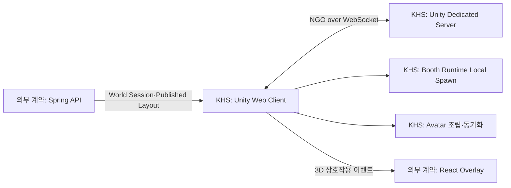

# KHS 기술 컨퍼런스 인덱스

## 문서 목적

이 폴더는 **KHS가 SSAFESTA에서 직접 구현·설계한 기술**을 다른 파트와 공유하기 위한 개인 학습 자료다. 팀 전체의 작업을 모으거나 다른 담당자의 구현을 대신 설명하지 않는다. 기능 명세를 복사하는 대신 다음 질문에 답한다.

1. 우리 프로젝트에서 어떤 문제가 있었는가?
2. 어떤 기술 개념을 선택했으며, 왜 이 문제에 맞는가?
3. 일반적인 개념을 SSAFESTA 구조에 어떻게 적용했는가?
4. 현재 어디까지 구현됐고 무엇이 계약·설계 단계인가?
5. 다른 파트가 연결할 때 무엇을 지켜야 하는가?

## 현재 기준

- 작성 기준일: 2026-08-25 (01~07은 08-19 기준, 08~11은 08-25 추가)
- KHS 구현 범위: Unity Client, NGO 멀티플레이 POC, Booth Runtime POC, 아바타 커스터마이징·씬 전환·동기화 POC, 11층 0819 월드, Linux Dedicated Server Docker 실행 구조
- KHS 계약 작업 범위: Unity가 React·Spring과 연결되기 위해 필요한 Booth Layout, World Session, Web-Unity Bridge 경계
- 제외 범위: 다른 담당자가 구현한 React 화면, Spring 비즈니스 로직, FastAPI AI 내부 구현
- 08~11은 2026-08-24 컨설턴트 피드백에 대한 분석·대응 기록이다. 앞 문서들이 "무엇을 어떻게
  구현했는가"라면, 이쪽은 **"왜 그 선택이었고 지금 무엇이 검증되지 않았는가"**를 다룬다.
- 문서의 `구현됨`은 현재 저장소 코드로 확인 가능한 항목만 뜻한다.
- `설계/계약`은 팀 합의와 후속 구현이 필요한 항목이다.
- 08~11에는 `판단` 표기가 추가로 쓰인다 — 구현도 계약도 아닌 **작성자의 분석·제안**이라는 뜻이다.
  팀 합의 전까지 확정 사항으로 인용하지 않는다.

## 읽는 순서

| 순서 | 문서 | 핵심 내용 |
|---|---|---|
| 1 | [멀티플레이와 상태 동기화](./01_멀티플레이와_상태_동기화.md) | NGO, 서버 권한, NetworkVariable/RPC, 로컬 생성 경계 |
| 2 | [Unity 클라이언트와 부스 런타임](./02_Unity_클라이언트와_부스_런타임.md) | Published Layout을 Prefab으로 만드는 Registry/Factory 구조 |
| 3 | [Dedicated Server와 실행 환경](./03_Dedicated_Server와_실행_환경.md) | KHS가 구성한 WebSocket 서버, Linux 빌드, Docker 실행 |
| 4 | [Unity 연동을 위한 통신 계약](./04_Unity_연동을_위한_통신_계약.md) | KHS가 맞춘 REST DTO, 식별자, Web-Unity 연결 경계 |
| 5 | [아바타 커스터마이징과 동기화](./05_아바타_커스터마이징과_동기화.md) | 모듈형 파츠, 외형 직렬화, 멀티플레이 전파 |
| 6 | [Unity 문제 해결과 검증](./06_Unity_문제_해결과_검증.md) | WebGL·URP·NGO 문제를 재발 방지 규칙으로 만든 과정 |
| 7 | [멀티플레이 상호작용 환경 실전 구조](./07_멀티플레이_상호작용_환경_실전_구조.md) | Client·Dedicated Server 역할, Client 간 간접 상호작용, 이동·부스·아바타 동기화 흐름 |
| 8 | [WebGL 렌더링 아키텍처 선택](./08_WebGL_렌더링_아키텍처_선택.md) | 픽셀 스트리밍 대신 클라이언트 복제를 택한 이유, Three.js 대비 Unity 근거와 그 대가 |
| 9 | [동시접속 규모와 성능 예산](./09_동시접속_규모와_성능_예산.md) | 30~40명 목표의 현재 검증 수준, 실측 최적화 이력, 남은 3대 병목과 검증 계획 |
| 10 | [부스 자동 생성과 외부 확장](./10_부스_자동_생성과_외부_확장.md) | 자동화 가능 구간, 3계층 에셋 전략, Rule+LLM 역할 분리 |
| 11 | [서비스 포지셔닝과 출시 경로](./11_서비스_포지셔닝과_출시_경로.md) | VRChat과의 차이, 실제 경쟁 상대, 스팀·데스크톱 출시 검토 |

## KHS 작업 범위 연결 그림

## KHS 작업에서 세운 연동 원칙

- Unity는 3D 월드와 입력·상호작용·멀티플레이 표현을 담당한다.
- KHS가 구현한 Unity는 영구 데이터를 직접 소유하지 않고 외부 계약을 통해 조회한다.
- React·Spring의 내부 구현은 이 문서의 범위가 아니며, Unity가 요구하는 입력·출력 경계만 기록한다.
- 정적 부스 배치는 네트워크 Spawn하지 않고 동일한 Published Layout으로 각 Unity Client가 재현한다.
- 플레이어 위치·입장 상태·아바타 같은 공유 상태는 Dedicated Server를 통한다.
- 계약 필드와 URL은 한 파트가 임의로 바꾸지 않는다. 변경 시 React·Spring·Unity가 함께 갱신한다.

## KHS 작업과 연결된 기준 문서

- [전체 시스템 아키텍처](../../07_전체_시스템_아키텍처.md)
- [Backend API 명세](../../08_Backend_API_명세서.md)
- [Frontend 설계](../../10_Frontend_설계서.md)
- [Unity Client 설계](../../11_Unity_Client_설계서.md)
- [Unity Game Server/Network 설계](../../12_Unity_Game_Server_Network_설계서.md)
- [Realtime 통신 명세](../../16_Realtime_통신_명세서.md)
- [Booth Studio 계약](../../specs/005-booth-studio-layout/spec.md)
- [Booth Runtime 계약](../../specs/006-booth-runtime/spec.md)
