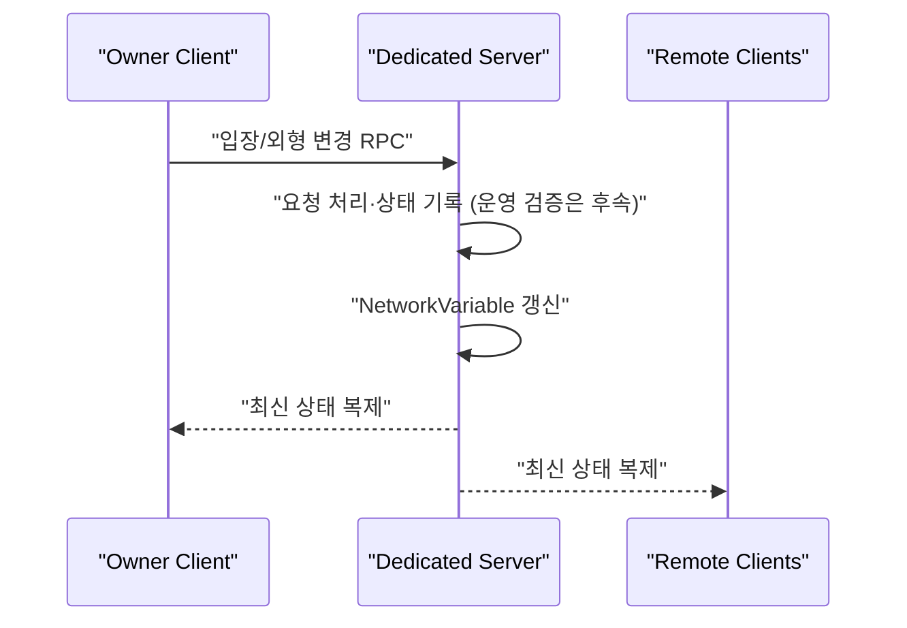

# 멀티플레이와 상태 동기화

## 1. 해결하려던 문제

KHS가 담당한 멀티플레이 POC에서는 브라우저의 여러 사용자가 같은 11층 월드에 접속하고 서로의 이동·닉네임·아바타·부스 입장 상태를 보도록 해야 했다. 반면 부스 안의 책상·스크린·장식까지 서버가 하나씩 네트워크 오브젝트로 전송하면 접속 직후 Spawn 수와 트래픽이 불필요하게 커진다.

따라서 상태를 두 종류로 나눴다.

| 상태 | 처리 방식 | 이유 |
|---|---|---|
| 플레이어 위치·회전 | Owner Client가 갱신하고 Dedicated Server가 다른 Client에 중계 | 현재 POC는 Client 권위 이동이며 서버 검증은 후속 구현 |
| 닉네임·현재 부스·아바타 | Dedicated Server가 최종값을 기록하고 전 Client에 복제 | 사용자 간 일관성과 권한 검증 필요 |
| 애니메이션·이모트 | Owner Write 상태를 Dedicated Server가 중계 | 빈번한 표현 상태의 POC |
| 책상·장식·스크린 등 정적 부스 배치 | Published Layout을 각 Client가 로컬 생성 | 같은 입력 데이터로 결정적으로 재현 가능 |
| AI 채팅·설문·긴 텍스트 입력 | React/Spring/FastAPI | 게임 서버가 업무 API와 UI까지 중계하지 않도록 분리 |

## 2. 사용한 기술 개념

### Netcode for GameObjects

Unity 6의 Netcode for GameObjects(NGO) 2.4.3을 사용한다. NGO는 `NetworkObject`의 수명주기, `NetworkVariable` 상태 복제, RPC 요청을 제공한다.

- `NetworkVariable`: 현재 상태를 보관하며 늦게 접속한 사용자도 최신 값을 받는다.
- RPC: “부스에 입장하고 싶다”, “외형을 바꾸고 싶다”처럼 행위를 서버에 요청한다.
- Server Authority: 중요한 값을 서버만 최종 기록한다.
- Owner Write: 걷기 애니메이션처럼 소유 클라이언트가 자주 갱신해도 되는 값만 제한적으로 허용한다.

### 상태 복제와 이벤트의 구분

현재 상태가 중요한 값은 `NetworkVariable`, 한 번의 요청이나 명령은 RPC가 적합하다. 예를 들어 `CurrentBoothId`는 새 접속자도 알아야 하므로 상태로 저장하고, 입장 시도는 Server RPC로 보낸다.

### Client와 Client는 직접 연결하지 않는다

현재 구조는 Peer-to-Peer가 아니다. Client A가 Client B에게 직접 위치나 외형을 보내는 것이 아니라, NGO 연결의 중심인 Dedicated Server가 요청 또는 상태를 받고 다른 Client에 복제한다.

```text
Client A 입력/요청
→ Dedicated Server
→ NGO 상태 복제
→ Client B, C가 같은 결과를 수신
```

이 구조에서는 한 사용자가 나가도 서버와 나머지 사용자의 월드가 유지되고, 서버가 접속 정원과 공유 상태의 최종 기록 지점을 가질 수 있다.

## 3. SSAFESTA 적용 방식



`NetworkPlayer`는 다음 값을 분리했다.

| 값 | 쓰기 권한 | 의미 |
|---|---|---|
| `UserId`, `Nickname`, `AvatarCode` | Server | 접속 승인 데이터에서 생성하므로 사용자 위조 방지 |
| `CurrentBoothId` | Server | 서버가 승인한 부스 위치 상태 |
| `AnimState`, `EmoteId` | Owner | 빈번한 표현 상태의 POC |

이동은 `ClientAuthoritativeNetworkTransform`을 사용한다. 소유 Client가 위치·회전을 갱신하고 Dedicated Server가 원격 Client에 중계하는 POC이므로 반응은 빠르지만, 현재 서버에는 속도·거리·순간이동 검증이 없다. 운영 단계에서 서버 검증을 추가하기 전까지는 완전한 Server Authority 이동이라고 부르면 안 된다.

접속 시 Client가 `ConnectionPayload`를 보내고 `ConnectionManager`가 정원과 토큰을 검사한다. 승인한 사용자 정보는 `SessionDataStore`에 잠시 보관한 뒤 Player Spawn 시 서버가 `NetworkVariable`에 기록한다.

현재 토큰 검증은 “비어 있지 않으면 통과”하는 POC다. 운영 단계에서는 Spring 내부 조회 또는 서명 검증으로 교체해야 한다.

## 4. 정적 부스를 NetworkObject로 만들지 않은 이유

모든 사용자가 같은 `Published Layout JSON`을 받으면 같은 `type`, `assetCode`, 좌표와 회전으로 같은 Prefab을 만들 수 있다. 이 데이터는 자주 변하지 않으므로 다음 방식이 효율적이다.

```text
Spring Published Layout
├─ Client A → Local Spawn
├─ Client B → Local Spawn
└─ Client C → Local Spawn
```

이 선택으로 얻는 이점은 다음과 같다.

- 부스 가구 수만큼 NetworkObject Spawn 메시지를 보내지 않는다.
- 게임 서버가 업무 데이터 저장소가 되지 않는다.
- 여러 World Channel도 하나의 Published Layout을 공유한다.
- 새 타입이 추가되어도 Unity Registry/Factory 매핑만 확장할 수 있다.

단, 움직이는 공동 오브젝트나 점수처럼 상호작용 결과가 공유되어야 하는 기능은 서버 동기화 대상이다.

## 5. 현재 구현 상태

### 구현됨

- WebSocket Transport 강제
- Dedicated Server 자동 시작과 `-port`, `-maxPlayers` 인자
- Connection Approval, 정원 제한, 세션 정리
- Player 기본 상태의 `NetworkVariable`
- Owner 권위 `NetworkTransform`을 통한 이동·회전 서버 중계 POC
- 부스 입장/퇴장 RPC POC
- 아바타 외형 문자열의 서버 기록과 전원 복제
- 정적 Booth Runtime Local Spawn

### 후속 구현

- 실제 토큰 서명 검증 또는 Spring 검증
- 부스 존재·Lease·거리·입장 가능 상태 검증
- 서버 권한 텔레포트와 내부 Anchor 매핑
- 재접속·채널 이동 상태 머신
- 운영 환경 30~40명 부하 측정

## 6. 파트 간 체크 포인트

- Backend는 World Session 응답에 `endpoint.scheme/host/port`와 짧은 수명의 `connectionToken`을 제공해야 한다.
- Unity는 endpoint를 코드에 고정하지 않고 Session 응답을 사용해야 한다.
- Avatar 문자열 최대 길이와 버전 호환 규칙을 Backend DB 길이 제한에 반영해야 한다.
- 정적 Layout 변경은 Publish 이후 다시 조회하는 정책과 갱신 시점을 함께 합의해야 한다.

## 7. 관련 코드와 문서

## 7. 관련 코드와 문서

- `festa-unity/Assets/_Project/Scripts/Network/Bootstrap/NetworkBootstrap.cs`
- `festa-unity/Assets/_Project/Scripts/Network/Connection/ConnectionManager.cs`
- `festa-unity/Assets/_Project/Scripts/Network/Player/NetworkPlayer.cs`
- `festa-unity/Assets/_Project/Scripts/World/Avatar/PlayerAppearanceController.cs`
- [월드 세션 Spec](../../specs/002-world-session/spec.md)
- [Game Server/Network 설계](../../12_Unity_Game_Server_Network_설계서.md)
