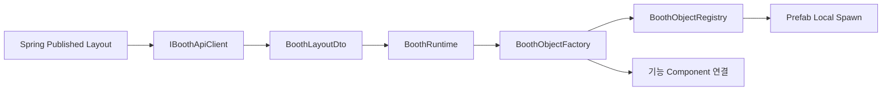

# Unity 클라이언트와 부스 런타임

## 1. 해결하려던 문제

KHS가 담당한 Unity Booth POC에서 부스마다 Scene과 GameObject를 직접 만들어 저장하면 부스 수가 늘 때 Scene 관리가 어렵고, 운영자가 웹에서 수정한 배치를 Unity에 반영하기도 힘들었다. 하나의 World Scene에서 여러 임대 부스를 운영하기 위해 **데이터로 배치를 표현하고 Unity가 런타임에 조립하는 구조**를 적용했다.

## 2. 사용한 기술 개념

### 데이터 주도 생성

화면에 무엇을 둘지 Scene에 하드코딩하지 않고 Layout DTO가 결정한다. 같은 JSON이 입력되면 같은 결과가 만들어지는 구조다.

### Registry와 Factory 패턴

- Registry: 비즈니스 타입과 Unity Prefab의 매핑을 보관한다.
- Factory: DTO 하나를 받아 올바른 Prefab을 만들고 Transform과 기능 컴포넌트를 적용한다.
- Runtime: API 조회, 기존 오브젝트 제거, 전체 재생성을 조정한다.

이렇게 책임을 나누면 API 파싱, 자산 매핑, 생성 수명주기를 서로 독립적으로 바꿀 수 있다.

## 3. SSAFESTA 적용 흐름

1. `BoothRuntime`이 `boothId`로 공개 Layout을 조회한다.
2. 새 Layout 적용 전 `Clear()`로 이전에 만든 자식 오브젝트를 제거한다.
3. `BoothObjectFactory`가 `type`을 Canonical Enum으로 해석한다.
4. `BoothObjectRegistry`에서 Prefab을 찾고, 없으면 POC Placeholder를 만든다.
5. DTO의 로컬 위치와 Y축 회전을 Booth Anchor 기준으로 적용한다.
6. `BoothRuntimeObject`에 `boothId`, `objectId`, `configId`를 남겨 클릭 시 웹 기능과 연결할 수 있게 한다.

## 4. 계약 필드가 실제 Unity 동작으로 바뀌는 방법

| Layout 값 | Unity 적용 |
|---|---|
| `boothId` | 어느 부스 Runtime인지 식별 |
| `objectId` | 배치 인스턴스 식별과 이벤트 추적 |
| `type` | Prefab 종류와 기능 컴포넌트 선택 |
| `assetCode` | 같은 타입 안에서 구체 자산 선택 예정 |
| `position` | Booth Anchor 기준 로컬 좌표, 1 단위 = 1m |
| `rotationY` | 바닥 기준 Y축 회전 |
| `configId` | AI·설문·노트북 홈페이지 등 Spring 설정 참조 |

URL이나 긴 콘텐츠 원문을 Layout에 직접 넣지 않고 `configId`로 참조하면 배치 계약과 업무 데이터를 분리할 수 있다.

## 5. 장애 격리와 전방 호환

새 Backend가 Unity보다 먼저 배포되어 모르는 `type`이 내려올 수 있다. 이때 부스 전체를 실패시키는 대신 해당 오브젝트만 경고 후 건너뛴다. HTTP 404는 “공개 Layout 없음”으로 처리하고, 통신·파싱 오류는 로그를 남긴 뒤 다른 게임 기능을 유지한다.

이 방식은 완전한 무시가 아니라 다음 원칙을 가진다.

- 알 수 없는 타입: 개별 오브젝트 Skip
- Layout 없음: 빈 부스로 유지
- 잘못된 JSON: 재생성하지 않고 오류 기록
- 정상 새 Layout: 기존 Runtime Object를 지우고 일괄 Rebuild

## 6. 외부 슬롯과 내부 슬롯 풀

1차 MVP는 사용자마다 별도 Scene이나 서버를 만들지 않는다.

- 외부 슬롯: 고정 구조물과 제한된 Facade만 표시
- 내부 Anchor: 물리 임대 슬롯 수만큼 미리 배치
- 입장 승인: Dedicated Server가 Lease와 입장 상태를 확인
- 내부 구성: 입장한 Client만 Published Layout을 Local Spawn
- 퇴장/만료: 플레이어를 외부로 이동한 뒤 `BoothRuntime.Clear()`

이 구조는 서버·Scene 수를 폭증시키지 않으면서 부스 내부를 분리해 보여 준다.

현재 Unity 독립 월드 뼈대는 `WorldSceneLayout`이 담당한다. `main` Scene 진입 시 11층 공용 바닥, 외벽, 이동 통로, 조명, 외부 부스 8슬롯을 로컬 정적 오브젝트로 구성한다. 내부 슬롯은 월드에서 보이지 않는 먼 좌표에 8개를 미리 두고, 각 슬롯에 다음 기준점을 둔다.

- `EntryAnchor`: 부스 내부 입장 시 플레이어 도착 위치
- `ExitAnchor`: 내부에서 외부로 나갈 때 기준 위치
- `ContentAnchor`: Published Layout 오브젝트를 조립할 부모 위치

이 단계는 React 편집기나 Spring API 없이 Unity 단독으로 공간과 이동 동선을 검증할 수 있다. 이후 Layout 연동 시 `ContentAnchor` 아래만 동적으로 채우면 고정 건축 구조와 임대 콘텐츠의 수명주기가 섞이지 않는다.

공용 입장 구역은 최대 40명을 8 × 5 그리드로 분산한다. Dedicated Server의 Connection Approval도 동일 좌표 규칙을 사용하므로 Scene에 보이는 Spawn 기준과 실제 Network Player 생성 위치가 일치한다.

## 7. 현재 구현 상태

### 구현됨

- Layout DTO 파싱
- Mock/HTTP API Client 교체 구조
- Registry/Factory/Runtime Local Spawn
- 위치·회전 적용
- Unknown Type 격리
- AI NPC·Video Screen POC Component 연결
- URP 호환 Placeholder Material과 Runtime Font 지정

### 설계/후속

- 정식 Prefab과 `assetCode` 매핑
- 외부 Facade Runtime
- 서버 승인 텔레포트와 내부 Anchor 연결
- Publish 변경 자동 새로고침
- URL·설문·프로젝트·상담 Overlay E2E
- Addressables 도입 여부와 자산 버전 정책

## 8. 관련 코드와 문서

- `festa-unity/Assets/_Project/Scripts/Booth/Runtime/BoothRuntime.cs`
- `festa-unity/Assets/_Project/Scripts/Booth/Factory/BoothObjectFactory.cs`
- `festa-unity/Assets/_Project/Scripts/Booth/Factory/BoothObjectRegistry.cs`
- `festa-unity/Assets/_Project/Scripts/Integration/Spring/HttpBoothApiClient.cs`
- [Booth Studio 계약](../../specs/005-booth-studio-layout/spec.md)
- [Booth Runtime 계약](../../specs/006-booth-runtime/spec.md)
