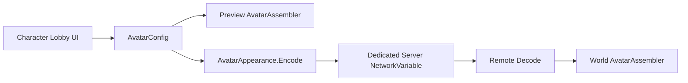

# 아바타 커스터마이징과 동기화

## 1. KHS가 해결하려던 문제

초기 아바타는 고정 프리셋에 가까워 얼굴·헤어·의상 조합과 세부 색상을 표현하기 어려웠다. 커스터마이징 화면에서 바꾼 모습이 자기 화면에만 보이면 멀티플레이에서도 사용할 수 없다. 또한 서로 다른 파츠를 단순히 겹치면 목이 뜨거나, 피부가 옷을 뚫고 나오거나, 상의/하의를 바꿀 때 숨김 상태가 뒤집히는 문제가 생겼다.

KHS 작업은 이 문제를 다음 세 층으로 나눴다.

1. `AvatarConfig`: 선택한 파츠와 색상을 데이터로 표현
2. `AvatarAssembler`: 데이터를 실제 Mesh·Material 상태로 조립
3. `PlayerAppearanceController`: 결과를 서버를 통해 모든 Client에 전파

## 2. 데이터 모델을 먼저 만든 이유

UI Button이 GameObject를 직접 켜고 끄게 만들면 Preview와 실제 World Avatar가 서로 다른 로직을 가지기 쉽다. 대신 UI는 `AvatarConfig`만 바꾸고, Preview와 World가 같은 Assembler를 사용한다.



`AvatarConfig`에는 다음 항목을 분리했다.

- 파츠: 얼굴, 헤어, 모자, 안경, 상의, 하의, 한벌옷, 신발
- 얼굴 색: 피부, 흰자위, 홍채, 동공, 눈썹, 입술
- 파츠 색: 상의·하의·한벌옷·신발·모자·안경 각각 A/B/C 영역의 어두운색·밝은색
- 성별과 호환 가능한 파츠 ID

이 구조 덕분에 “홍채를 바꿨는데 흰자까지 변함” 같은 결합 문제를 데이터 단계에서부터 분리할 수 있다.

## 3. 런타임 조립 방식

`AvatarAssembler`는 Config가 바뀌면 다음 순서로 처리한다.

1. 기준 Body와 Animator를 준비한다.
2. 선택한 Skinned Mesh를 기준 Skeleton에 연결한다.
3. Head/Hair/Hat/Glasses/Top/Bottom/Outfit/Shoes를 조합한다.
4. 의상 조합에 따라 가려야 하는 Body Part를 비활성화한다.
5. Renderer Material을 현재 URP에 호환되는 Runtime Material로 준비한다.
6. `MaterialPropertyBlock`으로 얼굴과 의상 색을 적용한다.

### MaterialPropertyBlock을 쓴 이유

공유 Material 자체를 수정하면 한 아바타의 색 변경이 같은 Material을 쓰는 다른 아바타까지 바꿀 수 있다. `MaterialPropertyBlock`은 Renderer별 속성만 덮어써 Material 공유와 아바타별 색상 독립을 함께 유지한다.

### 얼굴 색을 분리한 방식

Material 이름과 Shader Property를 기준으로 역할을 나눈다.

- Eye Material: `_ScleraColor`, `_IrisColor`, `_PupilColor`
- Head Material: `_SkinColor`, `_LipColor`, `_EyebrowColor`
- Hair/Eyebrow Material: 해당 Base Color
- Body Material: 얼굴과 같은 Skin Color

피부색은 얼굴만 바꾸지 않고 Body에도 적용해 목 경계선이 생기지 않게 했다.

### 의상 영역별 색

통짜 Tint 하나가 아니라 `_Color_A_1`, `_Color_A_2`, `_Color_B_1`, `_Color_B_2`, `_Color_C_1`, `_Color_C_2`를 사용한다. 자산이 실제로 제공하는 영역만 의미 있게 바뀌며, 상의·하의·한벌옷·신발·모자·안경의 색 상태는 별도로 저장한다. 안경 렌즈는 프레임 셰이더로 합치지 않고 투명 머티리얼을 유지하면서 B2 색만 적용한다.

## 4. 외형 직렬화와 네트워크 전파

모듈형 외형은 여러 ID와 정밀 RGB 값을 가진다. KHS는 이를 `fa|...` 형식의 하나의 문자열로 직렬화했다.

```text
fa
|g=성별
|i=8개 파츠 ID
|p=팔레트 ID
|q=정밀 RGB 색상
|w=36개 의상·모자·안경 영역 색상
```

변경 흐름은 다음과 같다.

1. Owner가 Preview에서 외형을 확정한다.
2. `AvatarAppearance.Encode()`로 문자열을 만든다.
3. Server RPC로 변경을 요청한다.
4. 서버가 길이와 기본 유효성을 확인한 뒤 `FixedString4096Bytes NetworkVariable`에 기록한다.
5. 모든 Client의 `PlayerAvatarVisual`이 변경 이벤트를 받고 Decode·Rebuild한다.
6. 프로필 저장 API는 별도로 시도하며 실패해도 현재 월드 외형은 유지한다.

외형 GameObject 자체는 NetworkObject가 아니다. 서버는 외형 데이터만 복제하고 각 Client가 동일 데이터를 로컬 조립한다. 정적 Booth Local Spawn과 같은 “상태만 동기화하고 표현은 로컬 생성” 원칙이다.

## 5. 호환성과 실패 가시성

- 모르는 직렬화 Segment는 무시해 이전 Client가 전체 외형을 깨뜨리지 않게 한다.
- 문자열이 최대 길이를 넘으면 기본값으로 몰래 바꾸지 않고 요청을 거부하고 오류를 표시한다.
- 서버가 2초 안에 같은 값을 반영하지 않으면 오래된 Docker Server 가능성을 사용자에게 알린다.
- 기존 짧은 Preset Code도 Decode할 수 있어 이전 상태와 호환한다.

## 6. 커스터마이징 UI와 카메라 입력

KHS가 구성한 UI 동작은 다음과 같다.

- 왼쪽: 상의·하의·한벌옷·신발 선택과 의상 영역별 색
- 오른쪽: 얼굴·헤어·모자·안경 선택과 얼굴/헤어 색
- 얼굴 탭: 피부·흰자위·홍채·동공·눈썹·입술을 이름으로 구분
- HSV 색상환 + 밝기 Bar: 버튼 팔레트보다 정밀한 색 선택
- UI 위에서 색이나 파츠를 고를 때 회전·Zoom 입력 차단
- 좌클릭 Drag: 캐릭터 회전
- 우클릭 Drag: 카메라 Orbit
- Wheel: 부드러운 지수형 Zoom

Pointer Zoom은 단순히 벽의 Raycast 지점을 따라가지 않는다. 화면의 Humanoid Bone Chain 중 Pointer와 가장 가까운 점을 찾아 Focus를 이동하고, Focus를 실제 Avatar Renderer Bounds 안으로 제한한다. Zoom-out은 Focus를 중앙으로 강제 복귀시키지 않고 현재 시점을 유지한 채 뒤로 이동한다.

### WebGL 창 크기에 대응하는 기준 프레임

커스터마이징 UI는 1600×900을 논리 해상도로 사용하는 하나의 16:9 프레임 아래에 좌측 의상 패널, 중앙 미리보기, 우측 외형 패널을 배치한다. 브라우저 창이 기준보다 좁으면 폭을, 더 넓으면 높이를 스케일 기준으로 사용한다.

이 방식의 목적은 화면을 무조건 늘려 채우는 것이 아니라 카드 크기, 패널 패딩, 스크롤 간격의 상대 관계를 보존하는 것이다. 16:9 캔버스에서는 여백 없이 채워지고, 다른 비율에서는 남는 영역을 안전 여백으로 사용해 UI 찌그러짐과 겹침을 막는다. 카메라 조작 가능 영역도 화면 비율 상수가 아니라 중앙 미리보기 RectTransform에서 계산한다.

얼굴형 4종은 하나의 2×2 atlas를 정해진 순서로 잘라 사용하고, 안경 썸네일은 투명 PNG를 기존 Texture GUID에 덮어써 카탈로그 연결을 보존했다. 외부 이미지 교체 시에는 알파 배경과 실제 콘텐츠 중심을 먼저 확인해야 한다.

## 7. 현재 구현 상태

### KHS 구현됨

- 파츠 Catalog/Config/Assembler 구조
- 얼굴·헤어·의상 색상 분리
- HSV 정밀 Color Picker
- 의상 A/B/C 영역별 2색 조정
- Preview Camera 회전·Orbit·Pointer Zoom
- UI Pointer 위 Camera 입력 차단
- 외형 문자열 Encode/Decode
- Server RPC + NetworkVariable 멀티플레이 전파
- Preview와 World의 동일 조립 경로

### 남은 검증·개선

- 모든 파츠 조합의 피부 노출·숨김 규칙 전수 검사
- 모든 원본 Material의 색 Property 매핑 검수
- 다중 Client에서 게임 중 변경 E2E
- Backend 프로필 저장 계약과 길이 제한 확정
- 서버 측 보유 아이템·허용 파츠 검증
- 장시간 반복 변경 시 Material/오브젝트 누수 측정

## 8. 관련 코드

- `festa-unity/Assets/_Project/Scripts/World/Avatar/Core/AvatarConfig.cs`
- `festa-unity/Assets/_Project/Scripts/World/Avatar/Assembly/AvatarAssembler.cs`
- `festa-unity/Assets/_Project/Scripts/World/Avatar/AvatarAppearance.cs`
- `festa-unity/Assets/_Project/Scripts/World/Avatar/PlayerAppearanceController.cs`
- `festa-unity/Assets/_Project/Scripts/World/Avatar/PlayerAvatarVisual.cs`
- `festa-unity/Assets/_Project/Scripts/World/Avatar/Lobby/CharacterLobbyController.cs`
- `festa-unity/Assets/_Project/Scripts/World/Avatar/Lobby/AvatarColorPicker.cs`
