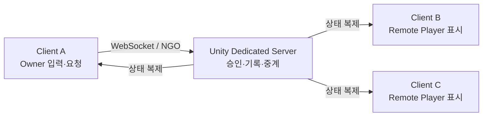
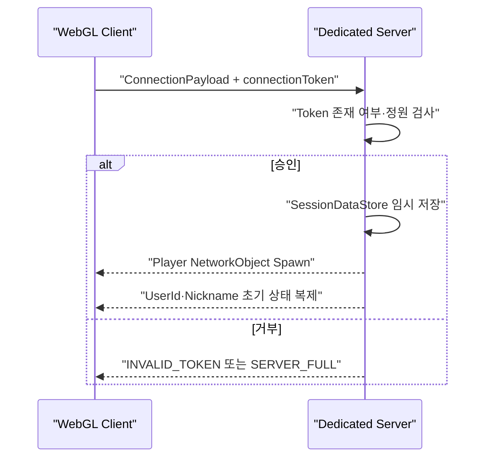
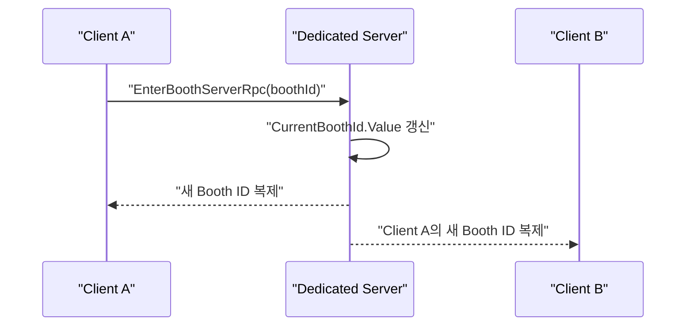
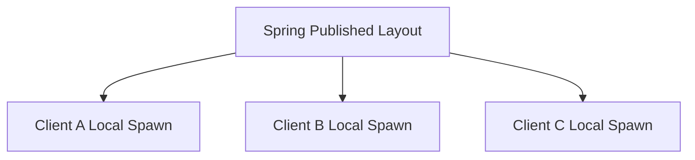

# 멀티플레이 상호작용 환경 실전 구조

## 1. 이 문서에서 설명하는 것

이 문서는 KHS가 SSAFESTA Unity 파트에서 구성한 멀티플레이 POC를 기준으로 다음 질문에 답한다.

1. Client와 Server는 각각 무엇인가?
2. Dedicated Server는 일반 Host 방식과 무엇이 다른가?
3. Client A의 행동이 Client B 화면에는 어떻게 나타나는가?
4. 이동, 부스 입장, 아바타 변경, 정적 부스는 왜 서로 다른 방식으로 처리하는가?
5. 현재 구현된 범위와 운영 전에 보강할 범위는 어디까지인가?

다른 담당자의 Backend 내부 구현을 설명하는 문서가 아니며, 현재 저장소에서 확인되는 KHS의 Unity Client·NGO·Dedicated Server 경계를 다룬다.

---

## 2. 먼저 알아야 할 역할

### Client

Client는 사용자가 실행하는 Unity WebGL 프로그램이다. SSAFESTA에서는 다음 일을 담당한다.

- 키보드와 마우스 입력 수집
- 자신의 캐릭터 이동과 카메라 표현
- 서버가 복제한 다른 사용자의 상태 표시
- 외형 문자열을 실제 헤어·얼굴·의상 Mesh로 로컬 조립
- Spring의 Published Layout을 받아 부스 가구를 로컬 생성
- 3D 오브젝트 클릭을 React Overlay 이벤트로 전달

Client는 자기 화면을 렌더링하지만 다른 사용자의 공유 상태를 최종 확정하는 저장소는 아니다.

### Dedicated Server

Dedicated Server는 특정 사용자가 플레이하면서 겸하는 Host가 아니라, 월드 운영만을 위해 따로 실행되는 Unity Server 프로세스다. 화면·카메라·그래픽을 렌더링하지 않고 다음을 담당한다.

- Client 접속 승인과 채널 정원 제한
- Player `NetworkObject` 생성·제거
- 서버 권한 상태의 최종 기록
- RPC 요청 수신
- 한 Client의 상태를 다른 Client에 복제
- 접속 종료 시 세션 정리

SSAFESTA POC에서는 Linux Headless Build를 Docker Container로 실행하며, WebGL의 제약 때문에 Client와 Server 모두 WebSocket Transport를 사용한다.

여기서 `Server`는 접속 승인과 공유 상태를 관리하는 **네트워크 역할**을 뜻한다. `Dedicated Server`는 그 역할을 사용자 Client와 분리된 전용 프로세스가 맡는 **실행 형태**다. 반대로 Host 방식은 한 사용자의 Client가 화면을 렌더링하면서 Server 역할도 함께 수행한다. SSAFESTA는 Host 사용자의 종료에 월드가 종속되지 않도록 Dedicated Server 방식을 선택했다.

### Remote Client

내 브라우저에서 다른 사용자는 Remote Client가 소유한 Player로 보인다. 원격 Player는 내 입력으로 움직이지 않고 NGO가 전달한 Transform·상태·외형값을 화면에 반영한다.

---

## 3. Client끼리 어떻게 상호작용하는가

SSAFESTA는 Client끼리 직접 연결하는 Peer-to-Peer 구조가 아니다.



따라서 “Client A와 Client B의 상호작용”은 실제로 다음 의미다.

```text
Client A가 행동한다
→ Dedicated Server가 요청 또는 상태를 받는다
→ 서버가 권위 있는 값을 기록하거나 중계한다
→ NGO가 Client B에 복제한다
→ Client B가 받은 값으로 화면을 갱신한다
```

이 구조를 사용한 이유는 다음과 같다.

- 한 사용자가 종료해도 월드가 함께 종료되지 않는다.
- 접속 승인과 최대 인원을 한 지점에서 관리할 수 있다.
- 공유 상태의 최종값을 모든 Client가 동일하게 받을 수 있다.
- 이후 속도, 거리, 소유권 같은 부정 요청 검증을 서버에 추가할 수 있다.

Client끼리 직접 메시지를 주고받는 코드와 현재 사용 중인 Client RPC는 없다. “모두에게 보이게 한다”는 요구는 Owner Client의 Server RPC 요청, Server Write NetworkVariable 또는 NetworkTransform 복제로 구현한다.

---

## 4. 사용한 NGO 구성 요소

| NGO 개념 | 프로젝트에서의 사용 | 선택 이유 |
|---|---|---|
| `NetworkObject` | 접속 승인 후 각 Player 생성 | Player의 소유자와 네트워크 수명주기 관리 |
| `NetworkBehaviour` | `NetworkPlayer`, `PlayerMovement`, `PlayerAppearanceController` | 네트워크 상태와 RPC를 가진 Component |
| `NetworkVariable` | 닉네임, Booth ID, 애니메이션, 외형 문자열 | 현재값을 보관하고 늦게 접속한 Client에도 복제 |
| Server RPC | 부스 입장·퇴장, 외형 변경 요청 | Client가 서버에 행동을 요청하는 단방향 진입점 |
| `NetworkTransform` | Player 위치·회전 복제 | Owner의 이동 결과를 원격 Client에 전달 |
| Connection Approval | Token·정원 확인 후 Player Spawn | 승인되지 않은 접속의 Player 생성을 차단 |

### NetworkVariable과 RPC의 차이

RPC는 “외형을 이 값으로 바꿔 달라”는 요청이고, NetworkVariable은 “현재 외형은 이 값이다”라는 상태다.

```text
요청: Client → Server RPC
판단·기록: Server → NetworkVariable.Value 변경
결과: NGO → 모든 Client에 최신값 복제
```

NetworkVariable을 사용하면 변경 순간을 놓쳤거나 늦게 접속한 Client도 현재 상태를 받을 수 있다.

---

## 5. 기능별 실제 상호작용 흐름

### 5.1 접속과 Player 생성



`ConnectionManager`가 Approval Callback을 처리한다. 현재 Token 검증은 비어 있지 않은지만 검사하는 POC이며 실제 서명 또는 Spring 검증은 후속 범위다.

### 5.2 캐릭터 이동: Owner 권위 + Server 중계

현재 이동은 완전한 Server Authority가 아니다.

1. `PlayerMovement`는 `IsOwner`인 Client에서만 입력을 읽는다.
2. Owner Client가 자신의 Transform을 변경한다.
3. `ClientAuthoritativeNetworkTransform`이 변경값을 NGO로 전송한다.
4. Dedicated Server가 다른 Client에 Transform을 중계한다.
5. Remote Client는 입력을 실행하지 않고 수신한 Transform만 표시한다.

이 방식은 Web POC에서 반응이 빠르고 구조가 단순하다. 하지만 Client가 보낸 속도·거리·순간이동 값을 서버가 아직 검증하지 않으므로 운영용 치트 방지까지 끝난 구조는 아니다.

| 항목 | 현재 상태 |
|---|---|
| 입력 권위 | Owner Client |
| 네트워크 전달 중심 | Dedicated Server |
| 원격 표현 | NGO NetworkTransform 수신 |
| 서버 이동 검증 | 미구현, P1 후속 |

### 5.3 부스 입장·퇴장: Server RPC + Server Write 상태

부스 ID는 다른 사용자와 늦게 접속한 사용자도 알아야 하는 현재 상태이므로 `CurrentBoothId` NetworkVariable로 관리한다.



현재 코드는 Booth ID 기록 POC까지 구현되어 있고, 부스 존재 여부·임대 상태·거리 검증과 실제 내부 Anchor 텔레포트는 후속 구현이다.

### 5.4 아바타 변경: 값은 서버 동기화, Mesh는 각 Client 조립

아바타의 헤어·의상 Mesh 전체를 네트워크로 전송하지 않는다. 선택 결과를 압축한 `fa|...` 외형 문자열만 공유한다.

```text
Owner Client 커스터마이징
→ 외형 문자열 Encode
→ RequestChangeServerRpc
→ Server가 FixedString4096Bytes NetworkVariable에 기록
→ 모든 Client가 같은 문자열 수신
→ 각 Client의 AvatarAssembler가 로컬 Mesh 조립
```

이 구조에서 Dedicated Server는 캐릭터를 렌더링하지 않는다. “어떤 파츠와 색을 사용한다”는 상태만 권위 있게 중계하고, 실제 그래픽 생성 비용은 각 Client가 부담한다.

### 5.5 정적 부스: Server를 거치지 않는 동일 데이터 재현

책상·패널·스크린 같은 정적 부스 가구는 Player처럼 NetworkObject로 Spawn하지 않는다.



각 Client가 같은 Published Layout의 `type`, `assetCode`, 위치, 회전을 읽어 같은 Prefab을 생성한다. 정적 가구 수만큼 Dedicated Server가 Spawn 메시지를 보내지 않아 채널 인원이 늘어도 네트워크 트래픽을 줄일 수 있다.

단, 여러 사용자가 함께 밀 수 있는 물체나 공동 점수처럼 실행 중 결과가 달라지는 오브젝트는 정적 Layout만으로 처리할 수 없으며 서버 동기화 대상으로 설계해야 한다.

### 5.6 Unity 오브젝트와 React Overlay

AI 채팅·노트북·설문 같은 기능은 모든 결과를 게임 서버가 중계하지 않는다. Unity는 3D 클릭 지점을 제공하고 복잡한 텍스트 UI는 React에 넘긴다.

2026-08-18 확정된 최초 이벤트 계약은 다음과 같다.

```text
window.FestaUnity.onBoothInteract(json)
BOOTH_LAPTOP_INTERACT { boothId, objectId, url? }
```

이 이벤트는 같은 브라우저 안의 Unity → React 전달이며 Client 간 동기화가 아니다. Unity의 LAPTOP 클릭 송신부와 WebGL Bridge는 구현됐고 React 오버레이와의 브라우저 E2E 검증이 남아 있다. 다른 사용자에게도 결과가 보여야 하는 기능이라면 별도의 서버 공유 상태 계약이 필요하다.

---

## 6. 어떤 상태를 어디에 두는가

| 데이터·행동 | 최종 관리 위치 | 전달 방식 |
|---|---|---|
| Player 접속·퇴장 | Dedicated Server | NGO Connection·NetworkObject |
| Player 위치·회전 | Owner Client 권위 POC, Server 중계 | NetworkTransform |
| 닉네임·현재 Booth ID | Dedicated Server | Server Write NetworkVariable |
| 아바타 외형값 | Dedicated Server | Server RPC + NetworkVariable |
| 실제 아바타 Mesh | 각 Unity Client | 외형값으로 로컬 조립 |
| 정적 Booth Layout 원본 | Spring Published Version | REST 조회 |
| 정적 Booth 3D Object | 각 Unity Client | Layout으로 로컬 Spawn |
| AI·노트북·설문 UI | React 및 업무 API | Web-Unity Bridge + REST/SSE 등 |

핵심 기준은 “다른 사용자와 실행 중 합의해야 하는 값인가?”다. 그렇다면 Dedicated Server 상태 후보이고, 같은 원본 데이터로 각자 재현할 수 있는 정적 표현이라면 Client 로컬 생성 방식이 적합하다.

---

## 7. Dedicated Server 실행 환경

```text
WebGL Client
→ ws://localhost:7777               로컬 개발
→ wss://world.example.com           HTTPS 운영 후보
→ TLS 종료 Load Balancer
→ ws://Unity Linux Dedicated Server
```

- WebGL은 임의 UDP Socket을 사용할 수 없어 WebSocket을 사용한다.
- Server Build는 `-batchmode -nographics`로 그래픽 없이 실행한다.
- `-port`와 `-maxPlayers` 실행 인자로 채널 포트와 정원을 바꾼다.
- Docker Image 하나를 여러 Channel 인스턴스로 반복 실행할 수 있게 구성했다.
- 현재 AWS 배포, `wss` E2E, 자동 확장과 30~40명 부하 시험은 완료 전이다.

---

## 8. 현재 구현과 후속 범위

### 저장소 코드로 확인되는 구현

- NGO 2.4.3 기반 Player NetworkObject POC
- WebSocket Transport와 Dedicated Server 자동 시작
- Connection Approval, 정원 제한, 접속 종료 세션 정리
- Owner Client 이동과 서버 경유 원격 Transform 복제
- Booth 입장·퇴장 Server RPC와 `CurrentBoothId` 복제
- 외형 변경 Server RPC와 `FixedString4096Bytes` 상태 복제
- 각 Client의 아바타 Mesh 로컬 조립
- Published Layout 기반 정적 Booth Local Spawn
- Linux Dedicated Server Docker 실행 구조

### 운영 전에 필요한 보강

- 실제 Connection Token 서명 또는 Spring 연동 검증
- 이동 속도·거리·순간이동 서버 검증
- Booth 존재·Lease·거리 검증과 서버 권한 텔레포트
- 재접속·Channel 이동 상태 머신
- Shared Interactive Object별 권위 정책
- 운영 `wss`와 30~40명 동시접속 부하 검증
- React 오버레이와 Unity LAPTOP Bridge의 브라우저 E2E 검증

---

## 9. 이 구조로 만든 상호작용 환경

KHS의 POC는 브라우저 사용자들이 하나의 채널에 접속해 서로의 Player Spawn, 이동, 닉네임, 현재 Booth 상태와 조립형 아바타 외형을 볼 수 있는 기반을 만들었다. 공유 상태는 Dedicated Server를 중심으로 복제하고, 정적 부스는 동일한 Published Layout으로 각 Client가 재현한다. 이 경계 덕분에 게임 서버가 정적 가구와 업무 콘텐츠까지 모두 떠안지 않으면서도 여러 사용자가 같은 월드에 있는 경험을 구성할 수 있다.

다만 이동 검증, 실제 Lease 기반 Booth 승인, 운영 인증과 배포는 아직 후속 범위이므로 현재 결과는 운영 완성본이 아니라 **멀티플레이 상호작용 구조를 검증한 POC**로 표현해야 한다.

## 10. 관련 코드와 문서

- `festa-unity/Assets/_Project/Scripts/Network/Bootstrap/NetworkBootstrap.cs`
- `festa-unity/Assets/_Project/Scripts/Network/Connection/ConnectionManager.cs`
- `festa-unity/Assets/_Project/Scripts/Network/Player/NetworkPlayer.cs`
- `festa-unity/Assets/_Project/Scripts/Network/Player/PlayerMovement.cs`
- `festa-unity/Assets/_Project/Scripts/Network/Player/ClientAuthoritativeNetworkTransform.cs`
- `festa-unity/Assets/_Project/Scripts/World/Avatar/PlayerAppearanceController.cs`
- `festa-unity/Assets/_Project/Scripts/Booth/Runtime/BoothRuntime.cs`
- [멀티플레이와 상태 동기화](./01_멀티플레이와_상태_동기화.md)
- [Dedicated Server와 실행 환경](./03_Dedicated_Server와_실행_환경.md)
- [Unity 연동을 위한 통신 계약](./04_Unity_연동을_위한_통신_계약.md)
- [Unity Game Server/Network 설계](../../12_Unity_Game_Server_Network_설계서.md)
