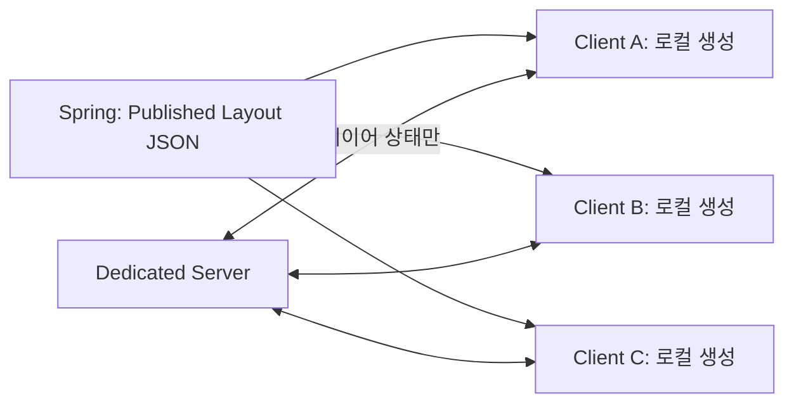

# 08. WebGL 렌더링 아키텍처 선택 — 왜 복제 구조이고, 왜 Unity인가

> 작성 기준일: 2026-08-25
> 상태 표기: **구현됨** = 저장소 코드로 확인 가능 / **계약** = 팀 합의 필요 / **판단** = 이 문서의 분석·제안

컨설턴트 피드백에서 "왜 Three.js가 아니라 Unity WebGL인가"를 정리하라는 요구를 받았다
(GitLab #92). 이 문서는 그 답과, 그보다 먼저 결정된 **렌더링 위치 선택**을 함께 기록한다.

---

## 1. 문제 — 브라우저에 3D 멀티플레이를 어떻게 띄울 것인가

행사 참가자는 앱 설치 없이 링크 하나로 들어와야 한다. 그런데 3D 월드를 브라우저에
띄우는 방법은 근본적으로 두 가지뿐이고, 둘의 비용 구조가 완전히 다르다.

| 방식 | 서버가 보내는 것 | 서버 자원 | 인원 증가 시 |
|---|---|---|---|
| 픽셀 스트리밍 (클라우드 렌더링) | 인코딩된 영상 | 접속자 1인당 GPU 세션 1개 | 비용이 인원수에 **선형 증가** |
| **클라이언트 복제 (채택)** | 상태값(위치·회전·애니메이션) | GPU 불필요, CPU 중계만 | 대역폭만 증가 |

**선택 근거**: 픽셀 스트리밍은 40명이면 GPU 인스턴스 40개가 필요하다. SSAFY 프로젝트
예산·인프라에서 성립하지 않는다. 그래서 **각 브라우저가 월드 전체를 로컬에 복제해
직접 렌더링**하고, 서버는 "누가 어디 있는지"만 중계한다.

이 선택의 대가는 명확하다 — **부하가 서버가 아니라 접속자 PC로 옮겨간다.** 그래서
클라이언트 최적화가 이 프로젝트의 최우선 기술 과제가 된다 (→ [09 동시접속 규모와 성능 예산](./09_동시접속_규모와_성능_예산.md)).

---

## 2. 복제 구조가 코드에 박혀 있는 방식 — 정적 오브젝트는 네트워크로 스폰하지 않는다

**구현됨.** 프로젝트 규칙(`CLAUDE.md`)에 명시된 아키텍처 원칙이다.

> Booth 정적 오브젝트는 NetworkObject 금지 (Local Spawn)

부스 12개에 딸린 오브젝트를 서버가 스폰하고 동기화하면, 네트워크 객체 수가
`부스 오브젝트 수 × 접속자 수`로 늘어난다. 대신 이렇게 한다.

- **모두가 같은 Published Layout JSON을 받아 각자 결정적으로 생성한다.** 입력이 같으므로
  결과도 같다 — 동기화할 필요 자체가 없다.
- 네트워크로 도는 것은 **사람(위치·아바타·애니메이션 상태)뿐**이다.
- 좌표계 계약이 이 재현성을 보장한다: 레이아웃 좌표 = 부스 로컬 미터(불변),
  앵커 스케일 40, `boothId 1~12 = FestivalSlot_XX = Interior_XX` (GitLab #62).

**운영 측면의 복제**: 월드 인스턴스는 Docker 컨테이너 1개 = 월드 1개다
(`festa-world:dev`, → [03 Dedicated Server와 실행 환경](./03_Dedicated_Server와_실행_환경.md)).
인원이 늘면 한 월드를 무한히 키우는 게 아니라 **컨테이너를 복제해 월드를 늘린다.**

---

## 3. 왜 Three.js가 아니라 Unity WebGL인가

Three.js는 렌더링 라이브러리이고 Unity는 게임 엔진이다. 우리가 필요한 것 중 Three.js
경로에서 **직접 만들어야 했을 것들**을 프로젝트에서 실제 겪은 사례로 적는다.

| 필요 기능 | Unity에서 받은 것 | Three.js였다면 |
|---|---|---|
| 멀티플레이 | NGO(Netcode for GameObjects) — 스폰·소유권·보간·연결 승인 | 직접 구현 (상태 동기화·보간·권위 모델 전부) |
| 캐릭터 물리 | CharacterController — 경사·계단·충돌 해결 | 물리 엔진 결합 + 캐릭터 컨트롤러 자체 제작 |
| 애니메이션 | 휴머노이드 리타게팅 — 외부 클립을 다른 골격에 재사용 | 리깅별 클립 재작업 |
| 가시성 최적화 | 오클루전 컬링 베이크(에디터 내장) | 직접 구현하거나 포기 |
| LOD | LODGroup + 크로스페이드 | 직접 구현 |
| 에셋 생태계 | 상용 3D 에셋 즉시 사용 | 대부분 재가공 필요 |
| 계측 | Profiler로 프레임·메모리 실측 | 브라우저 도구 수준 |

**POC 속도의 실질 원천은 마지막 두 줄이다.** 축제 존을 구성할 때 상용 에셋 팩을 그대로
쓰고, Profiler로 병목을 실측해 잡았다. 이 두 가지가 없었으면 지금 진도가 나오지 않았다.

### 정직하게 적는 Unity WebGL의 대가

Three.js를 택했다면 없었을 문제도 분명히 있다. 이걸 숨기면 근거가 약해진다.

| 대가 | 우리가 낸 답 | 상태 |
|---|---|---|
| **한글 IME 입력이 사실상 불가** | 텍스트 입력은 Unity가 아닌 **React 오버레이**가 담당 | 구현됨(아키텍처 원칙) |
| 빌드 용량·초기 로딩 | 텍스처 임포트 상한, 압축 빌드 | 부분 적용 |
| 브라우저 탭 메모리 상한 | 텍스처 예산 관리 — 이 프로젝트 최대 위험 | 진행 중 (#89) |
| `Task.Delay` 미동작 | `Awaitable.WaitForSecondsAsync` 로 교체 | 구현됨 (T-기록) |
| 런타임 생성 머티리얼이 빌드에서 마젠타 | `Shader.Find("Universal Render Pipeline/Lit")` 명시 | 구현됨 |
| IMGUI가 빌드에서 렌더 안 됨 | Active Input Handling `Both` | 구현됨 |

**한글 IME 제약은 단순한 버그가 아니라 설계를 결정했다.** 컨설턴트가 제안한
"Unity 인게임 에디터 통합"을 채택하지 않은 근본 사유가 이것이다 —
부스 이름·소개 문구를 Unity 안에서 한글로 입력할 수 없기 때문이다.
역할 분리(웹 = 텍스트·이미지·정보 입력 / Unity = 3D 반영·미리보기)는 타협이 아니라
플랫폼 제약에 대한 정답이다.

---

## 4. 다른 파트가 지킬 것

- **Published Layout은 결정적이어야 한다.** 같은 JSON이 모든 클라이언트에서 같은 결과를
  내야 복제 구조가 성립한다. 서버가 클라이언트마다 다른 값을 주면 월드가 갈라진다.
- **좌표·식별자 계약을 한 파트가 임의로 바꾸지 않는다** (#62).
- **텍스트 입력이 필요한 기능은 Unity에 요구하지 않는다** — React 오버레이 경계로 설계한다.
- 새로운 상시 동기화 대상을 추가하기 전에 [09 문서](./09_동시접속_규모와_성능_예산.md)의
  대역폭 항목을 먼저 본다. 동기화 대상 추가는 인원수 제곱으로 비용이 는다.
