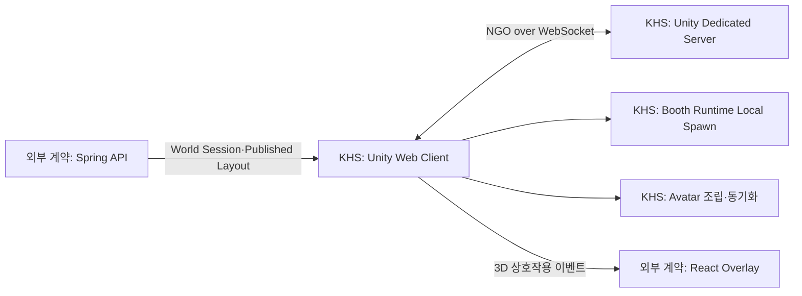
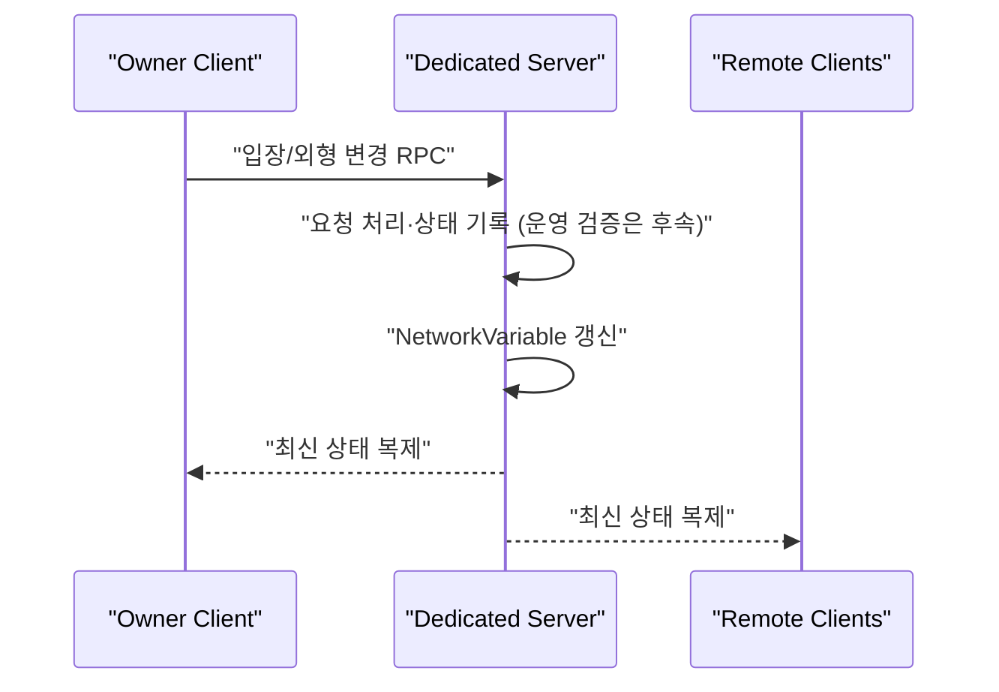
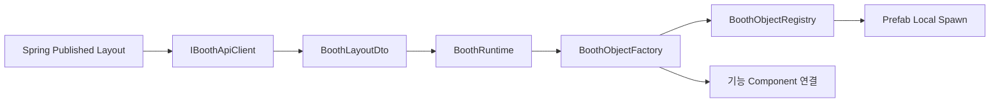
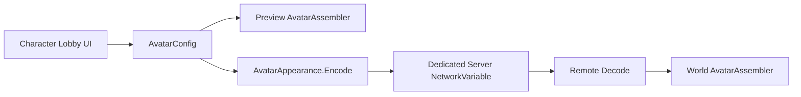
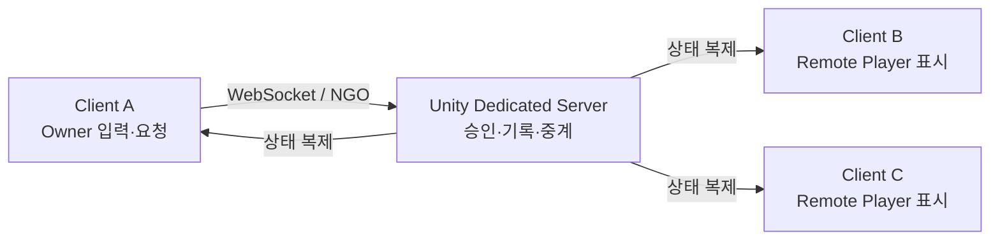
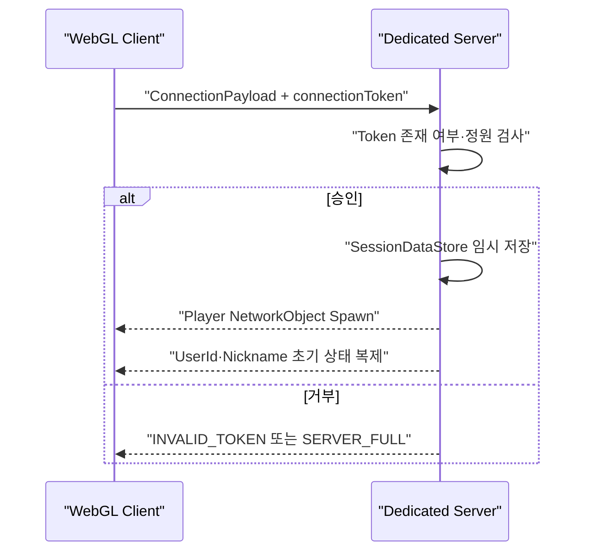
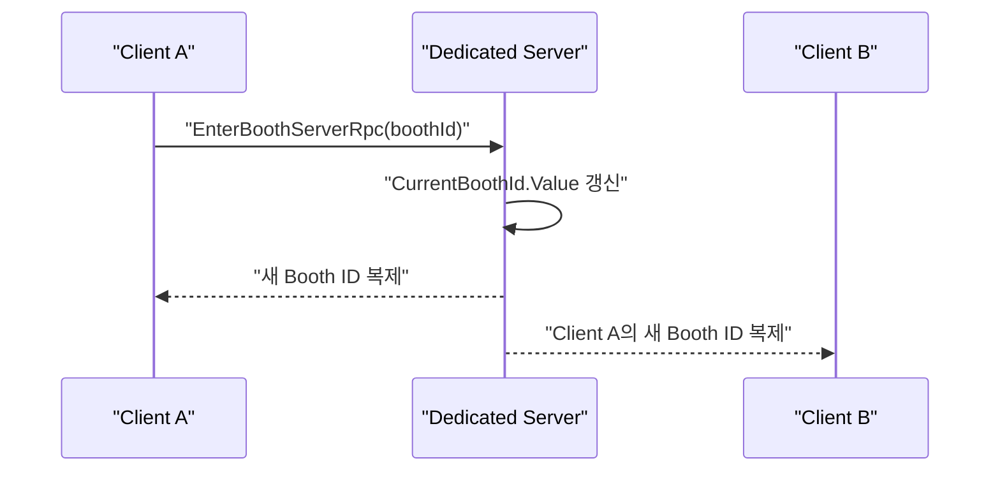
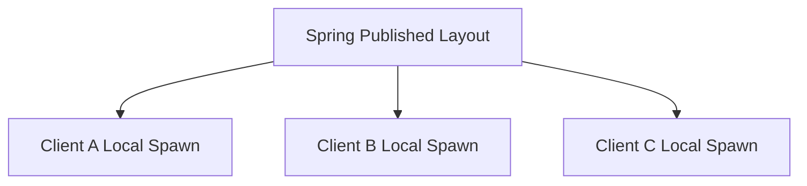
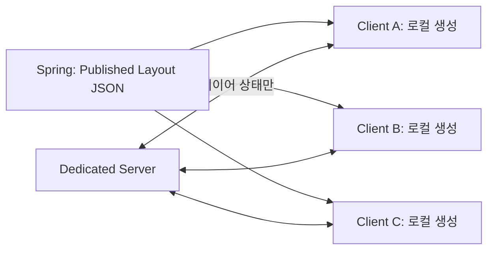

# KHS 기술 컨퍼런스

> **이 문서는 이전 `00_인덱스` + `01~11` 개별 파일 12개를 하나로 합친 것이다** (2026-08-27).
> 개별 파일은 삭제했고 git 이력에 남아 있다. 이후 갱신은 이 파일 하나만 고친다.

## 문서 목적

이 문서는 **KHS가 SSAFESTA에서 직접 구현·설계한 기술**을 다른 파트와 공유하기 위한 개인 학습 자료다.
팀 전체의 작업을 모으거나 다른 담당자의 구현을 대신 설명하지 않는다.
기능 명세를 복사하는 대신 다음 질문에 답한다.

1. 우리 프로젝트에서 어떤 문제가 있었는가?
2. 어떤 기술 개념을 선택했으며, 왜 이 문제에 맞는가?
3. 일반적인 개념을 SSAFESTA 구조에 어떻게 적용했는가?
4. 현재 어디까지 구현됐고 무엇이 계약·설계 단계인가?
5. 다른 파트가 연결할 때 무엇을 지켜야 하는가?

## 현재 기준

- 작성 기준일: 1~7장 2026-08-19 · 8~11장 2026-08-25 · **12장 2026-08-27**
- KHS 구현 범위: Unity Client, NGO 멀티플레이, Booth Runtime, 아바타 커스터마이징·씬 전환·동기화,
  11층 월드, Linux Dedicated Server Docker 실행 구조
- KHS 계약 작업 범위: Unity 가 React·Spring 과 연결되기 위해 필요한 Booth Layout, World Session,
  Web-Unity Bridge 경계
- 제외 범위: 다른 담당자가 구현한 React 화면, Spring 비즈니스 로직, FastAPI AI 내부 구현
- 8~11장은 2026-08-24 컨설턴트 피드백에 대한 분석·대응 기록이다. 앞 장들이 "무엇을 어떻게
  구현했는가"라면, 이쪽은 **"왜 그 선택이었고 지금 무엇이 검증되지 않았는가"** 를 다룬다.
- **12장은 외부 발표용**이다. 청중이 웹 개발자라 모든 게임 용어에 웹 비유를 붙였고,
  1장·7장의 내용을 발표 형태로 다시 구성했다. 수치는 전부 실측값이다.

### 표기 규칙

| 표기 | 뜻 |
|---|---|
| `구현됨` | 현재 저장소 코드로 확인 가능한 항목 |
| `설계/계약` | 팀 합의와 후속 구현이 필요한 항목 |
| `판단` | 구현도 계약도 아닌 **작성자의 분석·제안**. 팀 합의 전까지 확정 사항으로 인용하지 않는다 |

## 목차

| 장 | 제목 | 핵심 내용 |
|---|---|---|
| 1 | 멀티플레이와 상태 동기화 | NGO, 서버 권한, NetworkVariable/RPC, 로컬 생성 경계 |
| 2 | Unity 클라이언트와 부스 런타임 | Published Layout 을 Prefab 으로 만드는 Registry/Factory 구조 |
| 3 | Dedicated Server 와 실행 환경 | WebSocket 서버, Linux 빌드, Docker 실행 |
| 4 | Unity 연동을 위한 통신 계약 | REST DTO, 식별자, Web-Unity 연결 경계 |
| 5 | 아바타 커스터마이징과 동기화 | 모듈형 파츠, 외형 직렬화, 멀티플레이 전파 |
| 6 | Unity 문제 해결과 검증 | WebGL·URP·NGO 문제를 재발 방지 규칙으로 만든 과정 |
| 7 | 멀티플레이 상호작용 환경 실전 구조 | Client·Server 역할, 이동·부스·아바타 동기화 흐름 |
| 8 | WebGL 렌더링 아키텍처 선택 | 픽셀 스트리밍 대신 클라이언트 복제를 택한 이유 |
| 9 | 동시접속 규모와 성능 예산 | 30~40명 목표의 검증 수준, 실측 최적화 이력, 남은 병목 |
| 10 | 부스 자동 생성과 외부 확장 | 자동화 가능 구간, 3계층 에셋 전략, Rule+LLM 역할 분리 |
| 11 | 서비스 포지셔닝과 출시 경로 | VRChat 과의 차이, 실제 경쟁 상대, 출시 검토 |
| **12** | **총 한 발에 일어나는 일 (발표용)** | **RTT·틱 레이트, 이벤트↔상태, 권위 모델, 실패담과 측정** |

## KHS 작업 범위 연결 그림



## KHS 작업에서 세운 연동 원칙

- Unity 는 3D 월드와 입력·상호작용·멀티플레이 표현을 담당한다.
- KHS 가 구현한 Unity 는 영구 데이터를 직접 소유하지 않고 외부 계약을 통해 조회한다.
- React·Spring 의 내부 구현은 이 문서의 범위가 아니며, Unity 가 요구하는 입력·출력 경계만 기록한다.
- 정적 부스 배치는 네트워크 Spawn 하지 않고 동일한 Published Layout 으로 각 Unity Client 가 재현한다.
- 플레이어 위치·입장 상태·아바타 같은 공유 상태는 Dedicated Server 를 통한다.
- 계약 필드와 URL 은 한 파트가 임의로 바꾸지 않는다. 변경 시 React·Spring·Unity 가 함께 갱신한다.

## 연결된 기준 문서

- [전체 시스템 아키텍처](../../07_전체_시스템_아키텍처.md)
- [Backend API 명세](../../08_Backend_API_명세서.md)
- [Frontend 설계](../../10_Frontend_설계서.md)
- [Unity Client 설계](../../11_Unity_Client_설계서.md)
- [Unity Game Server/Network 설계](../../12_Unity_Game_Server_Network_설계서.md)
- [Realtime 통신 명세](../../16_Realtime_통신_명세서.md)
- [Booth Studio 계약](../../../specs/005-booth-studio-layout/spec.md)
- [Booth Runtime 계약](../../../specs/006-booth-runtime/spec.md)

---

## 1. 멀티플레이와 상태 동기화

### 1. 해결하려던 문제

KHS가 담당한 멀티플레이 POC에서는 브라우저의 여러 사용자가 같은 11층 월드에 접속하고 서로의 이동·닉네임·아바타·부스 입장 상태를 보도록 해야 했다. 반면 부스 안의 책상·스크린·장식까지 서버가 하나씩 네트워크 오브젝트로 전송하면 접속 직후 Spawn 수와 트래픽이 불필요하게 커진다.

따라서 상태를 두 종류로 나눴다.

| 상태 | 처리 방식 | 이유 |
|---|---|---|
| 플레이어 위치·회전 | Owner Client가 갱신하고 Dedicated Server가 다른 Client에 중계 | 현재 POC는 Client 권위 이동이며 서버 검증은 후속 구현 |
| 닉네임·현재 부스·아바타 | Dedicated Server가 최종값을 기록하고 전 Client에 복제 | 사용자 간 일관성과 권한 검증 필요 |
| 애니메이션·이모트 | Owner Write 상태를 Dedicated Server가 중계 | 빈번한 표현 상태의 POC |
| 책상·장식·스크린 등 정적 부스 배치 | Published Layout을 각 Client가 로컬 생성 | 같은 입력 데이터로 결정적으로 재현 가능 |
| AI 채팅·설문·긴 텍스트 입력 | React/Spring/FastAPI | 게임 서버가 업무 API와 UI까지 중계하지 않도록 분리 |

### 2. 사용한 기술 개념

#### Netcode for GameObjects

Unity 6의 Netcode for GameObjects(NGO) 2.4.3을 사용한다. NGO는 `NetworkObject`의 수명주기, `NetworkVariable` 상태 복제, RPC 요청을 제공한다.

- `NetworkVariable`: 현재 상태를 보관하며 늦게 접속한 사용자도 최신 값을 받는다.
- RPC: “부스에 입장하고 싶다”, “외형을 바꾸고 싶다”처럼 행위를 서버에 요청한다.
- Server Authority: 중요한 값을 서버만 최종 기록한다.
- Owner Write: 걷기 애니메이션처럼 소유 클라이언트가 자주 갱신해도 되는 값만 제한적으로 허용한다.

#### 상태 복제와 이벤트의 구분

현재 상태가 중요한 값은 `NetworkVariable`, 한 번의 요청이나 명령은 RPC가 적합하다. 예를 들어 `CurrentBoothId`는 새 접속자도 알아야 하므로 상태로 저장하고, 입장 시도는 Server RPC로 보낸다.

#### Client와 Client는 직접 연결하지 않는다

현재 구조는 Peer-to-Peer가 아니다. Client A가 Client B에게 직접 위치나 외형을 보내는 것이 아니라, NGO 연결의 중심인 Dedicated Server가 요청 또는 상태를 받고 다른 Client에 복제한다.

```text
Client A 입력/요청
→ Dedicated Server
→ NGO 상태 복제
→ Client B, C가 같은 결과를 수신
```

이 구조에서는 한 사용자가 나가도 서버와 나머지 사용자의 월드가 유지되고, 서버가 접속 정원과 공유 상태의 최종 기록 지점을 가질 수 있다.

### 3. SSAFESTA 적용 방식



`NetworkPlayer`는 다음 값을 분리했다.

| 값 | 쓰기 권한 | 의미 |
|---|---|---|
| `UserId`, `Nickname`, `AvatarCode` | Server | 접속 승인 데이터에서 생성하므로 사용자 위조 방지 |
| `CurrentBoothId` | Server | 서버가 승인한 부스 위치 상태 |
| `AnimState`, `EmoteId` | Owner | 빈번한 표현 상태의 POC |

이동은 `ClientAuthoritativeNetworkTransform`을 사용한다. 소유 Client가 위치·회전을 갱신하고 Dedicated Server가 원격 Client에 중계하는 POC이므로 반응은 빠르지만, 현재 서버에는 속도·거리·순간이동 검증이 없다. 운영 단계에서 서버 검증을 추가하기 전까지는 완전한 Server Authority 이동이라고 부르면 안 된다.

접속 시 Client가 `ConnectionPayload`를 보내고 `ConnectionManager`가 정원과 토큰을 검사한다. 승인한 사용자 정보는 `SessionDataStore`에 잠시 보관한 뒤 Player Spawn 시 서버가 `NetworkVariable`에 기록한다.

> **2026-08-27 갱신** — 작성 당시에는 “비어 있지 않으면 통과”하는 POC였으나 **현재는 구현됐다.**
> `WorldEntryTokenVerifier` 가 서명·발급자·만료·worldId 를 자체 검증하고(Spring 호출 없음),
> `GrantReplayLedger` 가 토큰 고유값(jti)을 소비해 재사용을 막는다. 원장 기록에 실패해도 거부한다(fail-closed).
> 신원은 **토큰 클레임이 정본**이며 클라이언트가 보낸 userId·nickname 은 쓰지 않는다. 자세한 내용은 12장.

### 4. 정적 부스를 NetworkObject로 만들지 않은 이유

모든 사용자가 같은 `Published Layout JSON`을 받으면 같은 `type`, `assetCode`, 좌표와 회전으로 같은 Prefab을 만들 수 있다. 이 데이터는 자주 변하지 않으므로 다음 방식이 효율적이다.

```text
Spring Published Layout
├─ Client A → Local Spawn
├─ Client B → Local Spawn
└─ Client C → Local Spawn
```

이 선택으로 얻는 이점은 다음과 같다.

- 부스 가구 수만큼 NetworkObject Spawn 메시지를 보내지 않는다.
- 게임 서버가 업무 데이터 저장소가 되지 않는다.
- 여러 World Channel도 하나의 Published Layout을 공유한다.
- 새 타입이 추가되어도 Unity Registry/Factory 매핑만 확장할 수 있다.

단, 움직이는 공동 오브젝트나 점수처럼 상호작용 결과가 공유되어야 하는 기능은 서버 동기화 대상이다.

### 5. 현재 구현 상태

#### 구현됨

- WebSocket Transport 강제
- Dedicated Server 자동 시작과 `-port`, `-maxPlayers` 인자
- Connection Approval, 정원 제한, 세션 정리
- **월드 입장 토큰 서명 자체 검증 + jti 재사용 차단(fail-closed)** *(2026-08-27 갱신)*
- Player 기본 상태의 `NetworkVariable`
- Owner 권위 `NetworkTransform`을 통한 이동·회전 서버 중계 POC
- 부스 입장/퇴장 RPC POC
- 아바타 외형 문자열의 서버 기록과 전원 복제
- 정적 Booth Runtime Local Spawn

#### 후속 구현

- 부스 존재·Lease·거리·입장 가능 상태 검증
- 서버 권한 텔레포트와 내부 Anchor 매핑
- 재접속·채널 이동 상태 머신
- 운영 환경 30~40명 부하 측정

### 6. 파트 간 체크 포인트

- Backend는 World Session 응답에 `endpoint.scheme/host/port`와 짧은 수명의 `connectionToken`을 제공해야 한다.
- Unity는 endpoint를 코드에 고정하지 않고 Session 응답을 사용해야 한다.
- Avatar 문자열 최대 길이와 버전 호환 규칙을 Backend DB 길이 제한에 반영해야 한다.
- 정적 Layout 변경은 Publish 이후 다시 조회하는 정책과 갱신 시점을 함께 합의해야 한다.

### 7. 관련 코드와 문서

- `festa-unity/Assets/_Project/Scripts/Network/Bootstrap/NetworkBootstrap.cs`
- `festa-unity/Assets/_Project/Scripts/Network/Connection/ConnectionManager.cs`
- `festa-unity/Assets/_Project/Scripts/Network/Player/NetworkPlayer.cs`
- `festa-unity/Assets/_Project/Scripts/World/Avatar/PlayerAppearanceController.cs`
- [월드 세션 Spec](../../../specs/002-world-session/spec.md)
- [Game Server/Network 설계](../../12_Unity_Game_Server_Network_설계서.md)

---

## 2. Unity 클라이언트와 부스 런타임

### 1. 해결하려던 문제

KHS가 담당한 Unity Booth POC에서 부스마다 Scene과 GameObject를 직접 만들어 저장하면 부스 수가 늘 때 Scene 관리가 어렵고, 운영자가 웹에서 수정한 배치를 Unity에 반영하기도 힘들었다. 하나의 World Scene에서 여러 임대 부스를 운영하기 위해 **데이터로 배치를 표현하고 Unity가 런타임에 조립하는 구조**를 적용했다.

### 2. 사용한 기술 개념

#### 데이터 주도 생성

화면에 무엇을 둘지 Scene에 하드코딩하지 않고 Layout DTO가 결정한다. 같은 JSON이 입력되면 같은 결과가 만들어지는 구조다.

#### Registry와 Factory 패턴

- Registry: 비즈니스 타입과 Unity Prefab의 매핑을 보관한다.
- Factory: DTO 하나를 받아 올바른 Prefab을 만들고 Transform과 기능 컴포넌트를 적용한다.
- Runtime: API 조회, 기존 오브젝트 제거, 전체 재생성을 조정한다.

이렇게 책임을 나누면 API 파싱, 자산 매핑, 생성 수명주기를 서로 독립적으로 바꿀 수 있다.

### 3. SSAFESTA 적용 흐름



1. `BoothRuntime`이 `boothId`로 공개 Layout을 조회한다.
2. 새 Layout 적용 전 `Clear()`로 이전에 만든 자식 오브젝트를 제거한다.
3. `BoothObjectFactory`가 `type`을 Canonical Enum으로 해석한다.
4. `BoothObjectRegistry`에서 Prefab을 찾고, 없으면 POC Placeholder를 만든다.
5. DTO의 로컬 위치와 Y축 회전을 Booth Anchor 기준으로 적용한다.
6. `BoothRuntimeObject`에 `boothId`, `objectId`, `configId`를 남겨 클릭 시 웹 기능과 연결할 수 있게 한다.

### 4. 계약 필드가 실제 Unity 동작으로 바뀌는 방법

| Layout 값 | Unity 적용 |
|---|---|
| `boothId` | 어느 부스 Runtime인지 식별 |
| `objectId` | 배치 인스턴스 식별과 이벤트 추적 |
| `type` | Prefab 종류와 기능 컴포넌트 선택 |
| `assetCode` | 같은 타입 안에서 구체 자산 선택 예정 |
| `position` | Booth Anchor 기준 로컬 좌표, 1 단위 = 1m |
| `rotationY` | 바닥 기준 Y축 회전 |
| `configId` | AI·설문·노트북 홈페이지 등 Spring 설정 참조 |

URL이나 긴 콘텐츠 원문을 Layout에 직접 넣지 않고 `configId`로 참조하면 배치 계약과 업무 데이터를 분리할 수 있다.

### 5. 장애 격리와 전방 호환

새 Backend가 Unity보다 먼저 배포되어 모르는 `type`이 내려올 수 있다. 이때 부스 전체를 실패시키는 대신 해당 오브젝트만 경고 후 건너뛴다. HTTP 404는 “공개 Layout 없음”으로 처리하고, 통신·파싱 오류는 로그를 남긴 뒤 다른 게임 기능을 유지한다.

이 방식은 완전한 무시가 아니라 다음 원칙을 가진다.

- 알 수 없는 타입: 개별 오브젝트 Skip
- Layout 없음: 빈 부스로 유지
- 잘못된 JSON: 재생성하지 않고 오류 기록
- 정상 새 Layout: 기존 Runtime Object를 지우고 일괄 Rebuild

### 6. 외부 슬롯과 내부 슬롯 풀

1차 MVP는 사용자마다 별도 Scene이나 서버를 만들지 않는다.

- 외부 슬롯: 고정 구조물과 제한된 Facade만 표시
- 내부 Anchor: 물리 임대 슬롯 수만큼 미리 배치
- 입장 승인: Dedicated Server가 Lease와 입장 상태를 확인
- 내부 구성: 입장한 Client만 Published Layout을 Local Spawn
- 퇴장/만료: 플레이어를 외부로 이동한 뒤 `BoothRuntime.Clear()`

이 구조는 서버·Scene 수를 폭증시키지 않으면서 부스 내부를 분리해 보여 준다.

현재 공용 월드는 `Models/11th-0819`을 `main` Scene의 `@World_11F` 아래에 정적으로 배치한다. 런타임에 빈 월드 Root를 복제하지 않으며 `WorldSceneLayout`은 Scene에 저장된 월드, 외부 Booth Slot, 내부 Anchor와 Spawn 표시를 보조한다. 새 맵의 실제 네트워크 Spawn 중심은 SSAFY 로고 앞 `(-75, 0, -235)`이고 최대 40명을 8 × 5, 2.25m 간격으로 분산한다. 내부 슬롯은 월드에서 보이지 않는 먼 좌표에 8개를 미리 두고, 각 슬롯에 다음 기준점을 둔다.

- `EntryAnchor`: 부스 내부 입장 시 플레이어 도착 위치
- `ExitAnchor`: 내부에서 외부로 나갈 때 기준 위치
- `ContentAnchor`: Published Layout 오브젝트를 조립할 부모 위치

이 단계는 React 편집기나 Spring API 없이 Unity 단독으로 공간과 이동 동선을 검증할 수 있다. 이후 Layout 연동 시 `ContentAnchor` 아래만 동적으로 채우면 고정 건축 구조와 임대 콘텐츠의 수명주기가 섞이지 않는다.

11층 결합 Mesh에는 정적 비볼록 `MeshCollider`를 연결했다. 따라서 공용 건축물과 바닥은 Booth Layout 데이터와 무관한 고정 월드 지형으로 유지된다.

공용 입장 구역은 최대 40명을 8 × 5 그리드로 분산한다. Dedicated Server의 Connection Approval도 동일 좌표 규칙을 사용하므로 Scene에 보이는 Spawn 기준과 실제 Network Player 생성 위치가 일치한다.

### 7. 현재 구현 상태

#### 구현됨

- Layout DTO 파싱
- Mock/HTTP API Client 교체 구조
- Registry/Factory/Runtime Local Spawn
- 위치·회전 적용
- Unknown Type 격리
- AI NPC·Video Screen POC Component 연결
- URP 호환 Placeholder Material과 Runtime Font 지정
- canonical 10종 Prefab 카탈로그와 `BoothObjectRegistry` 매핑
- 공통 `BoothInteractionTarget` 기반 Collider·상호작용 거리·Hover Highlight
- 노트북·상담 데스크·프로젝트 패널·영상 스크린 등 기능별 POC 외형
- Mock Layout 격자 배치로 위치·Y 회전·구 별칭·Unknown 격리 검증

#### 설계/후속

- 실제 서비스 아트 Prefab과 `assetCode` 세부 매핑
- 외부 Facade Runtime
- 서버 승인 텔레포트와 내부 Anchor 연결
- Publish 변경 자동 새로고침
- URL·설문·프로젝트·상담 Overlay E2E
- Addressables 도입 여부와 자산 버전 정책

### 8. 관련 코드와 문서

- `festa-unity/Assets/_Project/Scripts/Booth/Runtime/BoothRuntime.cs`
- `festa-unity/Assets/_Project/Scripts/Booth/Factory/BoothObjectFactory.cs`
- `festa-unity/Assets/_Project/Scripts/Booth/Factory/BoothObjectRegistry.cs`
- `festa-unity/Assets/_Project/Scripts/Booth/Interaction/BoothInteractionTarget.cs`
- `festa-unity/Assets/_Project/Editor/Booth/BoothPrefabCatalogBuilder.cs`
- `festa-unity/Assets/_Project/Prefabs/Booth`
- `festa-unity/Assets/_Project/Scripts/Integration/Spring/HttpBoothApiClient.cs`
- [Booth Studio 계약](../../../specs/005-booth-studio-layout/spec.md)
- [Booth Runtime 계약](../../../specs/006-booth-runtime/spec.md)

---

## 3. Dedicated Server와 실행 환경

### 1. KHS가 해결하려던 문제

에디터 Host 한 대에 다른 사용자가 붙는 방식은 개발 확인에는 편하지만 운영 구조가 아니다. Host 사용자가 종료하면 월드가 사라지고, 브라우저 Client가 임의로 서버 역할을 맡게 되며, 채널별 정원과 접속 승인을 일관되게 관리하기 어렵다.

KHS 작업에서는 **그래픽이 없는 Unity Linux Dedicated Server를 별도 프로세스로 실행**하고 WebGL Client가 WebSocket으로 접속하는 POC를 구성했다.

### 2. 적용한 개념

#### Dedicated Server

Dedicated Server는 플레이 화면을 렌더링하지 않고 네트워크 권한과 공유 상태만 처리한다. SSAFESTA에서는 다음 책임을 가진다.

- Client 접속 승인과 정원 제한
- Player NetworkObject Spawn·Despawn
- 위치·상태·아바타 외형 전파
- 현재 Booth/Zone 상태의 서버 권한 관리

정적 부스 가구나 AI 응답을 직접 보관·렌더링하는 서버는 아니다.

Client끼리는 서로 직접 Socket을 연결하지 않는다. 모든 WebGL Client는 Dedicated Server에만 접속하며, 한 Client의 이동·부스 상태·아바타 변경은 NGO가 서버를 경유해 다른 Client에 전달한다. 단, 현재 이동 Transform은 Owner Client 권위이고 서버는 중계 역할을 하며, 닉네임·부스 ID·아바타 외형값은 서버가 최종 기록한다.

#### Headless Linux Build와 Container

Unity Linux Server 빌드를 Ubuntu 22.04 기반 Docker Image에 넣었다. 실행 시 `-batchmode -nographics`를 사용하고, 컨테이너 내부에서는 비루트 `unity` 사용자로 프로세스를 실행한다.

컨테이너화한 이유는 다음과 같다.

- 개발 PC와 운영 서버의 실행 환경 차이를 줄인다.
- 동일 Image를 여러 Channel 인스턴스로 반복 실행할 수 있다.
- 포트, 정원 같은 값을 실행 인자로 바꿀 수 있다.
- 이후 ECR/ECS 같은 환경으로 옮길 수 있는 배포 단위를 만든다.

### 3. 브라우저 때문에 WebSocket을 선택한 이유

일반 Native Unity Client는 UDP를 쓸 수 있지만 브라우저 WebGL은 임의 UDP Socket을 열 수 없다. 그래서 `NetworkBootstrap`이 Client와 Server 모두 `UnityTransport.UseWebSockets = true`로 통일한다.

로컬 개발 경로는 다음과 같다.

```text
WebGL Browser
  └─ ws://127.0.0.1:7777
       └─ Docker Port Mapping
            └─ Unity Linux Dedicated Server
```

운영 후보 경로는 다음과 같으며 아직 AWS E2E 검증 전이다.

```text
HTTPS Web Page
  └─ wss://world.example.com
       └─ Load Balancer에서 TLS 종료
            └─ ws://Unity Dedicated Server:7777
```

HTTPS 페이지는 보안 정책상 평문 `ws://`로 접속할 수 없으므로 운영에서는 `wss://`가 필요하다.

### 4. 실행 설정을 코드와 분리한 방법

`NetworkBootstrap`은 다음 CLI 인자를 읽는다.

| 인자 | 기본값 | 역할 |
|---|---:|---|
| `-port` | 7777 | 서버 수신 포트 |
| `-maxPlayers` | 40 | 채널 정원 |

서버는 컨테이너에서 모든 인터페이스를 받아야 하므로 `0.0.0.0`에 Bind한다. Client는 World Session API가 준 실제 Host와 Port로 연결한다.

### 5. 채널 확장에 적용한 생각

한 서버에 모든 사용자를 넣는 대신 동일 월드를 실행하는 여러 Dedicated Server를 Channel로 본다.

```text
11F World Data
├─ Channel 01: Dedicated Server, 목표 30~40명
├─ Channel 02: Dedicated Server, 목표 30~40명
└─ Channel 03: Dedicated Server, 목표 30~40명
```

각 채널은 플레이어 상태만 따로 가지며 Booth Published 데이터는 Spring에서 함께 읽는다. 따라서 채널 수가 늘어도 Booth Layout을 채널마다 복제 저장하지 않는다.

Session/Channel Manager와 자동 증설은 KHS가 구현한 범위가 아니다. KHS는 Unity가 고정 주소가 아니라 `scheme/host/port` 응답을 받아 연결할 수 있는 Client 경계를 준비했다.

### 6. 현재 구현 상태

#### KHS 구현 완료

- Unity Server/Batch Mode 자동 `StartServer()`
- WebSocket Transport 강제
- 포트·정원 CLI 파싱
- Linux Server용 Dockerfile
- 비루트 사용자 실행
- 로컬 Browser ↔ Docker Server 테스트 절차 문서화

#### 아직 검증·구현하지 않은 범위

- 실제 AWS ECR/ECS 배포
- ALB `wss` TLS 종료 E2E
- Session/Channel Manager
- 자동 Health Check·Drain·Scale-out
- 운영 동시접속 30~40명 부하 시험

### 7. 관련 파일

- `festa-unity/Assets/_Project/Scripts/Network/Bootstrap/NetworkBootstrap.cs`
- `festa-unity/Assets/_Project/Scripts/Network/Connection/ConnectionManager.cs`
- `festa-unity/Docker/Dockerfile`
- `festa-unity/Docker/README.md`
- [월드 세션 Spec](../../../specs/002-world-session/spec.md)

---

## 4. Unity 연동을 위한 통신 계약

### 1. 이 문서의 범위

이 문서는 Frontend나 Backend 담당자의 내부 구현을 설명하지 않는다. KHS가 Unity 기능을 구현하면서 **Unity가 외부 파트에서 무엇을 받아야 하고 무엇을 전달해야 하는지** 정의·정리한 계약만 다룬다.

### 2. 해결하려던 문제

React, Spring, Unity가 같은 기능을 각자 구현하더라도 URL, 필드명, 좌표 기준이 다르면 통합 시 실패한다. 실제로 초기 문서에는 공개 Layout 경로가 `/layouts/published`와 `/layout/published`, 오브젝트 ID가 `objectId`와 `id`로 갈린 적이 있었다.

이 문제를 해결하기 위해 Canonical Contract를 한 번 정하고 Unity DTO와 HTTP Client를 그 계약에 맞췄다.

### 3. Published Layout 계약

Unity가 사용하는 조회 경로는 다음과 같다.

```http
GET /api/v1/booths/{boothId}/layouts/published
Authorization: Bearer {accessToken}
```

핵심 JSON 형태는 다음과 같다.

```json
{
  "boothId": 7,
  "template": "PROJECT_EXHIBITION",
  "version": 2,
  "objects": [
    {
      "objectId": "ai-1",
      "type": "AI_AGENT",
      "assetCode": "ai_staff_01",
      "position": { "x": 1.2, "y": 0.0, "z": 1.5 },
      "rotationY": 0.0,
      "configId": 78
    }
  ]
}
```

#### KHS가 Unity 관점에서 고정한 규칙

- 배치 인스턴스 식별자는 `objectId`다.
- Unity 자산 식별자는 `assetCode`다.
- 좌표는 Booth Anchor 기준 로컬 좌표이며 Unity 1 단위를 1m로 본다.
- 회전은 MVP에서 Y축 `rotationY`만 사용한다.
- AI·설문·홈페이지 원문은 넣지 않고 Spring 설정의 `configId`만 가진다.
- Unity는 Draft가 아니라 Published만 조회한다.
- 모르는 `type`은 부스 전체를 중단하지 않고 그 항목만 건너뛴다.

### 4. Draft와 Published를 나눈 이유

Unity 방문자에게 운영자의 편집 중 상태가 즉시 보이면 미완성 배치나 잘못된 설정이 노출된다. 그래서 Unity가 읽는 공개 계약은 Publish 시점의 Version으로 한정했다.

```text
편집 중 Draft 저장
        └─ 방문자에게 보이지 않음
Publish
        └─ 새 Published Version 생성
Unity 입장/갱신
        └─ Published만 조회·렌더링
```

Draft 저장·Publish의 Backend 내부 구현은 다른 담당 범위이며, KHS 작업은 Unity가 Published만 소비하도록 경계를 정한 것이다.

### 5. World Session 계약

Unity Client가 서버 주소를 하드코딩하면 Channel 확장이 불가능하다. 따라서 접속 전 World Session 응답이 다음 값을 준다는 경계를 사용한다.

```json
{
  "connectionToken": "short-lived-token",
  "endpoint": {
    "scheme": "wss",
    "host": "world.example.com",
    "port": 443
  }
}
```

Unity는 `scheme`에 따라 Transport 암호화를 설정하고 `connectionToken`을 NGO Connection Payload에 포함한다. 현재 서버 검증은 POC이므로 운영 검증 방식은 팀 합의가 필요하다.

### 6. Web-Unity 기능 경계

KHS가 구현한 Unity 오브젝트는 클릭 가능한 3D 진입점을 제공하고, 한글 입력이나 긴 업무 UI는 React Overlay로 넘기는 방향을 문서화했다.

```text
Unity 오브젝트 클릭
→ window.FestaUnity.onBoothInteract(json)
→ BOOTH_LAPTOP_INTERACT { boothId, objectId, url? }
→ React Overlay 열기
→ React가 Spring/FastAPI 호출
→ 결과 UI 표시
```

Unity가 담당하는 것은 3D 오브젝트, 거리/클릭 판정, 현재 Booth 문맥이다. React 내부 화면과 API 상태 관리는 이 자료의 범위가 아니다.

2026-08-18 기준 FE·Unity가 위 노트북 이벤트 계약을 확정했고 Unity LAPTOP 타입·클릭 송신부·WebGL 브리지까지 구현했다. `boothId`와 `objectId`는 필수이고 `url`은 선택이며, URL이 없으면 React가 오류 대신 안내를 표시한다.

주의할 실제 실패 형태는 다음과 같다. 계약 JSON이 `objectId`를 보내는데 Unity DTO가 구 `id`만 읽으면 Runtime Object 식별자가 null이 되고, Bridge의 guard가 조기 반환한다. 따라서 **빈 식별자 이벤트가 전달되는 것이 아니라 클릭해도 이벤트가 전혀 전달되지 않는다.** 현재는 `objectId`를 정식 필드로 사용하며 `id`는 구 데이터 fallback으로만 지원한다.

### 7. 실패 처리 계약

| 상황 | Unity 처리 |
|---|---|
| 200 + 정상 JSON | Layout 재생성 |
| 404 | Published 없음으로 보고 빈 부스 유지 |
| 401/403 | 권한 오류 기록, 생성 중단 |
| 5xx/Timeout/CORS | 통신 오류 기록, Client 전체는 유지 |
| 알 수 없는 `type` | 해당 Object만 Skip |
| 빈 `objects` | 정상 빈 Layout으로 처리 |

### 8. 현재 상태와 다음 연결 작업

#### KHS가 반영한 부분

- Unity DTO의 `objectId` 기준 정리 완료 (`id`는 하위 호환 fallback)
- `FURNITURE`·`DECORATION`의 `assetCode` 기반 Registry 조회 완료
- Published Endpoint 통일
- `configId`를 Runtime Object에 보존
- Mock/실제 HTTP Client 인터페이스 분리
- 404·Protocol·Network·Parse 실패 분리
- World Session Endpoint를 받을 수 있는 접속 함수

#### 타 파트와 함께 검증해야 하는 부분

- 실제 Spring 응답과 Unity JSON 역직렬화 E2E
- 인증 토큰 전달·갱신 방식
- 확정된 React ↔ Unity 이벤트 계약의 Unity 송신부·WebGL 브리지 구현
- Publish 직후 새로고침 방식
- 좌표 편집기 픽셀↔Unity meter 변환 규칙

### 9. 관련 파일과 문서

- `festa-unity/Assets/_Project/Scripts/Integration/Spring/HttpBoothApiClient.cs`
- `festa-unity/Assets/_Project/Scripts/Booth/Layout/BoothLayoutDto.cs`
- `festa-unity/Assets/_Project/Scripts/Booth/Runtime/BoothRuntimeObject.cs`
- `festa-unity/Assets/_Project/Scripts/Network/Connection/ConnectionManager.cs`
- [Backend API 계약](../../08_Backend_API_명세서.md)
- [Realtime 통신 계약](../../16_Realtime_통신_명세서.md)

---

## 5. 아바타 커스터마이징과 동기화

### 1. KHS가 해결하려던 문제

초기 아바타는 고정 프리셋에 가까워 얼굴·헤어·의상 조합과 세부 색상을 표현하기 어려웠다. 커스터마이징 화면에서 바꾼 모습이 자기 화면에만 보이면 멀티플레이에서도 사용할 수 없다. 또한 서로 다른 파츠를 단순히 겹치면 목이 뜨거나, 피부가 옷을 뚫고 나오거나, 상의/하의를 바꿀 때 숨김 상태가 뒤집히는 문제가 생겼다.

KHS 작업은 이 문제를 다음 세 층으로 나눴다.

1. `AvatarConfig`: 선택한 파츠와 색상을 데이터로 표현
2. `AvatarAssembler`: 데이터를 실제 Mesh·Material 상태로 조립
3. `PlayerAppearanceController`: 결과를 서버를 통해 모든 Client에 전파

### 2. 데이터 모델을 먼저 만든 이유

UI Button이 GameObject를 직접 켜고 끄게 만들면 Preview와 실제 World Avatar가 서로 다른 로직을 가지기 쉽다. 대신 UI는 `AvatarConfig`만 바꾸고, Preview와 World가 같은 Assembler를 사용한다.



`AvatarConfig`에는 다음 항목을 분리했다.

- 파츠: 얼굴, 헤어, 모자, 안경, 상의, 하의, 한벌옷, 신발
- 얼굴 색: 피부, 흰자위, 홍채, 동공, 눈썹, 입술
- 파츠 색: 상의·하의·한벌옷·신발·모자·안경 각각 A/B/C 내부 슬롯 쌍. 사용자 UI에서는 내부 슬롯명을 숨기고 실제로 보이는 부위마다 한 색만 조절하며, 선택한 색을 대응 슬롯 쌍에 동일하게 기록
- 성별과 호환 가능한 파츠 ID

이 구조 덕분에 “홍채를 바꿨는데 흰자까지 변함” 같은 결합 문제를 데이터 단계에서부터 분리할 수 있다.

### 3. 런타임 조립 방식

`AvatarAssembler`는 Config가 바뀌면 다음 순서로 처리한다.

1. 기준 Body와 Animator를 준비한다.
2. 선택한 Skinned Mesh를 기준 Skeleton에 연결한다.
3. Head/Hair/Hat/Glasses/Top/Bottom/Outfit/Shoes를 조합한다.
4. 의상 조합에 따라 가려야 하는 Body Part를 비활성화한다.
5. Renderer Material을 현재 URP에 호환되는 Runtime Material로 준비한다.
6. `MaterialPropertyBlock`으로 얼굴과 의상 색을 적용한다.

#### MaterialPropertyBlock을 쓴 이유

공유 Material 자체를 수정하면 한 아바타의 색 변경이 같은 Material을 쓰는 다른 아바타까지 바꿀 수 있다. `MaterialPropertyBlock`은 Renderer별 속성만 덮어써 Material 공유와 아바타별 색상 독립을 함께 유지한다.

#### 얼굴 색을 분리한 방식

Material 이름과 Shader Property를 기준으로 역할을 나눈다.

- Eye Material: `_ScleraColor`, `_IrisColor`, `_PupilColor`
- Head Material: `_SkinColor`, `_LipColor`, `_EyebrowColor`
- Hair/Eyebrow Material: 해당 Base Color
- Body Material: 얼굴과 같은 Skin Color

피부색은 얼굴만 바꾸지 않고 Body에도 적용해 목 경계선이 생기지 않게 했다.

#### 의상 영역별 색

셰이더와 네트워크 내부에는 `_Color_A_1`, `_Color_A_2`, `_Color_B_1`, `_Color_B_2`, `_Color_C_1`, `_Color_C_2`를 유지한다. 다만 사용자는 A/B/C나 어두운색·밝은색을 알 필요가 없으므로 현재 아이템의 `garmentColorAreaMask`에 포함된 실제 부위만 `재킷 몸판`, `카고 포켓·허리선`, `안경테`처럼 구체적인 이름과 단일 색상 행으로 본다. 한 행에서 고른 색은 해당 부위의 내부 슬롯 두 개에 함께 기록해 기존 `w=` 36색 직렬화와 호환한다. 전·후면 렌더에서 대표 영역 대비 변화가 5% 미만인 부위는 아이템별로 UI에서 숨긴다. 안경 렌즈는 프레임 셰이더로 합치지 않고 투명 머티리얼을 유지하면서 대응 부위 색을 적용한다.

### 4. 외형 직렬화와 네트워크 전파

모듈형 외형은 여러 ID와 정밀 RGB 값을 가진다. KHS는 이를 `fa|...` 형식의 하나의 문자열로 직렬화했다.

```text
fa
|g=성별
|i=8개 파츠 ID
|p=팔레트 ID
|q=정밀 RGB 색상
|w=36개 의상·모자·안경 영역 색상
```

변경 흐름은 다음과 같다.

1. Owner가 Preview에서 외형을 확정한다.
2. `AvatarAppearance.Encode()`로 문자열을 만든다.
3. Server RPC로 변경을 요청한다.
4. 서버가 길이와 기본 유효성을 확인한 뒤 `FixedString4096Bytes NetworkVariable`에 기록한다.
5. 모든 Client의 `PlayerAvatarVisual`이 변경 이벤트를 받고 Decode·Rebuild한다.
6. 프로필 저장 API는 별도로 시도하며 실패해도 현재 월드 외형은 유지한다.

외형 GameObject 자체는 NetworkObject가 아니다. 서버는 외형 데이터만 복제하고 각 Client가 동일 데이터를 로컬 조립한다. 정적 Booth Local Spawn과 같은 “상태만 동기화하고 표현은 로컬 생성” 원칙이다.

### 5. 호환성과 실패 가시성

- 모르는 직렬화 Segment는 무시해 이전 Client가 전체 외형을 깨뜨리지 않게 한다.
- 문자열이 최대 길이를 넘으면 기본값으로 몰래 바꾸지 않고 요청을 거부하고 오류를 표시한다.
- 서버가 2초 안에 같은 값을 반영하지 않으면 오래된 Docker Server 가능성을 사용자에게 알린다.
- 기존 짧은 Preset Code도 Decode할 수 있어 이전 상태와 호환한다.

### 6. 커스터마이징 UI와 카메라 입력

KHS가 구성한 UI 동작은 다음과 같다.

- 왼쪽: 투명 누끼 탭으로 상의·하의·한벌옷·신발을 전환하고 2열 대형 카드와 아이템별 유효 부위 색을 표시
- 오른쪽: 얼굴·헤어·모자·안경을 2열 대형 카드로 선택하고 필요한 색상 영역을 패널 하단에 고정
- 얼굴 탭: 피부·흰자위·홍채·동공·눈썹·입술을 이름으로 구분
- HSV 색상환 + 밝기 Bar: 버튼 팔레트보다 정밀한 색 선택
- 색상 팝업: 전체 화면 스크림 없이 실제 창 안에서만 회전·Zoom 입력을 차단하고 제목을 드래그해 이동
- 최초 진입: 현재 로컬 외형 또는 저장된 `fa` 프로필이 있으면 우선 복원하고, 없으면 자연스러운 추천 상·하의 조합을 생성해 `상의` 탭으로 시작
- 무작위: 자연스러운 얼굴 팔레트와 조화된 의상 테마를 공유하고 모자·안경을 동시에 붙이지 않는 추천 조합 생성
- 좌클릭 Drag: 캐릭터 회전
- 우클릭 Drag: 카메라 Orbit
- Wheel: 부드러운 지수형 Zoom

Pointer Zoom은 단순히 벽의 Raycast 지점을 따라가지 않는다. 화면의 Humanoid Bone Chain 중 Pointer와 가장 가까운 점을 찾아 Focus를 이동하고, Focus를 실제 Avatar Renderer Bounds 안으로 제한한다. Zoom-out은 Focus를 중앙으로 강제 복귀시키지 않고 현재 시점을 유지한 채 뒤로 이동한다.

#### WebGL 창 크기에 대응하는 기준 프레임

커스터마이징 UI는 1600×900을 논리 해상도로 사용하는 하나의 16:9 프레임 아래에 좌측 의상 패널, 중앙 미리보기, 우측 외형 패널을 배치한다. 브라우저 창이 기준보다 좁으면 폭을, 더 넓으면 높이를 스케일 기준으로 사용한다.

이 방식의 목적은 화면을 무조건 늘려 채우는 것이 아니라 카드 크기, 패널 패딩, 스크롤 간격의 상대 관계를 보존하는 것이다. 16:9 캔버스에서는 여백 없이 채워지고, 다른 비율에서는 남는 영역을 안전 여백으로 사용해 UI 찌그러짐과 겹침을 막는다. 카메라 조작 가능 영역도 화면 비율 상수가 아니라 중앙 미리보기 RectTransform에서 계산한다.

얼굴형 4종은 하나의 2×2 atlas를 정해진 순서로 잘라 사용하고, 안경 썸네일은 투명 PNG를 기존 Texture GUID에 덮어써 카탈로그 연결을 보존했다. 외부 이미지 교체 시에는 알파 배경과 실제 콘텐츠 중심을 먼저 확인해야 한다.

같은 디자인의 여성·남성 의상은 실제 장착 메시와 itemId가 다르더라도 사용자에게 보이는 이름·썸네일은 하나의 공통 표시 원본을 사용한다. 따라서 성별을 바꿔도 카드가 구형 T포즈 렌더로 되돌아가지 않는다. 신체 숨김 번호는 성별 Body마다 달라질 수 있으므로 크롭형 상의는 여성·남성의 허리 파츠를 각각 확인하고 `forcedVisibleBodyParts`로 필요한 몸통만 다시 표시한다.

좌·우 패널은 같은 상단 패딩과 `제목 → 120px 탭 → 섹션 제목 → 2열 아이템 목록 → 하단 색상 영역` 기준선을 사용한다. 얼굴·의상·모자·안경 카드에는 같은 중성 회색을, 어두운 헤어에는 더 밝은 배경을 사용한다. 색상 행은 깨진 프레임처럼 보이던 장식 외곽선을 제거하고 단색 마커와 동일 규격의 둥근 색상칩으로 통일했다.

### 7. 현재 구현 상태

#### KHS 구현됨

- 파츠 Catalog/Config/Assembler 구조
- 얼굴·헤어·의상 색상 분리
- HSV 정밀 Color Picker
- 아이템별 유효 색상 부위와 부위당 단일 조정 UI
- 2열 대형 썸네일·투명 의상 탭·하단 고정 색상 영역의 반응형 로비 UI
- 저장 외형 우선 복원과 자연스러운 최초/버튼 무작위 추천
- 이동 가능한 컴팩트 색상 팝업과 팝업 Rect 기반 입력 차단
- Preview Camera 회전·Orbit·Pointer Zoom
- UI Pointer 위 Camera 입력 차단
- 외형 문자열 Encode/Decode
- Server RPC + NetworkVariable 멀티플레이 전파
- Preview와 World의 동일 조립 경로

#### 남은 검증·개선

- 모든 원본 Material의 색 Property 매핑 추가 검수
- 다중 Client에서 게임 중 변경 E2E
- Backend 프로필 저장 계약과 길이 제한 확정
- 서버 측 보유 아이템·허용 파츠 검증
- 장시간 반복 변경 시 Material/오브젝트 누수 측정

### 8. 관련 코드

- `festa-unity/Assets/_Project/Scripts/World/Avatar/Core/AvatarConfig.cs`
- `festa-unity/Assets/_Project/Scripts/World/Avatar/Assembly/AvatarAssembler.cs`
- `festa-unity/Assets/_Project/Scripts/World/Avatar/AvatarAppearance.cs`
- `festa-unity/Assets/_Project/Scripts/World/Avatar/PlayerAppearanceController.cs`
- `festa-unity/Assets/_Project/Scripts/World/Avatar/PlayerAvatarVisual.cs`
- `festa-unity/Assets/_Project/Scripts/World/Avatar/Lobby/CharacterLobbyController.cs`
- `festa-unity/Assets/_Project/Scripts/World/Avatar/Lobby/AvatarColorPicker.cs`

---

### 9. 월드 입장 외형 전달: 짧은 접속 데이터와 전체 외형 데이터의 분리

이 프로젝트의 모듈 외형은 `fa|...` 한 문자열에 파츠 ID와 색상값을 함께 담는다. 최대 길이가 3800자라서, 접속 승인처럼 짧은 식별자를 전제로 만든 필드에 그대로 실으면 월드에서는 기본 몸체만 남는 문제가 생긴다.

그래서 KHS 구현은 역할을 두 단계로 나눴다.

```text
CharacterLobby
  └─ 현재 AvatarConfig를 fa 문자열로 저장
      └─ main 접속 요청 (짧은 preset만 사용)
          └─ Owner Player Spawn
              └─ 전체 fa → Server RPC
                  └─ Server Encoded(FixedString4096Bytes)
                      └─ 모든 Client Decode → 로컬 AvatarAssembler 재조립
```

- `NetworkPlayer.AvatarCode`: 접속 승인 호환용 짧은 preset만 유지한다.
- `PlayerAppearanceController.Encoded`: 전체 `fa` 문자열의 권위 있는 멀티플레이 동기화 값이다.
- `AvatarSceneHandoff`: Scene 전환 순간의 외형을 runtime cache와 PlayerPrefs로 전달한다. runtime 값을 우선하여 WebGL 저장 타이밍에 영향을 받지 않게 했다.
- 재시도: Owner Spawn과 Scene 전환이 동시에 일어나도 첫 RPC 누락으로 기본값이 남지 않도록, 서버 반영값을 받을 때까지 제한 시간 동안 재요청한다.

이 구조에서 서버가 최종 외형값을 소유하므로 WebGL만 재빌드해서는 검증할 수 없다. Linux Dedicated Server와 WebGL을 동일 리비전으로 빌드하고 서버를 재시작한 뒤, 두 브라우저 Client에서 선택한 헤어·의상·색상이 모두 같은 결과로 조립되는지 확인해야 한다.

### 10. 감정표현 휠과 멀티플레이 동기화

감정표현은 `Alt + 왼쪽 클릭 드래그`로 휠을 열고, 드래그 방향으로 8개 동작 중 하나를 고르는 방식이다. 입력과 UI는 소유 Client에만 나타나며, 선택된 작은 상태값만 서버와 다른 Client에 공유한다.

```text
Owner Client 입력
  → 8방향 휠에서 EmoteId 선택
  → NetworkPlayer.EmoteId (Owner Write)
  → Dedicated Server가 복제
  → 모든 Client의 OnValueChanged
  → 각 Client가 로컬 모듈러 Animator에서 같은 상태 CrossFade
```

`NetworkAnimator`로 모든 Animator 내부 상태를 그대로 전송하지 않고 `PlayerEmoteId`만 동기화한 이유는 다음과 같다.

- 네트워크에는 8개 중 어느 감정표현인지 나타내는 작은 값만 필요하다.
- 아바타 파츠는 각 Client가 동일한 설정으로 로컬 조립하므로, 조립된 Animator에 같은 상태 이름을 실행하면 같은 결과를 얻는다.
- 외형을 재조립해 Animator 인스턴스가 바뀌어도 현재 `EmoteId`를 새 Animator에 다시 적용할 수 있다.

`강남스타일`과 `트월킹`은 반복 상태이며 이동 입력이 들어올 때까지 유지한다. 일회성 동작은 클립 길이에 맞춰 자동 종료한다. 어느 경우든 이동이 시작되면 Owner가 `EmoteId.None`으로 되돌리고, 각 Client는 0.2초 CrossFade로 Idle/Walk/Run에 복귀한다. 이 방식으로 동작이 갑자기 끊기는 느낌을 줄이면서 서버와 Client 사이의 상태도 하나로 유지한다.

관련 구현은 `NetworkPlayer`, `PlayerEmoteController`, `PlayerMovement`, `PlayerAvatarVisual`, `AvatarAnimator.controller`에 나뉘어 있다.

---

## 6. Unity 문제 해결과 검증

### 1. KHS 작업에서 반복된 문제

Unity Editor에서 정상으로 보이는 코드가 WebGL이나 Linux Dedicated Server에서는 다르게 동작했고, 런타임 생성 자산과 NGO의 제약 때문에 “컴파일은 되지만 화면이나 동기화가 깨지는” 문제가 반복됐다. KHS는 개별 수정에 그치지 않고 원인과 예방 규칙을 남기는 방식으로 대응했다.

세부 발생 기록은 [KHS 트러블슈팅](../25_트러블슈팅.md)에 있고, 이 문서는 그중 재사용 가능한 기술 패턴만 요약한다.

### 2. WebGL 비동기 처리

#### 문제

WebGL은 브라우저 실행 환경과 단일 Thread 제약 때문에 일반 .NET 비동기 코드가 Native Build와 다르게 동작할 수 있다. 특히 게임 Loop와 무관한 `Task.Delay` 기반 대기는 WebGL에서 문제가 되기 쉽다.

#### 적용 방식

- Unity Frame과 연결된 대기는 `Awaitable` 계열을 우선한다.
- `UnityWebRequest` 실패는 `await` 예외와 `request.result`를 모두 고려한다.
- HTTP 오류 하나가 Booth Runtime 전체를 중단시키지 않게 Result별로 분기한다.

#### 프로젝트 예방 규칙

- WebGL 대상 코드에 `Task.Delay`를 새로 넣지 않는다.
- Network/HTTP 실패 경로도 Editor와 WebGL에서 각각 확인한다.
- CORS, Mixed Content(`https` 페이지의 `http/ws` 호출), Timeout을 코드 오류와 분리한다.

### 3. URP에서 마젠타 Material

#### 문제

런타임에 기본 Material이나 호환되지 않는 Shader를 사용하면 URP Build에서 오브젝트가 마젠타로 보인다. Editor에 남아 있는 Shader가 Build에서 Strip되어 런타임 `Shader.Find`가 실패할 수도 있다.

#### 적용 방식

- Placeholder는 `Universal Render Pipeline/Lit`을 명시해 Material을 생성했다.
- Avatar Assembler는 원본 Material의 Texture와 주요 값을 보존하면서 호환 Runtime Material을 준비했다.
- 동일 원본 Material 변환 결과는 Cache해 불필요한 Material 생성을 줄였다.
- 아바타별 색은 공유 Material 변경 대신 `MaterialPropertyBlock`으로 적용했다.

#### 프로젝트 예방 규칙

- Built-in Shader 전제의 Asset을 URP에 바로 사용하지 않는다.
- Runtime에만 찾는 Shader는 실제 Build 포함 여부를 확인한다.
- 색 변경 시 `sharedMaterial` 자체를 수정하지 않는다.

### 4. 런타임 TextMesh 글리치

#### 문제

Unity 6에서 코드로 만든 `TextMesh`가 Font와 Material을 명시하지 않으면 글자가 깨지거나 이상한 Texture로 보일 수 있었다.

#### 적용 방식

`LegacyRuntime.ttf`를 명시적으로 불러와 `TextMesh.font`와 `MeshRenderer.material` 양쪽에 연결했다. Network Player 이름표와 Booth Placeholder Label에 같은 규칙을 사용했다.

### 5. NGO 제약과 오래된 Server Build

#### 문제 1: NetworkVariable 선언

NGO IL Post Processor는 `NetworkVariable`을 필드로 기대한다. Property 형태로 감추면 생성 코드가 인식하지 못할 수 있다.

#### 예방

동기화 값은 `public readonly NetworkVariable<T>` 필드로 선언하고 읽기/쓰기 권한을 생성자에서 명시한다.

#### 문제 2: Client만 최신인 상태

Unity Client 코드를 바꿔도 Docker 안의 Linux Server가 이전 Build면 새 RPC나 긴 외형 문자열을 처리하지 못한다. 화면에서는 Button이 무반응처럼 보일 수 있다.

#### 적용 방식

- 외형 변경 요청 후 서버 `NetworkVariable`에 같은 값이 반영되는지 감시한다.
- 일정 시간 안에 적용되지 않으면 “서버 Build가 최신인지 확인” 오류를 표시한다.
- Client 변경뿐 아니라 Server Build 재생성 여부를 검증 절차에 포함한다.

### 6. 아바타 파츠와 Material 문제를 분리해 진단한 방법

화면에서 피부가 보이는 현상은 한 원인으로 단정할 수 없다.

| 증상 | 우선 확인할 층 |
|---|---|
| 목이 분리되어 보임 | Head/Body Skeleton·Bind Pose·Transform |
| 옷 사이로 피부가 보임 | Body Part 숨김 규칙 또는 의상 Mesh 크기 |
| 상의 없음이 다시 생김 | Config 병합·Category 독립성 |
| 홍채 변경 시 눈 전체 변경 | Eye Shader Property/Material Slot 분리 |
| 피부색이 얼굴에만 적용 | Head와 Body Renderer 적용 범위 |
| 색이 다른 사용자까지 변함 | 공유 Material 수정 여부 |

KHS 구현에서는 선택 데이터, 조립·숨김, Material Property의 세 층을 따로 확인하도록 구조를 나눴다.

### 7. 검증 순서

#### 코드 단계

1. Unity Compile Error 0건 확인
2. Console의 신규 Error 확인
3. DTO Encode→Decode 왕복 확인
4. Unknown Type·404 같은 실패 경로 확인

#### Editor 단계

1. 성별·각 파츠 탭 전환
2. 없음 상태 유지와 다른 Category 변경 간 독립성
3. 얼굴 6색·의상 24색 격리
4. 좌/우 Drag와 Wheel Zoom
5. UI 위 Pointer에서 Camera 입력 차단

#### 멀티플레이 단계

1. 최신 Server Build 실행
2. Client 2개 이상 접속
3. Player Spawn·이동·이름표 확인
4. 한 Client의 외형 변경이 자기 화면과 원격 화면에 모두 반영되는지 확인
5. 퇴장 후 Session과 Runtime Object 정리 확인

#### Build 단계

1. WebGL에서 Font·Shader·HTTP 확인
2. Linux Server Container 기동 로그 확인
3. Browser ↔ Docker WebSocket 접속 확인
4. 운영 전 `wss`, CORS, HTTPS Mixed Content 검증

### 8. 관련 기록과 코드

- [KHS 트러블슈팅](../25_트러블슈팅.md)
- `festa-unity/Assets/_Project/Scripts/Booth/Factory/BoothObjectFactory.cs`
- `festa-unity/Assets/_Project/Scripts/Integration/Spring/HttpBoothApiClient.cs`
- `festa-unity/Assets/_Project/Scripts/World/Avatar/Assembly/AvatarAssembler.cs`
- `festa-unity/Assets/_Project/Scripts/World/Avatar/PlayerAppearanceController.cs`

---

## 7. 멀티플레이 상호작용 환경 실전 구조

### 1. 이 문서에서 설명하는 것

이 문서는 KHS가 SSAFESTA Unity 파트에서 구성한 멀티플레이 POC를 기준으로 다음 질문에 답한다.

1. Client와 Server는 각각 무엇인가?
2. Dedicated Server는 일반 Host 방식과 무엇이 다른가?
3. Client A의 행동이 Client B 화면에는 어떻게 나타나는가?
4. 이동, 부스 입장, 아바타 변경, 정적 부스는 왜 서로 다른 방식으로 처리하는가?
5. 현재 구현된 범위와 운영 전에 보강할 범위는 어디까지인가?

다른 담당자의 Backend 내부 구현을 설명하는 문서가 아니며, 현재 저장소에서 확인되는 KHS의 Unity Client·NGO·Dedicated Server 경계를 다룬다.

---

### 2. 먼저 알아야 할 역할

#### Client

Client는 사용자가 실행하는 Unity WebGL 프로그램이다. SSAFESTA에서는 다음 일을 담당한다.

- 키보드와 마우스 입력 수집
- 자신의 캐릭터 이동과 카메라 표현
- 서버가 복제한 다른 사용자의 상태 표시
- 외형 문자열을 실제 헤어·얼굴·의상 Mesh로 로컬 조립
- Spring의 Published Layout을 받아 부스 가구를 로컬 생성
- 3D 오브젝트 클릭을 React Overlay 이벤트로 전달

Client는 자기 화면을 렌더링하지만 다른 사용자의 공유 상태를 최종 확정하는 저장소는 아니다.

#### Dedicated Server

Dedicated Server는 특정 사용자가 플레이하면서 겸하는 Host가 아니라, 월드 운영만을 위해 따로 실행되는 Unity Server 프로세스다. 화면·카메라·그래픽을 렌더링하지 않고 다음을 담당한다.

- Client 접속 승인과 채널 정원 제한
- Player `NetworkObject` 생성·제거
- 서버 권한 상태의 최종 기록
- RPC 요청 수신
- 한 Client의 상태를 다른 Client에 복제
- 접속 종료 시 세션 정리

SSAFESTA POC에서는 Linux Headless Build를 Docker Container로 실행하며, WebGL의 제약 때문에 Client와 Server 모두 WebSocket Transport를 사용한다.

여기서 `Server`는 접속 승인과 공유 상태를 관리하는 **네트워크 역할**을 뜻한다. `Dedicated Server`는 그 역할을 사용자 Client와 분리된 전용 프로세스가 맡는 **실행 형태**다. 반대로 Host 방식은 한 사용자의 Client가 화면을 렌더링하면서 Server 역할도 함께 수행한다. SSAFESTA는 Host 사용자의 종료에 월드가 종속되지 않도록 Dedicated Server 방식을 선택했다.

#### Remote Client

내 브라우저에서 다른 사용자는 Remote Client가 소유한 Player로 보인다. 원격 Player는 내 입력으로 움직이지 않고 NGO가 전달한 Transform·상태·외형값을 화면에 반영한다.

---

### 3. Client끼리 어떻게 상호작용하는가

SSAFESTA는 Client끼리 직접 연결하는 Peer-to-Peer 구조가 아니다.



따라서 “Client A와 Client B의 상호작용”은 실제로 다음 의미다.

```text
Client A가 행동한다
→ Dedicated Server가 요청 또는 상태를 받는다
→ 서버가 권위 있는 값을 기록하거나 중계한다
→ NGO가 Client B에 복제한다
→ Client B가 받은 값으로 화면을 갱신한다
```

이 구조를 사용한 이유는 다음과 같다.

- 한 사용자가 종료해도 월드가 함께 종료되지 않는다.
- 접속 승인과 최대 인원을 한 지점에서 관리할 수 있다.
- 공유 상태의 최종값을 모든 Client가 동일하게 받을 수 있다.
- 이후 속도, 거리, 소유권 같은 부정 요청 검증을 서버에 추가할 수 있다.

Client끼리 직접 메시지를 주고받는 코드와 현재 사용 중인 Client RPC는 없다. “모두에게 보이게 한다”는 요구는 Owner Client의 Server RPC 요청, Server Write NetworkVariable 또는 NetworkTransform 복제로 구현한다.

---

### 4. 사용한 NGO 구성 요소

| NGO 개념 | 프로젝트에서의 사용 | 선택 이유 |
|---|---|---|
| `NetworkObject` | 접속 승인 후 각 Player 생성 | Player의 소유자와 네트워크 수명주기 관리 |
| `NetworkBehaviour` | `NetworkPlayer`, `PlayerMovement`, `PlayerAppearanceController` | 네트워크 상태와 RPC를 가진 Component |
| `NetworkVariable` | 닉네임, Booth ID, 애니메이션, 외형 문자열 | 현재값을 보관하고 늦게 접속한 Client에도 복제 |
| Server RPC | 부스 입장·퇴장, 외형 변경 요청 | Client가 서버에 행동을 요청하는 단방향 진입점 |
| `NetworkTransform` | Player 위치·회전 복제 | Owner의 이동 결과를 원격 Client에 전달 |
| Connection Approval | Token·정원 확인 후 Player Spawn | 승인되지 않은 접속의 Player 생성을 차단 |

#### NetworkVariable과 RPC의 차이

RPC는 “외형을 이 값으로 바꿔 달라”는 요청이고, NetworkVariable은 “현재 외형은 이 값이다”라는 상태다.

```text
요청: Client → Server RPC
판단·기록: Server → NetworkVariable.Value 변경
결과: NGO → 모든 Client에 최신값 복제
```

NetworkVariable을 사용하면 변경 순간을 놓쳤거나 늦게 접속한 Client도 현재 상태를 받을 수 있다.

---

### 5. 기능별 실제 상호작용 흐름

#### 5.1 접속과 Player 생성



`ConnectionManager`가 Approval Callback을 처리한다. 현재 Token 검증은 비어 있지 않은지만 검사하는 POC이며 실제 서명 또는 Spring 검증은 후속 범위다.

#### 5.2 캐릭터 이동: Owner 권위 + Server 중계

현재 이동은 완전한 Server Authority가 아니다.

1. `PlayerMovement`는 `IsOwner`인 Client에서만 입력을 읽는다.
2. Owner Client가 자신의 Transform을 변경한다.
3. `ClientAuthoritativeNetworkTransform`이 변경값을 NGO로 전송한다.
4. Dedicated Server가 다른 Client에 Transform을 중계한다.
5. Remote Client는 입력을 실행하지 않고 수신한 Transform만 표시한다.

이 방식은 Web POC에서 반응이 빠르고 구조가 단순하다. 하지만 Client가 보낸 속도·거리·순간이동 값을 서버가 아직 검증하지 않으므로 운영용 치트 방지까지 끝난 구조는 아니다.

| 항목 | 현재 상태 |
|---|---|
| 입력 권위 | Owner Client |
| 네트워크 전달 중심 | Dedicated Server |
| 원격 표현 | NGO NetworkTransform 수신 |
| 서버 이동 검증 | 미구현, P1 후속 |

#### 5.3 부스 입장·퇴장: Server RPC + Server Write 상태

부스 ID는 다른 사용자와 늦게 접속한 사용자도 알아야 하는 현재 상태이므로 `CurrentBoothId` NetworkVariable로 관리한다.



현재 코드는 Booth ID 기록 POC까지 구현되어 있고, 부스 존재 여부·임대 상태·거리 검증과 실제 내부 Anchor 텔레포트는 후속 구현이다.

#### 5.4 아바타 변경: 값은 서버 동기화, Mesh는 각 Client 조립

아바타의 헤어·의상 Mesh 전체를 네트워크로 전송하지 않는다. 선택 결과를 압축한 `fa|...` 외형 문자열만 공유한다.

```text
Owner Client 커스터마이징
→ 외형 문자열 Encode
→ RequestChangeServerRpc
→ Server가 FixedString4096Bytes NetworkVariable에 기록
→ 모든 Client가 같은 문자열 수신
→ 각 Client의 AvatarAssembler가 로컬 Mesh 조립
```

이 구조에서 Dedicated Server는 캐릭터를 렌더링하지 않는다. “어떤 파츠와 색을 사용한다”는 상태만 권위 있게 중계하고, 실제 그래픽 생성 비용은 각 Client가 부담한다.

#### 5.5 정적 부스: Server를 거치지 않는 동일 데이터 재현

책상·패널·스크린 같은 정적 부스 가구는 Player처럼 NetworkObject로 Spawn하지 않는다.



각 Client가 같은 Published Layout의 `type`, `assetCode`, 위치, 회전을 읽어 같은 Prefab을 생성한다. 정적 가구 수만큼 Dedicated Server가 Spawn 메시지를 보내지 않아 채널 인원이 늘어도 네트워크 트래픽을 줄일 수 있다.

단, 여러 사용자가 함께 밀 수 있는 물체나 공동 점수처럼 실행 중 결과가 달라지는 오브젝트는 정적 Layout만으로 처리할 수 없으며 서버 동기화 대상으로 설계해야 한다.

#### 5.6 Unity 오브젝트와 React Overlay

AI 채팅·노트북·설문 같은 기능은 모든 결과를 게임 서버가 중계하지 않는다. Unity는 3D 클릭 지점을 제공하고 복잡한 텍스트 UI는 React에 넘긴다.

2026-08-18 확정된 최초 이벤트 계약은 다음과 같다.

```text
window.FestaUnity.onBoothInteract(json)
BOOTH_LAPTOP_INTERACT { boothId, objectId, url? }
```

이 이벤트는 같은 브라우저 안의 Unity → React 전달이며 Client 간 동기화가 아니다. Unity의 LAPTOP 클릭 송신부와 WebGL Bridge는 구현됐고 React 오버레이와의 브라우저 E2E 검증이 남아 있다. 다른 사용자에게도 결과가 보여야 하는 기능이라면 별도의 서버 공유 상태 계약이 필요하다.

---

### 6. 어떤 상태를 어디에 두는가

| 데이터·행동 | 최종 관리 위치 | 전달 방식 |
|---|---|---|
| Player 접속·퇴장 | Dedicated Server | NGO Connection·NetworkObject |
| Player 위치·회전 | Owner Client 권위 POC, Server 중계 | NetworkTransform |
| 닉네임·현재 Booth ID | Dedicated Server | Server Write NetworkVariable |
| 아바타 외형값 | Dedicated Server | Server RPC + NetworkVariable |
| 실제 아바타 Mesh | 각 Unity Client | 외형값으로 로컬 조립 |
| 정적 Booth Layout 원본 | Spring Published Version | REST 조회 |
| 정적 Booth 3D Object | 각 Unity Client | Layout으로 로컬 Spawn |
| AI·노트북·설문 UI | React 및 업무 API | Web-Unity Bridge + REST/SSE 등 |

핵심 기준은 “다른 사용자와 실행 중 합의해야 하는 값인가?”다. 그렇다면 Dedicated Server 상태 후보이고, 같은 원본 데이터로 각자 재현할 수 있는 정적 표현이라면 Client 로컬 생성 방식이 적합하다.

---

### 7. Dedicated Server 실행 환경

```text
WebGL Client
→ ws://localhost:7777               로컬 개발
→ wss://world.example.com           HTTPS 운영 후보
→ TLS 종료 Load Balancer
→ ws://Unity Linux Dedicated Server
```

- WebGL은 임의 UDP Socket을 사용할 수 없어 WebSocket을 사용한다.
- Server Build는 `-batchmode -nographics`로 그래픽 없이 실행한다.
- `-port`와 `-maxPlayers` 실행 인자로 채널 포트와 정원을 바꾼다.
- Docker Image 하나를 여러 Channel 인스턴스로 반복 실행할 수 있게 구성했다.
- 현재 AWS 배포, `wss` E2E, 자동 확장과 30~40명 부하 시험은 완료 전이다.

---

### 8. 현재 구현과 후속 범위

#### 저장소 코드로 확인되는 구현

- NGO 2.4.3 기반 Player NetworkObject POC
- WebSocket Transport와 Dedicated Server 자동 시작
- Connection Approval, 정원 제한, 접속 종료 세션 정리
- Owner Client 이동과 서버 경유 원격 Transform 복제
- Booth 입장·퇴장 Server RPC와 `CurrentBoothId` 복제
- 외형 변경 Server RPC와 `FixedString4096Bytes` 상태 복제
- 각 Client의 아바타 Mesh 로컬 조립
- Published Layout 기반 정적 Booth Local Spawn
- Linux Dedicated Server Docker 실행 구조

#### 운영 전에 필요한 보강

- 실제 Connection Token 서명 또는 Spring 연동 검증
- 이동 속도·거리·순간이동 서버 검증
- Booth 존재·Lease·거리 검증과 서버 권한 텔레포트
- 재접속·Channel 이동 상태 머신
- Shared Interactive Object별 권위 정책
- 운영 `wss`와 30~40명 동시접속 부하 검증
- React 오버레이와 Unity LAPTOP Bridge의 브라우저 E2E 검증

---

### 9. 이 구조로 만든 상호작용 환경

KHS의 POC는 브라우저 사용자들이 하나의 채널에 접속해 서로의 Player Spawn, 이동, 닉네임, 현재 Booth 상태와 조립형 아바타 외형을 볼 수 있는 기반을 만들었다. 공유 상태는 Dedicated Server를 중심으로 복제하고, 정적 부스는 동일한 Published Layout으로 각 Client가 재현한다. 이 경계 덕분에 게임 서버가 정적 가구와 업무 콘텐츠까지 모두 떠안지 않으면서도 여러 사용자가 같은 월드에 있는 경험을 구성할 수 있다.

다만 이동 검증, 실제 Lease 기반 Booth 승인, 운영 인증과 배포는 아직 후속 범위이므로 현재 결과는 운영 완성본이 아니라 **멀티플레이 상호작용 구조를 검증한 POC**로 표현해야 한다.

### 10. 관련 코드와 문서

- `festa-unity/Assets/_Project/Scripts/Network/Bootstrap/NetworkBootstrap.cs`
- `festa-unity/Assets/_Project/Scripts/Network/Connection/ConnectionManager.cs`
- `festa-unity/Assets/_Project/Scripts/Network/Player/NetworkPlayer.cs`
- `festa-unity/Assets/_Project/Scripts/Network/Player/PlayerMovement.cs`
- `festa-unity/Assets/_Project/Scripts/Network/Player/ClientAuthoritativeNetworkTransform.cs`
- `festa-unity/Assets/_Project/Scripts/World/Avatar/PlayerAppearanceController.cs`
- `festa-unity/Assets/_Project/Scripts/Booth/Runtime/BoothRuntime.cs`
- [멀티플레이와 상태 동기화](./01_멀티플레이와_상태_동기화.md)
- [Dedicated Server와 실행 환경](./03_Dedicated_Server와_실행_환경.md)
- [Unity 연동을 위한 통신 계약](./04_Unity_연동을_위한_통신_계약.md)
- [Unity Game Server/Network 설계](../../12_Unity_Game_Server_Network_설계서.md)

---

## 8. WebGL 렌더링 아키텍처 선택 — 왜 복제 구조이고, 왜 Unity인가

> 작성 기준일: 2026-08-25
> 상태 표기: **구현됨** = 저장소 코드로 확인 가능 / **계약** = 팀 합의 필요 / **판단** = 이 문서의 분석·제안

컨설턴트 피드백에서 "왜 Three.js가 아니라 Unity WebGL인가"를 정리하라는 요구를 받았다
(GitLab #92). 이 문서는 그 답과, 그보다 먼저 결정된 **렌더링 위치 선택**을 함께 기록한다.

---

### 1. 문제 — 브라우저에 3D 멀티플레이를 어떻게 띄울 것인가

행사 참가자는 앱 설치 없이 링크 하나로 들어와야 한다. 그런데 3D 월드를 브라우저에
띄우는 방법은 근본적으로 두 가지뿐이고, 둘의 비용 구조가 완전히 다르다.

| 방식 | 서버가 보내는 것 | 서버 자원 | 인원 증가 시 |
|---|---|---|---|
| 픽셀 스트리밍 (클라우드 렌더링) | 인코딩된 영상 | 접속자 1인당 GPU 세션 1개 | 비용이 인원수에 **선형 증가** |
| **클라이언트 복제 (채택)** | 상태값(위치·회전·애니메이션) | GPU 불필요, CPU 중계만 | 대역폭만 증가 |

**선택 근거**: 픽셀 스트리밍은 40명이면 GPU 인스턴스 40개가 필요하다. SSAFY 프로젝트
예산·인프라에서 성립하지 않는다. 그래서 **각 브라우저가 월드 전체를 로컬에 복제해
직접 렌더링**하고, 서버는 "누가 어디 있는지"만 중계한다.

이 선택의 대가는 명확하다 — **부하가 서버가 아니라 접속자 PC로 옮겨간다.** 그래서
클라이언트 최적화가 이 프로젝트의 최우선 기술 과제가 된다 (→ [09 동시접속 규모와 성능 예산](./09_동시접속_규모와_성능_예산.md)).

---

### 2. 복제 구조가 코드에 박혀 있는 방식 — 정적 오브젝트는 네트워크로 스폰하지 않는다

**구현됨.** 프로젝트 규칙(`CLAUDE.md`)에 명시된 아키텍처 원칙이다.

> Booth 정적 오브젝트는 NetworkObject 금지 (Local Spawn)

부스 12개에 딸린 오브젝트를 서버가 스폰하고 동기화하면, 네트워크 객체 수가
`부스 오브젝트 수 × 접속자 수`로 늘어난다. 대신 이렇게 한다.



- **모두가 같은 Published Layout JSON을 받아 각자 결정적으로 생성한다.** 입력이 같으므로
  결과도 같다 — 동기화할 필요 자체가 없다.
- 네트워크로 도는 것은 **사람(위치·아바타·애니메이션 상태)뿐**이다.
- 좌표계 계약이 이 재현성을 보장한다: 레이아웃 좌표 = 부스 로컬 미터(불변),
  앵커 스케일 40, `boothId 1~12 = FestivalSlot_XX = Interior_XX` (GitLab #62).

**운영 측면의 복제**: 월드 인스턴스는 Docker 컨테이너 1개 = 월드 1개다
(`festa-world:dev`, → [03 Dedicated Server와 실행 환경](./03_Dedicated_Server와_실행_환경.md)).
인원이 늘면 한 월드를 무한히 키우는 게 아니라 **컨테이너를 복제해 월드를 늘린다.**

---

### 3. 왜 Three.js가 아니라 Unity WebGL인가

Three.js는 렌더링 라이브러리이고 Unity는 게임 엔진이다. 우리가 필요한 것 중 Three.js
경로에서 **직접 만들어야 했을 것들**을 프로젝트에서 실제 겪은 사례로 적는다.

| 필요 기능 | Unity에서 받은 것 | Three.js였다면 |
|---|---|---|
| 멀티플레이 | NGO(Netcode for GameObjects) — 스폰·소유권·보간·연결 승인 | 직접 구현 (상태 동기화·보간·권위 모델 전부) |
| 캐릭터 물리 | CharacterController — 경사·계단·충돌 해결 | 물리 엔진 결합 + 캐릭터 컨트롤러 자체 제작 |
| 애니메이션 | 휴머노이드 리타게팅 — 외부 클립을 다른 골격에 재사용 | 리깅별 클립 재작업 |
| 가시성 최적화 | 오클루전 컬링 베이크(에디터 내장) | 직접 구현하거나 포기 |
| LOD | LODGroup + 크로스페이드 | 직접 구현 |
| 에셋 생태계 | 상용 3D 에셋 즉시 사용 | 대부분 재가공 필요 |
| 계측 | Profiler로 프레임·메모리 실측 | 브라우저 도구 수준 |

**POC 속도의 실질 원천은 마지막 두 줄이다.** 축제 존을 구성할 때 상용 에셋 팩을 그대로
쓰고, Profiler로 병목을 실측해 잡았다. 이 두 가지가 없었으면 지금 진도가 나오지 않았다.

#### 정직하게 적는 Unity WebGL의 대가

Three.js를 택했다면 없었을 문제도 분명히 있다. 이걸 숨기면 근거가 약해진다.

| 대가 | 우리가 낸 답 | 상태 |
|---|---|---|
| **한글 IME 입력이 사실상 불가** | 텍스트 입력은 Unity가 아닌 **React 오버레이**가 담당 | 구현됨(아키텍처 원칙) |
| 빌드 용량·초기 로딩 | 텍스처 임포트 상한, 압축 빌드 | 부분 적용 |
| 브라우저 탭 메모리 상한 | 텍스처 예산 관리 — 이 프로젝트 최대 위험 | 진행 중 (#89) |
| `Task.Delay` 미동작 | `Awaitable.WaitForSecondsAsync` 로 교체 | 구현됨 (T-기록) |
| 런타임 생성 머티리얼이 빌드에서 마젠타 | `Shader.Find("Universal Render Pipeline/Lit")` 명시 | 구현됨 |
| IMGUI가 빌드에서 렌더 안 됨 | Active Input Handling `Both` | 구현됨 |

**한글 IME 제약은 단순한 버그가 아니라 설계를 결정했다.** 컨설턴트가 제안한
"Unity 인게임 에디터 통합"을 채택하지 않은 근본 사유가 이것이다 —
부스 이름·소개 문구를 Unity 안에서 한글로 입력할 수 없기 때문이다.
역할 분리(웹 = 텍스트·이미지·정보 입력 / Unity = 3D 반영·미리보기)는 타협이 아니라
플랫폼 제약에 대한 정답이다.

---

### 4. 다른 파트가 지킬 것

- **Published Layout은 결정적이어야 한다.** 같은 JSON이 모든 클라이언트에서 같은 결과를
  내야 복제 구조가 성립한다. 서버가 클라이언트마다 다른 값을 주면 월드가 갈라진다.
- **좌표·식별자 계약을 한 파트가 임의로 바꾸지 않는다** (#62).
- **텍스트 입력이 필요한 기능은 Unity에 요구하지 않는다** — React 오버레이 경계로 설계한다.
- 새로운 상시 동기화 대상을 추가하기 전에 [09 문서](./09_동시접속_규모와_성능_예산.md)의
  대역폭 항목을 먼저 본다. 동기화 대상 추가는 인원수 제곱으로 비용이 는다.

---

## 9. 동시접속 규모와 성능 예산 — 30~40명은 가능한가

> 작성 기준일: 2026-08-25
> 상태 표기: **실측** = 수치로 확인 / **미검증** = 아직 측정 안 됨 / **판단** = 이 문서의 분석

컨설턴트 피드백의 1순위 요구는 "월드당 30~40명을 감당하는 WebGL 최적화"였다.
이 문서는 **현재 어디까지 검증됐고, 무엇이 남았는지**를 과장 없이 기록한다.

---

### 1. 현재 검증 수준 — 정직한 출발점

| 항목 | 상태 |
|---|---|
| 브라우저 2탭 + 에디터 서버 멀티플레이 | **실측 완료** |
| Docker Dedicated Server 경유 멀티플레이 | **실측 완료** |
| 아바타 10·20·30·40기 **클라이언트 렌더·메모리 비용** (에디터) | **실측 완료 (2026-08-25)** — 아래 §3-2 |
| 실제 접속자 5·12명 **네트워크 트래픽** (봇) | **실측 완료 (2026-08-25)** — 아래 §3-4 · 40명은 외삽 |
| WebGL 빌드에서의 절대 수치 | **실측 완료 (2026-08-25)** — 아래 §3-5 · **40기 25.7 FPS 로 목표 미달** |

**30~40명은 아직 "가능하다"고 말할 근거가 없다.** 그래서 GitLab #89(부하 측정 인프라)를
다른 모든 최적화 이슈보다 앞에 뒀다. 측정 없이 최적화하면 엉뚱한 곳을 판다 — 아래가 그 증거다.

---

### 2. 이 프로젝트에서 실측이 추론을 뒤집은 사례

에디터가 심하게 버벅여서 "렌더링이 무겁다"고 추론하고 렌더 최적화를 하려던 시점에
Profiler를 돌린 결과다.

| 지표 | 값 |
|---|---|
| 게임 뷰 렌더 시간 | 축제 **2.9 ms** / 방 **5.4 ms** (충분히 빠름) |
| 실제 에디터 프레임 | **99.5 ms** |
| 관리 힙 | **1.0 GB** |
| 텍스처 | **921 MB** |
| Unity 프로세스 총 메모리 | **2.8 GB** |

**범인은 렌더가 아니라 메모리였다.** 렌더를 아무리 깎아도 99.5 ms는 줄지 않았을 것이다.
이 경험이 "30~40명도 실측으로 병목을 정한다"는 원칙의 근거다.

---

### 3. 지금까지 한 최적화 (실측 수치)

맵 쪽은 이미 상당 부분 끝났다. 컨설턴트 피드백 항목 중 다수는 **이미 적용된 상태**다.

| 최적화 | 결과 |
|---|---|
| 전구 78개 → 색별 병합 | 렌더러 977 → 888 |
| 부스 슬롯·소품 서브메시 병합 | 렌더러 505 → 15 (씬 전체 888 → 398) |
| 엘리베이터 서브트리 병합 | 드로우 정점 1,221,414 → **8,850** (138배) |
| 11층 방 정리 | 오브젝트 2,043 → 156, 렌더러 1,425 → 138 |
| 텍스처 임포트 상한 | 로드 텍스처 649 → **357 MB (−292 MB)** |
| 오클루전 컬링 | 베이크 완료 |
| LOD | LODGroup 23개 크로스페이드 + lodBias 1.5 |
| 잡동사니 병합 | 렌더러 32 → 2 |
| 프레임 상한 | `targetFrameRate 60` (한 PC 2인스턴스 자원 경쟁 방지) |

#### 병합에서 배운 함정 (재발 방지)

- **병합과 정적 배칭은 양자택일이다.** 64k 정점을 넘긴 병합 메시에 `BatchingStatic`을
  같이 켜면 Play 모드에서 파손된다 (T-191). 병합한 오브젝트는 `OccludeeStatic`만 켠다.
- **오클루전 컬링은 카메라 연출과 충돌한다.** 카메라를 보간으로 당기면 전환 한 순간에
  실내 전체가 컬링돼 "바깥 세상이 번쩍"인다 (T-190). 당김은 즉시(하드 클램프), 복귀만 보간.

---
#### 3-2. 아바타 부하 실측 (2026-08-25, 에디터 · 프레임 상한 해제)

`AvatarStressSpawner` 로 프로덕션과 같은 조립 경로의 아바타를 N기 세워 측정했다.
**11층·복도**와 **축제 존** 두 구역에서 따로 쟀다 — 배경 부하가 다르기 때문이다.

**11층·복도**

| 아바타 | FPS | 평균 ms | 드로우콜 | 삼각형 |
|---|---|---|---|---|
| 0 | 225.9 | 4.43 | 124 | 187k |
| 10 | 144.9 | 6.90 | 369 | 429k |
| 20 | 117.7 | 8.49 | 614 | 671k |
| 30 | 98.5 | 10.16 | 858 | 914k |
| 40 | 82.9 | 12.07 | 1,104 | 1,156k |

**축제 존** (배경만으로 드로우콜 349 / 삼각형 1.61M)

| 아바타 | FPS | 평균 ms | 드로우콜 | 삼각형 |
|---|---|---|---|---|
| 0 | 156.3 | 6.40 | 349 | 1,612k |
| 20 | 103.8 | 9.63 | 831 | 2,087k |
| 40 | 80.0 | 12.50 | 1,311 | 2,566k |

**결론 — 비용을 지배하는 것은 배경이 아니라 아바타다.**

- 아바타 1기당: **렌더러 11개 · 본 665개 · 드로우콜 +24.5 · 삼각형 +24k · 프레임 +0.19 ms**
- 두 구역 모두 40기에서 **평균 12 ms 대로 수렴**한다. 배경 차이(4.43 vs 6.40 ms)보다
  아바타 40기가 더하는 비용(+7.6 / +6.1 ms)이 크다.
- 증가는 **선형**이다(폭발하지 않는다). 다만 40기에서 드로우콜 1,100~1,300 이고
  WebGL 은 드로우콜 단가가 비싸 여기가 실제 한계선이 될 지점이다.

#### 3-3. 최적화 A/B 실측 (같은 도구, 같은 조건)

**① Animator 컬링** (`CullUpdateTransforms`) — 화면 밖 40기 기준

| | 평균 ms | FPS |
|---|---|---|
| 현행 (AlwaysAnimate) | 9.17 | 109.0 |
| 컬링 적용 | **6.46** | **154.7** |

**2.71 ms 절감(29.5%)**. 넓은 축제 부지에서는 상당수가 화면 밖이라 실효가 크다.
→ 프로덕션 `PlayerAvatarVisual` 에 반영 완료.

**② 런타임 재질 공유** — 축제 존 40기 기준

| 지표 | 전 | 후 |
|---|---|---|
| 고유 재질 | 480개 (12/기) | **14개** |
| SetPass 호출 | 835 | **613** (−26%) |
| 아바타 조립 시간 | 20.7 ms/기 | **2.4 ms/기** (8.5배) |
| 드로우콜 | 1,311 | 1,311 (변화 없음) |

변환된 런타임 재질이 **아바타 인스턴스마다 따로** 만들어지고 있었다. 아바타별 색은 전부
MaterialPropertyBlock 으로 나가 재질에는 개인 상태가 없다는 것을 코드로 확인하고
프로세스 공유 캐시로 바꿨다. **드로우콜이 그대로인 것은 예상된 결과** — 렌더러 수(11/기)가
줄지 않았기 때문이다. 이걸 줄이려면 파츠 스킨메시 결합 + 텍스처 아틀라스가 필요하다(#90 잔여).

> ⚠ 이 수치는 **에디터 측정치**다. 절대값은 WebGL 빌드와 다르다 — 유효한 것은
> **1기당 비용과 상대 증가율**이다. 관리 힙 ~1 GB 는 MCP 동적 어셈블리 누적분으로 아바타와 무관하다.
> 측정 도구 자체가 아바타를 1.3 m 묻은 채로 재고 있던 버그가 있었다 (T-201) — 보정 후 값이다.

#### 3-4. 네트워크 대역폭 실측 (2026-08-25, 에디터 Server + 봇 클라이언트)

`LoadTestBot` 을 별도 프로세스로 띄워 **실제 접속·이동·애니메이션 전환**을 만들고 측정했다.
봇은 `PlayerMovement` 에 합성 입력을 주입해 사람과 같은 경로를 탄다 — 처음에는
CharacterController 를 직접 밀었더니 **AnimState 가 Idle 에 고정**돼 애니메이션 동기화
트래픽과 원격 아바타 CPU 가 통째로 빠졌었다.

| 봇 | 서버 수신(전체 합) | 클라이언트 1대 수신 | 서버 프레임 |
|---|---|---|---|
| 5기 | 3.92 KB/s | — | 6.62 ms |
| 12기 | 6.15 KB/s | **4.0~4.5 KB/s** | 8.41 ms |

상태 분포 확인 — 12기에서 Walk 6 / Run 3 / Idle 3 로 실제 사용자처럼 전환된다.

**40명 환산 (릴레이 모델, 측정값 기반 외삽)**

| 항목 | 값 | 평가 |
|---|---|---|
| 클라이언트 1대 수신 | 39명 × 0.38 KB/s ≈ **15 KB/s (0.12 Mbps)** | 예산 1 Mbps 의 **1/8** |
| 서버 인바운드 | 40 × 0.51 ≈ **20 KB/s** | 무시 가능 |
| 서버 아웃바운드 | 40 × 15 ≈ **600 KB/s (4.8 Mbps)** | 일반 서버 회선에서 여유 |

**결론 — 네트워크는 30~40명의 병목이 아니다.** 30~40인 목표에서 우리가 감당해야 할 것은
여전히 **클라이언트 렌더(아바타)** 다. 이 결과로 GitLab #91(NT 트래픽 완화)의 우선순위는
낮아진다 — 임계값 튜닝으로 아낄 절대량이 애초에 작다.

> ⚠ 한계: 봇 1기당 메모리 ~400 MB 라 이 PC 에서는 **12기가 상한**이었다(여유 3.1 GB).
> 30~40기 직접 실측은 다른 PC 를 붙이거나 메모리를 비운 뒤 해야 한다.
> 다만 5기·12기 두 점이 모두 선형이고 릴레이 모델이 단순해 외삽 신뢰도는 높다.
> 서버 송신 카운터(`TotalBytesSent`)는 호스트에서 0 으로 읽혀, 클라이언트 수신값으로 역산했다.

#### 3-5. WebGL 빌드 실측 (2026-08-25, 실제 크롬 · Development 빌드 · 1920×1200)

**에디터 수치로는 판단할 수 없다는 것이 실제로 확인됐다.** 같은 도구(F3 HUD · F6 스폰)를
브라우저에서 돌린 결과다. 서버·에디터 Play 는 꺼 둔 상태라 경쟁 부하가 없다.

| 아바타 | FPS | 평균 ms | 드로우콜 | SetPass | 삼각형 |
|---|---|---|---|---|---|
| 0 | 101.0 | 9.9 | 219 | 57 | 1,284,449 |
| 5 | 83.5 | 12.0 | 218 | 96 | 1,205,347 |
| 20 | 49.0 | 20.4 | 719 | 219 | 1,714,009 |
| **40** | **25.7** | **38.8** | 990 | 381 | 2,022,751 |

> 0기와 5기의 드로우콜이 같은 이유 — 아바타가 카메라 앞을 채우며 배경을 가려, 늘어난 만큼
> 배경 드로우콜이 줄었다. 20기부터는 시야가 넓어져 합계가 그대로 드러난다.

#### 결론 1 — 40명은 지금 상태로 목표 미달이다

**40기에서 25.7 FPS.** 09 문서의 성능 예산(평균 30 fps 이상)을 넘지 못한다. 30기도 약 32 fps 로
턱걸이다. **"30~40명 가능"이라고 말하려면 최적화가 선행돼야 한다.**

#### 결론 2 — 에디터 수치는 3.8배 낙관적이었다

| | 1기당 프레임 비용 |
|---|---|
| 에디터 | 0.19 ms |
| **WebGL** | **0.72 ms (3.8배)** |

에디터에서 40기 12.07 ms(83 fps)를 보고 "여유 있다"고 판단했다면 완전히 틀렸을 것이다.
**타깃 플랫폼에서 재기 전까지는 어떤 최적화도 정당화되지 않는다.**

#### 결론 3 — 병목은 픽셀이 아니라 드로우콜(CPU)이다

40기 상태에서 캔버스를 1920×1200 → 640×400 으로 낮췄다. **픽셀 수 9분의 1**이다.

| 해상도 | 픽셀 | FPS | 평균 ms |
|---|---|---|---|
| 1920×1200 | 2.30 M | 25.7 | 38.8 |
| 640×400 | 0.26 M | 29.4 | 34.0 |

**9배를 줄였는데 12% 개선에 그쳤다.** 프레임을 잡고 있는 것은 GPU 픽셀 처리가 아니라
**드로우콜 제출·스킨 애니메이션 등 CPU 작업**이다. 에디터에서 드로우콜을 157 줄여도 프레임이
안 움직였던 것(§3-3)과 정반대 결과이며, 이것이 **WebGL 에서 재야 했던 이유**다.

#### 다음 작업 — 드로우콜 감축 (#90 잔여)

이제 근거가 있다. 40기에서 드로우콜 990 중 아바타 몫이 약 800(1기당 20~25)이고,
그 원인은 **1기당 SkinnedMeshRenderer 11개**다.

- 파츠 스킨메시 결합 → 렌더러 11 → 소수
- 같은 셰이더끼리 텍스처 아틀라스 → 서브메시·SetPass 추가 감소
- 기대: 드로우콜 990 → 300~400 대. 위 실측상 프레임 비용의 대부분이 여기 걸려 있다.

### 4. 30~40명에서 터질 3대 병목 (판단)

맵이 아니라 **사람 쪽**에 남아 있다.

#### ① 메모리 — 가장 위험

WebGL은 브라우저 탭 힙 상한(실질 1~1.5 GB)에 걸리면 느려지는 게 아니라 **탭이 죽는다.**
현재 텍스처만 357 MB이고, 여기에 아바타 30~40기의 스킨메시·텍스처가 얹힌다.

- 대응: 아바타 텍스처 아틀라스화·머티리얼 공유, 파츠 텍스처 해상도 상한.
- 이 항목은 "느려짐"이 아니라 "실패"라서 우선순위가 가장 높다.

#### ② 드로우콜 — 모듈러 아바타 구조상 인원수에 곱해진다

모듈러 아바타는 파츠별 렌더러를 갖는다. 1인당 렌더러 N개 × 40명 = 수백 드로우콜이고,
WebGL은 드로우콜 단가가 네이티브보다 비싸다.

- 대응 (GitLab #90): Animator Culling Mode `CullUpdateTransforms`(화면 밖 애니메이션 계산 중단),
  파츠 스킨메시 결합, 거리 기반 갱신 완화.

#### ③ 대역폭 — O(N²)

서버는 N명의 상태를 N명에게 중계한다. 인원이 2배면 트래픽은 4배다.

- 현재 `PositionThreshold = 0.001` (**1 mm**) — 사실상 매 틱 전송이다. **실측된 과민 설정**이다.
- 대응 (GitLab #91): 임계값 2~5 cm로 완화(보간이 메꾼다), HalfFloat·쿼터니언 압축,
  회전 3축 → yaw만, 외형 `FixedString4096Bytes`가 변경 시에만 동기화되는지 점검.

---

### 5. 성능 예산 (제안 — 팀 합의 필요)

"가능하다"의 기준부터 정해야 한다. 아래는 제안값이다.

| 항목 | 목표 |
|---|---|
| 기준 기기 | 중급 노트북(내장 GPU 아님), Chrome 최신 |
| 프레임 | 평균 30 fps 이상, 최저 20 fps 이상 |
| 탭 메모리 | 1.0 GB 이하 (상한 대비 안전 마진 확보) |
| 초기 로딩 | 30초 이내 |
| 클라이언트 수신 | 1 Mbps 이하 |
| 정원 | 월드당 30명 (40명은 스트레치 목표) |

---

### 6. 검증 계획 (GitLab #89)

1. **헤드리스 봇 클라이언트** — `-batchmode`로 N명 접속시켜 무작위 이동·점프
2. **인빌드 계측 HUD** — FPS·프레임타임·관리 힙·GC 횟수·수신 패킷량 토글 표시
3. 봇 0/10/20/30/40 단계별 WebGL 실측 → **병목 순위표 작성**
4. 그 순위표로 #90·#91의 착수 순서를 정한다

---

### 7. 최후 보험 — 못 넘기면 인스턴스를 나눈다

40명이 한 월드에 안 들어가면, 안 되는 걸 억지로 밀지 않고 **정원 20~25명 + 인스턴스 복제**로
간다. VRChat을 포함한 상용 서비스가 쓰는 방식이고, 서버 구조상 컨테이너를 늘리면 된다
(→ [08 문서](./08_WebGL_렌더링_아키텍처_선택.md) 2절). 서비스가 죽는 것보다 훨씬 낫다.

---

### 8. WebGL 고유 주의 — GC 스파이크

WebGL은 단일 스레드라 GC가 프레임을 직접 끊는다. 데스크톱보다 체감이 훨씬 나쁘다.

**규칙: `Update`·`OnGUI`에서 매 프레임 할당(new)을 만들지 않는다.**
실제 사례 — 상호작용 프롬프트가 떠 있는 동안 `OnGUI`에서 `GUIStyle`을 매 프레임 생성하고
있었다. 캐시로 교체했다. 코드 리뷰에서 이 항목을 상시 확인 대상으로 둔다.

---

## 10. 부스 자동 생성과 외부 확장 — 어디까지 자동화되는가

> 작성 기준일: 2026-08-25
> 상태 표기: **구현됨** / **계약** = 팀 합의 필요 / **판단** = 이 문서의 분석·제안

컨설턴트 피드백: "SSAFY 내부용 수작업 도구가 아니라, 외부 고객도 쉽게 쓰는 템플릿·프리셋·
자동 생성 구조를 만들라." 이 문서는 **자동화가 이미 어디까지 되어 있고, 남은 병목이 무엇인지**를
정리한다.

---

### 1. 핵심 인식 — 병목은 3D 제작이 아니라 입력 데이터 수집이다

직관과 다른 지점이라 먼저 적는다.

**부스의 3D 생성은 이미 자동이다.** Published Layout JSON을 넣으면 런타임에 부스가
만들어진다 (Registry/Factory 구조, → [02 문서](./02_Unity_클라이언트와_부스_런타임.md)).
사람이 Unity에서 오브젝트를 배치하는 수작업은 **0**이다.

정작 사람 손이 필요한 곳은 **"무엇을 넣을지"** — 포스터 이미지, 소개 문구, 영상 링크다.
따라서 자동화 투자는 3D 쪽이 아니라 **콘텐츠 입력을 줄이는 쪽**에 해야 효과가 난다.

---

### 2. 자동화 가능 구간 분류 (판단)

| 구간 | 자동화 수준 | 방법 | 현재 |
|---|---|---|---|
| 부스 골격 (바닥·벽·간판·조명) | **완전 자동** | Layout JSON → 런타임 생성 | 구현됨 |
| 콘텐츠 슬롯 배치 (포스터·영상·패널) | **완전 자동** | 앵커 스냅 + 겹침 검사 + 바닥 접지 | 규칙 확립됨 |
| 색상·브랜드 테마 | **완전 자동** | 팔레트 12색 계약 | 계약 존재 |
| 통행·경계 검증 | **완전 자동** | 래스터 침식 + flood fill 통행 검증 | 구현됨 |
| 최적화 패스 (병합·LOD) | **완전 자동** | 발행 파이프라인에 편입 | 판단(미구현) |
| 소개 문구·요약 | **반자동** | LLM 초안 → 사람 수정 | 계약 단계 (#95) |
| 테마·소품 추천 | **반자동** | LLM 제안 → 사람 선택 | 계약 단계 |
| 이미지·영상 준비 | **수동** | 고객이 제공 | — |
| 브랜드 판단·저작권 검토 | **수동** | 자동화 부적절 | — |

**정량 추정 (판단)**: 부스 하나의 작업량을 100이라 하면 **70~80%는 데이터 주입으로 소화**되고,
남은 20~30%가 콘텐츠 준비와 미세 조정이다.

---

### 3. 자동화의 토대는 계약이다

자동 배치가 가능한 이유는 **좌표 규격이 고정돼 있기 때문**이다 (GitLab #62).

- 레이아웃 좌표 = **부스 로컬 미터** (불변, 표현 배율과 분리)
- 앵커 스케일 **40** = 표현 배율 (1 m → 월드 4 m)
- `boothId 1~12` = `FestivalSlot_XX` = `Interior_XX` = 백엔드 식별자

좌표가 미터로 고정돼 있어서 "포스터를 벽면 눈높이 1.5 m에 붙여라" 같은 규칙이
**부스 종류와 무관하게 성립한다.** 이 계약이 깨지면 자동 배치도 같이 깨진다.

#### 이미 검증된 자동 배치 규칙

축제 존 소품 배치에서 실제로 쓴 로직이 그대로 서비스 로직이 된다.

- **바닥 접지**: 렌더러 bounds 최하단을 지면에 맞춘다 (피벗이 제각각이라 필수)
- **겹침 검사**: 배치 후 기존 오브젝트 bounds와 교차 검사 → 충돌 시 재배치
- **경계 침범 검사**: 부스 경계를 넘어가는지 확인
- **스케일 정규화**: 모델마다 임포트 스케일이 다르므로 목표 높이 기준으로 환산

---

### 4. 외부 고객 대응 — 3계층 에셋 전략 (제안)

"고객이 오브젝트를 어떻게 만들고 배치하나"에 대한 답이다. **한 번에 다 열면 성능이 무너진다.**

#### 1계층 — 검증된 카탈로그에서 선택 (권장 기본)

우리가 만들거나 구매한 에셋만 노출한다. 폴리곤·텍스처가 이미 최적화돼 있어 성능이 보장된다.
**외부 고객 대부분이 여기서 해결된다.**

#### 2계층 — 이미지·영상 업로드 → 슬롯 매핑

실제 전시부스 콘텐츠의 대부분은 **평면**이다(포스터·배너·영상·패널).
고객이 이미지를 올리면 정해진 슬롯에 자동 배치한다. **3D 지식이 전혀 필요 없다.**
투자 대비 효과가 가장 큰 구간이다 (GitLab #93).

#### 3계층 — GLB 업로드 (POC 범위 밖)

자유도는 최대지만, 열려면 **자동 검증 파이프라인이 전제**다.

| 검증 항목 | 이유 |
|---|---|
| 폴리곤 상한 | 고객 한 명의 200만 폴리곤 모델이 그 월드 전체를 죽인다 |
| 텍스처 해상도·개수 상한 | WebGL 탭 메모리 상한 직결 (→ [09 문서](./09_동시접속_규모와_성능_예산.md)) |
| 머티리얼 수 상한 | 드로우콜 |
| 자동 감축(decimation) | 상한 초과분 자동 처리 |
| 바운딩 박스 정규화 | 스케일 제각각 문제 |
| 악성 파일·저작권 스캔 | 보안·법무 |

**판단**: 이건 별도 프로젝트급 규모다. "최적화 최우선"이라는 피드백 1번 결론과 정면으로
충돌하므로 POC 범위에서 제외하고, 필요하면 **1·2계층으로 좁혀서** 받는다.

---

### 5. Rule-based + LLM 역할 분리 (GitLab #95)

컨설턴트가 긍정 평가한 구조다. 우리 계약과 맞아떨어진다.

| 담당 | 역할 | 근거 |
|---|---|---|
| **Rule-based** | 부스 규격·배치 규칙·필수 슬롯·팔레트·템플릿 선택 | 이미 계약으로 존재 — 결정적으로 처리해야 하는 영역 |
| **LLM** | 소개 문구·콘텐츠 요약·테마 추천·장식 제안 | 창의 영역만 |

산출물은 **Published Layout JSON + 문구**로 나와서 기존 발행 파이프라인을 그대로 탄다.
새 경로를 만들지 않는 것이 핵심이다.

#### Vector DB는 지금 도입하지 않는다 (판단)

피드백에 포함된 항목이지만 **현재 규모에서는 오버엔지니어링**이다.

- 검색할 코퍼스가 없다 — 부스 12개, 축적된 운영 사례 0건.
- 템플릿 전체가 프롬프트 하나에 들어가는 크기다.
- 사례가 쌓이는 정식 운영 이후에 도입한다. **로드맵 항목으로만 기록.**

---

### 6. 다른 파트 연결점

- **FE**: 템플릿·프리셋은 Published Layout 샘플 세트로 만든다 (#93). 새 스키마를 만들지 않는다.
- **BE**: 부스 방문·체류·코인 흐름 계측 이벤트 (#94). 게임 클라이언트의 발신 훅은
  포털 텔레포트 지점(`BoothPortal`/`PortalInteractor`)이다.
- **AI**: 산출물이 Published Layout 계약을 그대로 지켜야 한다 (#95). 계약 밖 필드를 만들면
  Unity가 무시하거나 런타임에 실패한다.
- **공통**: 좌표·식별자 계약(#62)은 한 파트가 임의로 바꾸지 않는다.

---

## 11. 서비스 포지셔닝과 출시 경로 — VRChat과 무엇이 다른가

> 작성 기준일: 2026-08-25
> 상태 표기: **판단** = 이 문서의 분석·제안 (팀·기획 합의 대상)
>
> 이 문서는 다른 컨퍼런스 문서와 성격이 다르다. 구현 기술이 아니라 **기술 선택이 만든
> 제품 포지션**을 다룬다. 발표에서 반드시 나오는 질문("VRChat이랑 뭐가 다르냐")에
> 기술 근거로 답하기 위한 자료다.

---

### 1. VRChat과의 차이

| 축 | VRChat | SSAFESTA |
|---|---|---|
| 목적 | 소셜 놀이터 — 목적 없이 노는 곳 | **행사 운영 도구** — 목적이 있는 곳 |
| 진입 | 설치 + 계정 + 다운로드 | **URL 클릭** (WebGL) |
| 제작 주체 | Unity SDK·Blender를 다루는 제작자 | **웹 폼을 채우는 비개발자** |
| 제작 시간 | 수일~수주 | 템플릿 기준 **분 단위** 목표 |
| 데이터 | 월드 안에 박제 — 밖에서 조회 불가 | 부스·방문·설문이 **서버에 구조화 저장** |
| 성과 측정 | 없음 | 방문수·체류시간·설문 응답 (GitLab #94) |
| 자유도 | 압도적 (코드까지 가능) | 제한적 — 대신 성능·안전·일관성 보장 |
| 정원 | 인스턴스 분할 | 인스턴스 분할 (같은 방식) |

#### 한 문장 요약

> VRChat은 **무엇이든 만들 수 있지만 만들 줄 알아야 하고, 만든 뒤에 데이터가 남지 않는다.**
> SSAFESTA는 **정해진 틀 안에서 빠르게 만들고, 행사 성과가 숫자로 남는다.**

---

### 2. 이 차이는 기술 선택에서 나왔다

포지셔닝이 마케팅 문구가 아니라 아키텍처의 결과라는 점이 중요하다.

| 제품 특성 | 그것을 만든 기술 결정 |
|---|---|
| 설치 없이 URL 접속 | **Unity WebGL** 채택 (→ [08 문서](./08_WebGL_렌더링_아키텍처_선택.md)) |
| 비개발자가 부스 제작 | Published Layout **JSON 계약** — 3D가 아니라 데이터를 입력한다 |
| 행사 성과가 데이터로 남음 | 영구 상태의 **Source of Truth를 Spring**에 둔 경계 설계 |
| 성능·안전 보장 | 검증된 에셋 카탈로그 + 정적 부스 Local Spawn |
| 자유도 제한 | 위 항목들의 **의도된 대가** |

마지막 줄이 핵심이다. **자유도 제한은 우리가 못 만들어서가 아니라, 접근성과 성능을
얻기 위해 지불한 대가다.** 발표에서 이렇게 말할 수 있어야 한다.

---

### 3. 실제 경쟁 상대는 VRChat이 아니다 (판단)

VRChat과 콘텐츠 다양성으로 경쟁하면 **반드시 진다.** 애초에 시장이 다르다.

| 구분 | 서비스 | 우리와의 관계 |
|---|---|---|
| 2D 메타버스 오피스·행사 | Gather.town, oVice, ZEP | **접근성 경쟁자** — 우리가 3D 표현력으로 차별 |
| 3D 가상 행사·전시 | Spatial, Virbela | **표현력 경쟁자** — 우리가 접근성·제작 편의로 차별 |
| 소셜 VR | VRChat, Horizon Worlds | 시장이 다름 — 비교 대상 아님 |

**우리 포지션**: "ZEP의 접근성 + 3D의 표현력".
발표에서 VRChat과 비교당하면 이 구도로 되돌리는 것이 유리하다.

---

### 4. 외부 출시 경로 — 스팀은 권하지 않는다 (판단)

#### 기술적으로는 쉽다

Unity를 쓰기 때문에 **데스크톱 빌드는 거의 공짜**다. 같은 코드베이스에서 Windows 빌드를
뽑으면 되고, WebGL 제약(탭 메모리 상한·한글 IME·드로우콜 단가)이 사라져서
오히려 40명 이상이 훨씬 수월하다.

#### 그런데 사업적으로 맞지 않는다

| 항목 | 스팀 | 우리 |
|---|---|---|
| 시장 | 게임 소비자(B2C) | 행사 주최자(B2B) |
| 진입 | 설치·계정·다운로드 | URL 클릭 |
| 수익 | 단품 판매 | 행사당·월정액 |

**행사 참가자에게 "스팀 설치하고 계정 만들고 다운받으세요"는 성립하지 않는다.**
스팀 출시는 우리의 최대 강점인 접근성을 스스로 버리는 선택이다.

#### 권장 출시 경로 우선순위

1. **웹 (주력)** — URL 하나로 입장. 이것이 제품의 정체성이다.
2. **데스크톱 클라이언트 (옵션)** — 대규모 행사·고사양 요구 시. 기술 비용이 낮아
   "필요할 때 꺼내 쓰는 카드"로 남겨둔다.
3. **스팀** — B2C로 피벗할 때만. 현재 로드맵에는 넣지 않는다.

---

### 5. 솔직한 한계 (발표에서 먼저 말하는 편이 낫다)

- 콘텐츠 다양성은 VRChat을 이길 수 없다. **이기려 하지 않는 것이 전략이다.**
- 30~40명 동시접속은 **아직 검증되지 않았다** (→ [09 문서](./09_동시접속_규모와_성능_예산.md)).
  "가능하다"가 아니라 "검증 계획이 있다"가 현재 정확한 표현이다.
- GLB 자유 업로드는 아직 못 연다 — 자동 검증 파이프라인이 없기 때문
  (→ [10 문서](./10_부스_자동_생성과_외부_확장.md) 4절).
- 현재 표현·구조에 SSAFY 전용 요소가 하드코딩돼 있다. 범용화는 코드 재작성이 아니라
  **설정 데이터화**로 대응 가능하지만, 아직 하지 않았다.

---
## 12. 총 한 발에 일어나는 일 — 웹 개발자를 위한 멀티플레이 입문 (발표용)

> **용도**: 주 단위 컨퍼런스 외부 발표 (2026-08-30, 약 12분). 청중은 전원 웹 개발자다.
> **노션**: [형순 - 멀티플레이 네트워크 시스템](https://app.notion.com/p/3cc2ff41a8f38006b1aefa029f97990f)
> **구성 의도**: 1장·7장이 "우리가 무엇을 어떻게 만들었는가"라면, 이 장은 같은 내용을
> **FPS 의 총 쏘기 한 발**이라는 익숙한 장면으로 풀고, 게임 용어마다 웹 비유를 붙여 다시 쓴 것이다.
> 발표의 결론은 **"장르가 아키텍처를 정한다"** — 우리는 FPS 와 정반대 선택을 했고 그 이유가 본문이다.

### 1. 왜 이 소재인가

멀티플레이를 처음 듣는 사람에게 NGO·NetworkVariable·권위 모델을 순서대로 설명하면 남는 것이 없다.
**FPS 에서 총을 한 발 쏘는 장면 안에 멀티플레이의 핵심 개념 5개가 모두 들어 있다.**
그 한 발을 뜯는 것으로 개념을 전부 깔고, 그다음 **우리는 그중 하나를 아예 쓰지 않는다**는 반전으로
우리 프로젝트의 설계 판단을 설명한다.

| 개념 | 총 쏘기에서 하는 일 | 웹 비유 |
|---|---|---|
| Client-side Prediction | 서버 답을 안 기다리고 내 화면에 총구 화염을 먼저 그림 | 낙관적 업데이트 (좋아요 하트) |
| RPC | "이 위치에서 이 방향으로 쐈다"를 서버에 요청 | POST 요청 / tRPC |
| Server Authority | 탄약·연사속도·명중을 서버가 판정 = 정답 | 백엔드 검증 |
| Multicast | "A가 쐈다"를 주변에 전파 | WebSocket broadcast |
| Replication | HP·위치 같은 **상태**를 동기화 | 실시간 DB 구독 / 캐시 자동 갱신 |

### 2. 발표의 척추 — 이벤트와 상태의 구분

이 발표에서 청중이 하나만 가져간다면 이것이어야 한다.

| | 이벤트 | 상태 |
|---|---|---|
| 예시 | 총구 화염, 발사음, 점프 모션 | 체력, 위치, 점수, 착용 중인 옷 |
| 성격 | 한 번 일어나고 끝난다 | 계속 유지된다 |
| 전송 | RPC / 브로드캐스트 | **Replication (`NetworkVariable`)** |
| 놓치면 | 다음에 영향 없음 | **영원히 틀림** |

상태를 이벤트로만 보내면 중간에 한 번 못 받은 클라이언트는 영원히 틀린 값을 갖는다.
"HP 30 깎였다"를 놓치면 그 화면에서만 상대가 100 인 채로 남고 저절로 맞춰지지 않는다.
그래서 상태는 **"얼마 깎였다"가 아니라 "지금 70이다"** 로 현재 값을 계속 보낸다.

우리 코드에서 이 구분이 그대로 드러난다 — `NetworkPlayer` 의 값은 전부 `NetworkVariable`(상태)이고,
부스 입장 요청과 외형 변경 요청만 `[Rpc(SendTo.Server)]`(이벤트)다.

### 3. RTT — 웹 개발자에게 가장 잘 먹히는 지점

웹에서 응답 100ms 는 빠른 축이라, *"서버 기다리면 되지 않나"* 가 자연스러운 반문이다.
**프레임으로 환산하는 순간 감각이 뒤집힌다.**

- 광케이블 신호는 초속 약 20만 km. 서울–미국 서부 9,600km → 편도 48ms, **왕복 약 96ms**
- 이건 **물리 법칙이라 최적화로 못 줄인다**
- 60FPS 는 16.7ms 마다 한 장 → **100ms = 화면 6장**
- 사람은 대략 100ms 근처부터 "버튼이 안 먹는다"고 느낀다

그래서 입력 반응만은 서버를 기다리지 않고 먼저 그린다 — 이것이 예측이다.

#### 그런데 RTT 는 거리만의 문제가 아니다 (우리 실측)

우리 빌드에서 잰 RTT 는 **15~38ms** 였는데, 이건 **같은 컴퓨터에서 도는 서버**에 붙어 잰 값이다.
네트워크 거리가 0 인데도 그렇다.

원인은 **틱 레이트**다. 우리 `NetworkManager` 는 **30Hz**(`TickRate: 30`)로 돌아
**33ms 마다 한 번** 요청을 모아 처리한다. 요청이 처리 직후에 도착하면 최대 33ms 를 그냥 기다린다.

```
  0ms       33ms      66ms      99ms
   │─────────│─────────│─────────│
   ▲    ▲
처리 시점  요청 도착 → 다음 처리까지 대기
```

> 웹 비유: **폴링 주기 / 배치 잡 실행 간격.** 1분 크론잡에 넣으면 서버가 아무리 빨라도 최악 1분을 기다린다.

체감 지연은 이렇게 쌓인다: **네트워크 왕복 30ms + 틱 대기 최대 33ms + 처리·렌더 17ms ≈ 80ms**.
틱을 60Hz 로 올리면 대기는 절반이 되지만 트래픽이 두 배다. **부드러움 ↔ 대역폭 절충이라 팀 결정 사항**으로 남겨 뒀다.

### 4. 우리는 예측을 쓰지 않는다 — 그리고 그게 핵심이다

`ClientAuthoritativeNetworkTransform` 이 `OnIsServerAuthoritative() => false` 로
**이동의 정답을 클라이언트가 갖는다.** FPS 와 정반대다.

1. **엑스포지 경쟁 게임이 아니다.** 남보다 빨리 걷는다고 이길 게 없어 조작 유인이 없다.
2. **서버 권위 이동은 딸려오는 게 많다.** 예측 + 서버 재조정(Reconciliation)을 같이 만들어야
   조작감이 산다. 6~8주 프로젝트에서 감당할 복잡도가 아니다 (docs/12 §10 A안 선택 근거).
3. **클라이언트가 정답이면 예측이라는 개념 자체가 사라진다.** 되돌릴 것이 없다.

> 웹 비유: **낙관적 업데이트를 쓸지 말지의 판단과 같다.** 서버가 거절할 수 있으면 롤백 코드를
> 만들어야 하지만, 거절할 일이 없으면 클라이언트 값을 그냥 정답으로 쓰면 된다.

**대신 신원은 서버가 완전히 잠갔다.** 전부 잠그거나 전부 여는 것이 아니라 **항목마다 답이 다르다.**

| 데이터 | 쓰기 권한 | 이유 |
|---|---|---|
| `UserId` · `Nickname` · `CurrentBoothId` | **Server** | 위조되면 안 됨 |
| 위치 · `AnimState` · `EmoteId` | Owner | 조작해도 이득 없음 |

> 웹 비유: **DB 컬럼별 쓰기 권한.** `role` 은 사용자가 못 바꾸고 `nickname` 은 바꿀 수 있게 두는 것과 같다.

### 5. 입구는 단단히 잠갔다 — 접속 승인

이동을 열어 준 만큼 `ConnectionApprovalCallback` 에서 다음을 한다 (1장 갱신분 참조).

1. 정원(40명) 초과 거부
2. **서명 토큰을 서버가 자체 검증** — Spring 을 부르지 않아 왕복이 없다
3. 서명 · 발급자 · 만료 · worldId 확인
4. **jti 를 원장에서 소비** → 재사용 차단. 기록 실패 시에도 거부(fail-closed)
5. **신원은 토큰 클레임이 정본** — 클라이언트가 보낸 userId·nickname 은 보지 않는다
6. 같은 신원의 이전 접속은 끊는다 (나중 접속이 이김)

거부 사유는 서버 로그에만 남기고 클라이언트에는 뭉뚱그려 답한다 — 세분하면 위조를 돕는다.

> 웹 비유: **JWT 검증 인터셉터.** 4번은 일회용 토큰 재사용 방지(refresh token rotation),
> 5번은 *"요청 body 의 userId 를 믿지 말고 토큰에서 꺼내 써라"* 그 원칙 그대로다.
> 거부 사유를 감추는 것은 로그인 실패 시 "아이디 또는 비밀번호가 올바르지 않습니다"와 같은 이유다.

### 6. 실패담 셋 (발표에서 가장 반응이 좋은 부분)

#### ① 캐릭터가 허공에서 떨어졌다 — 권위 경합 (T-177)

서버는 승인 단계에서 올바른 위치를 배정하지만, 이동 권위가 Owner 라
**스폰 직후 서버의 초기 동기화와 Owner 의 첫 상태 전송이 경합**했다.
Owner 초기값은 프리팹 원위치 = **원점(0,0,0)** 이고 원점에는 바닥이 없어 낙하한다.
경합에서 서버가 이기면 정상 — "가끔만 정상"의 정체였다.

맵을 원점으로 옮기면 증상은 가려지지만 경합은 남아 언제든 재발한다.
**권위자인 Owner 가 스폰 직후 서버 배정 위치로 스스로 텔레포트**하게 고쳤다.

> 웹 비유: **전형적인 race condition.** 해결 방향도 같다 — **쓰는 주체를 하나로 만든다.**
> **교훈: 권위를 넘겼으면 초기화도 권위자가 해야 한다.**

#### ② 컴포넌트 하나 추가했더니 브라우저가 얼었다 — 프로토콜 불일치 (T-209)

```
NetworkBehaviour index 49988 was out of bounds
memory access out of bounds → Halting program.
```

NGO 는 `NetworkObject` 안의 `NetworkBehaviour` 를 **이름이 아니라 순서 번호로** 동기화하며
서버·클라이언트의 목록과 순서가 같다고 **전제**한다.
그날 클라이언트 프리팹에는 컴포넌트를 얹었는데 서버 빌드는 그 전 것이었고,
목록 길이가 달라 인덱스가 범위를 벗어났다. wasm 에서는 예외가 아니라 **프로세스 중단**이다.

> 웹 비유: **protobuf 에서 한쪽만 필드를 추가하고 배포한 것.** JSON 이면 모르는 필드를 무시하지만
> 번호 기반이면 그대로 깨진다.
> **교훈: NetworkBehaviour 구성 변경은 코드 수정이 아니라 프로토콜 변경이다. 서버를 같이 배포해야 한다.**

#### ③ 값이 조용히 동기화되지 않았다 (T-15)

`NetworkVariable` 을 **프로퍼티**로 선언하면 빌드 시점 코드 생성(ILPP)이 찾지 못해
**에러 없이 동기화가 안 된다.** 반드시 **필드**여야 한다.

> 웹 비유: 어노테이션·데코레이터가 특정 형태에서만 동작하는 경우. 컴파일도 되고 에러도 없는데
> 프레임워크가 못 찾아 아무 일도 일어나지 않는다.

### 7. 측정 — 안 하기로 한 것과, 틀렸던 것

#### 트래픽은 병목이 아니었다 (9장 §11 참조)

위치 동기화 임계값이 1mm 로 과민했지만 **손대기 전에 먼저 쟀다.**
봇 12기 실측 → 클라이언트 1대 수신 4.0~4.5 KB/s, **40명 환산 약 15 KB/s(0.12 Mbps)** — 예산의 1/8.

**그래서 안 하기로 했다.** 아낄 절대량이 작다는 것을 **알고** 안 하는 것과 **모르고** 안 하는 것은 다르다.

#### 진짜 병목은 드로우콜이었다

WebGL 40기에서 25.7 FPS. 픽셀을 9분의 1로 줄여도 12% 개선뿐이라 **CPU/드로우콜 병목**이 확정됐다.
1기당 SkinnedMeshRenderer 11개가 원인이었다.

> 웹 비유: **N+1 쿼리.** 데이터가 무거운 게 아니라 한 번에 가져올 것을 나눠 요청하는 상황이다.

#### 없는 개선을 있다고 적었다 (T-211)

거리별 애니메이터 갱신 조절로 **−17%** 를 얻었다고 기록했으나, 측정을 **한 방향 순서로만** 했다.
40기 스폰 직후에는 워밍업 때문에 가만히 둬도 프레임이 빨라지는데 그 변화를 개선으로 읽었다.

| 조건 | 프레임 시간 |
|---|---|
| ON | 10.25 ms |
| OFF | 10.34 ms |
| **차이** | **0.09 ms — 노이즈** |
| 같은 조건 회차 간 편차 | **2.8 ms** ("개선"이라 부른 값보다 큼) |

> 웹 비유: **벤치마크 워밍업.** JIT·커넥션 풀이 데워지기 전 첫 요청이 느린 것과 같다.
> A → B 순서로만 재면 B 가 무조건 빨라 보인다.

수치를 **공개 철회**하고 규칙을 세웠다 — **A/B 는 번갈아 3회 이상, 같은 조건 편차를 먼저 잰다.**

### 8. 결론 — 무엇을 지킬 것인가가 구조를 정한다

| | FPS | SSAFY FESTA |
|---|---|---|
| 이동의 정답 | 서버 | **클라이언트** |
| 예측 · 보정 | 반드시 필요 | **아예 불필요** |
| 서버가 지키는 것 | 명중 · 데미지 | **신원 · 입장 권한** |
| 제일 비싼 것 | 지연 시간 | **그리는 비용** |

같은 NGO 를 쓰는데 선택은 정반대다.
**"멀티플레이는 이렇게 만든다"는 정답은 없고, 무엇을 지켜야 하는지가 구조를 정한다.**
그리고 그 판단은 **재 보기 전에는 알 수 없다.**

### 9. 예상 질문

| 질문 | 답 |
|---|---|
| 클라이언트 권위면 치팅 되지 않나 | **된다.** 위치 조작은 막지 않는다. 다만 엑스포라 이득이 없고, 신원·입장은 서버가 완전히 통제한다. 순간이동 등 명백한 비정상 값 제한은 후속 과제다 |
| 40명은 검증된 숫자인가 | **설계 목표치다.** 트래픽은 실측으로 여유를 확인했지만 **렌더링 쪽 40명 부하 테스트는 남아 있다** (9장) |
| 틱을 60Hz 로 올리면 안 되나 | 대기는 절반이 되지만 트래픽이 두 배다. 여유는 확인했으나 **부드러움 ↔ 대역폭 팀 결정**으로 남겨 뒀다 |

### 10. 발표 대본

<details>
<summary>펼치기 — 약 12분 분량 구어체 대본</summary>

**[도입 · 2분]**

배틀그라운드나 서든어택 같은 총 게임에서, 총을 쏘면 내부적으로 어떤 일이 일어나는지 아시나요?

겉으로 보면 굉장히 단순합니다. 클릭하고, 총이 나가고, 상대가 맞고, 체력이 줄어듭니다.

그런데 네트워크 안에서는 훨씬 많은 일이 일어납니다. 오늘은 이 한 발을 뜯어보면서, 저희가 만든 메타버스에서는 이걸 어떻게 **정반대로** 선택했는지 말씀드리려고 합니다.

먼저, 총을 쏘는 순간 **제 화면에서는 총구 화염이 즉시 나옵니다.** 서버 허락을 안 기다려요.

기다린다고 생각해 볼까요. 클릭하고, "서버야, 나 총 쏴도 돼?" 물어보고, 답이 올 때까지 기다렸다가 총이 나갑니다.

이 왕복 시간을 **RTT**라고 부릅니다. **개발자 도구 네트워크 탭의 Time 값**이라고 보시면 됩니다.

**[RTT 는 물리 법칙 · 2분]**

그런데 이 RTT 는 **최적화로 못 줄입니다. 물리 법칙이거든요.**

광케이블 안에서 신호가 초속 20만 킬로미터로 갑니다. 서울에서 미국 서부까지 9,600킬로미터니까, 편도 48밀리초, **왕복 96밀리초**입니다.

서버를 아무리 좋은 걸 쓰고 코드를 아무리 갈아도, **서울-미국 왕복 100밀리초는 그대로입니다.**

*(잠깐 멈춘다)*

100밀리초. 웹에서는 빠른 축이죠. API 응답 100ms 면 훌륭합니다.

**그런데 게임에서는 이걸 프레임으로 환산합니다.**

60FPS 는 16.7밀리초마다 화면을 한 장씩 그린다는 뜻입니다. 그러면 100밀리초는 — **화면 여섯 장**입니다.

마우스를 눌렀는데 **화면이 여섯 장 지나간 다음에** 총이 나가는 겁니다. 사람은 보통 100밀리초 근처부터 "버튼이 안 먹는다"고 확실히 느낍니다.

그래서 **입력에 대한 반응만은 서버를 안 기다리고 먼저 보여줍니다.** 이게 **클라이언트 예측**입니다.

여러분이 매일 쓰시는 거예요. **좋아요 버튼 누르면 API 응답 기다리지 않고 하트가 먼저 빨개지잖아요.** 그거 없이 만들어 보면 버튼이 먹통처럼 느껴지죠. 정확히 같은 문제입니다.

**[RTT 는 거리만의 문제가 아니다 · 1분 30초]**

그런데 여기서 저희가 실제로 겪은 게 있습니다.

저희 프로젝트에서 RTT 를 재 봤더니 **15에서 38밀리초**가 나왔습니다. 그런데 이거, **같은 컴퓨터에서 도는 서버**에 붙어서 잰 값입니다. 네트워크 거리가 0인데도요.

왜 그럴까요?

**서버 틱 레이트 때문입니다.** 저희 서버는 30Hz 로 돕니다. **33밀리초마다 한 번** 요청을 모아서 처리해요.

그러니까 요청이 처리 시점 직후에 도착하면, **다음 차례까지 최대 33밀리초를 그냥 기다립니다.** 거리가 0이어도 이 시간은 안 줄어듭니다.

**폴링 주기랑 똑같습니다.** 1분마다 도는 크론잡에 작업을 넣으면 서버가 아무리 빨라도 최악의 경우 1분 기다리죠.

그래서 사용자가 실제로 느끼는 지연은 이렇게 쌓입니다. **네트워크 왕복 30, 틱 대기 최대 33, 처리하고 그리는 데 17. 합치면 80밀리초 정도.**

**[나머지 개념들 · 1분 30초]**

동시에 클라이언트는 서버한테 "나 지금 이 위치에서 이 방향으로 쐈다"고 보냅니다.

웹으로 치면 POST 요청인데, 게임에서는 **"서버에 있는 Fire 함수를 대신 실행해 달라"** 는 쪽으로 봅니다. 그래서 이름이 **RPC, 원격 함수 호출**입니다. tRPC 써 보신 분은 감이 비슷하실 겁니다.

서버는 진짜 판정을 합니다. 탄약 남았나, 연사 속도 정상인가 — 매크로로 초당 100발 쏘는 거 아닌가, 실제로 맞았나.

**백엔드 검증이랑 똑같습니다.** 게임에서는 **서버 권위**라고 하는데, 쉽게 말하면 **"누가 정답을 갖고 있냐"** 입니다.

정상이면 주변 사람들한테 "A가 쐈다"고 뿌립니다. **웹소켓 브로드캐스트죠.**

**[이벤트 vs 상태 — 오늘의 핵심 · 2분]**

*(속도를 늦춘다)*

그런데 **체력이 줄어드는 건 성격이 다릅니다.** 여기가 오늘 제일 중요한 부분입니다.

총구 화염은 **한 번 일어나고 끝나는 이벤트**입니다. 그런데 체력은 **계속 유지되는 상태**입니다.

왜 나눠야 하냐면 — **상태를 이벤트로만 보내면, 중간에 한 번 못 받은 사람은 영원히 틀린 값을 갖게 됩니다.**

"HP 30 깎였다"를 놓치면 그 사람 화면에서만 상대 체력이 100인 채로 남습니다. 그리고 그 오차는 **절대 저절로 안 맞춰집니다.**

그래서 상태는 다르게 보냅니다. **"얼마 깎였다"가 아니라 "지금 70이다"** 라고 현재 값을 계속 알려줍니다. 이걸 **Replication**이라고 합니다.

**웹훅이랑 실시간 DB 구독의 차이입니다.**

*(사이)*

여기까지가 총 한 발입니다. **예측**은 조작감, **RPC**는 요청, **서버 권위**는 정답, **브로드캐스트**는 알림, **Replication**은 상태.

**[용어와 NGO · 1분]**

아, 하나 짚고 갈 게 있는데 — 지금 제가 쓴 RPC, Multicast, Replication 은 사실 **언리얼 엔진 용어**입니다. 저희는 Unity 라서 이름이 좀 다릅니다.

*(표 띄우고)* 하는 일은 똑같습니다. 상태 동기화를 언리얼은 Replication, **Unity 는 NetworkVariable** 이라고 부릅니다.

저희가 쓴 **NGO 는 Netcode for GameObjects**, Unity 공식 멀티플레이 프레임워크입니다. **웹으로 치면 Socket.IO 같은 라이브러리 위치**예요.

저희 구성은 **전용 서버 + 웹소켓 + 최대 40명**입니다. 브라우저에서 도는 클라이언트라 UDP 를 못 써서 웹소켓을 씁니다.

**[우리의 총 쏘기 · 1분]**

저희는 총을 안 쏩니다. 엑스포거든요. 대신 **옷 갈아입기**가 똑같은 구조로 돕니다. 옷을 고르면 RPC 로 서버에 요청하고, 서버가 검증해서 값을 기록하고, 그 값이 전원에게 퍼지고, 각자 자기 화면에서 아바타를 다시 만듭니다.

여기서 크게 한 번 데었는데, 처음엔 외형 데이터를 **접속할 때 같이** 보내려고 했습니다. 그런데 접속 단계 데이터에 크기 제한이 있어서 **캐릭터 생성이 통째로 실패**했습니다.

**로그인 응답에 프로필 전체를 실으려다 헤더 크기 제한 걸린 거랑 같습니다.**

**[핵심 — 우리는 예측을 안 쓴다 · 2분]**

자, 오늘의 핵심입니다.

**저희는 아까 다섯 개 중에 첫 번째, 예측을 아예 안 씁니다.**

**이동의 정답을 서버가 아니라 클라이언트가 갖게 했거든요.** FPS 와 정반대입니다.

첫째, **저희는 경쟁 게임이 아니라 엑스포입니다.** 남보다 빨리 걷는다고 이길 게 없어요.

둘째, **서버 권위 이동은 딸려오는 게 많습니다.** 예측 넣고, 서버 답 오면 내 위치 슬쩍 되돌리는 보정까지 만들어야 조작감이 삽니다.

셋째가 중요한데, **클라이언트가 정답을 가지면 예측이라는 개념 자체가 없어집니다.** 되돌릴 게 없어요.

**낙관적 업데이트 쓸지 말지랑 똑같은 판단입니다.**

**대신 신원은 서버가 완전히 잠갔습니다.** 아이디, 닉네임, 어느 부스에 있는지는 **서버만** 씁니다. 위치나 감정표현은 본인이 씁니다.

전부 잠그거나 전부 여는 게 아니라 **항목마다 답이 다릅니다.** **DB 컬럼별로 쓰기 권한 나누는 거랑 같아요.**

**[접속 승인 · 1분]**

이동을 열어 준 만큼 **입구는 단단히 잠갔습니다. 로그인 미들웨어라고 보시면 됩니다.**

정원 찼으면 거부하고, **서명된 토큰을 서버가 직접 검증**합니다. 마지막으로 **토큰 고유 번호를 장부에 적어서 소비**합니다. 같은 토큰 두 번 못 쓰게요.

제일 중요한 원칙은 — **아이디랑 닉네임은 토큰에 적힌 것만 씁니다.** 클라이언트가 보낸 값은 아예 안 봐요.

**여러분이 이미 지키고 계신 원칙이죠. "요청 body 의 userId 를 믿지 말고 토큰에서 꺼내 써라."**

**[실패담 · 2분]**

**첫 번째. 캐릭터가 자꾸 하늘에서 떨어졌습니다.** 그런데 **가끔은 정상**이었어요.

서버는 승인할 때 올바른 위치를 줍니다. 그런데 이동의 정답을 클라이언트가 갖고 있다 보니, **서버가 준 위치와 클라이언트가 원래 갖고 있던 위치가 경쟁**했습니다.

클라이언트 초기값은 **좌표 원점**입니다. 근데 저희 맵은 원점에 없어요. **원점에는 바닥이 없습니다.**

**전형적인 경쟁 상태죠.** 해결도 똑같이 했습니다 — **쓰는 주체를 하나로.**

교훈은 **정답을 넘겼으면 초기화도 그쪽이 해야 한다**는 겁니다.

**두 번째. 컴포넌트 하나 추가했더니 브라우저가 얼었습니다.**

NGO 는 컴포넌트를 **이름이 아니라 순서 번호로** 동기화합니다. 그날 클라이언트에는 컴포넌트를 추가했는데 **서버는 추가 전 빌드**였습니다. 번호가 범위를 벗어났고, 브라우저에서 도는 프로그램은 이게 **즉시 강제 종료**입니다.

**protobuf 에서 한쪽만 필드 추가하고 배포한 거랑 똑같습니다.**

교훈은 **네트워크 컴포넌트 변경은 코드 수정이 아니라 프로토콜 변경**이라는 겁니다.

**[측정 · 2분]**

위치 동기화가 **1밀리미터만 움직여도 전송**하게 잡혀 있었습니다. 압축하려다가 **손대기 전에 먼저 쟀습니다.**

봇 12개 돌려 보니 40명 환산해도 **15KB/s**. 예산의 8분의 1이었습니다. **그래서 안 하기로 했습니다.**

아낄 게 없다는 걸 **알고** 안 하는 거랑 **모르고** 안 하는 건 다르니까요.

진짜 병목은 그림 그리는 쪽이었습니다. 40명 모이면 25FPS 까지 떨어졌는데, 해상도를 **9분의 1로** 줄여도 12%밖에 개선이 안 됐어요. **N+1 쿼리랑 같습니다.**

*(사이. 톤을 낮춘다)*

그리고 마지막으로, **제가 없는 개선을 있다고 적었던 이야기**를 하겠습니다.

애니메이션 최적화로 **17% 개선**했다고 문서에 적었습니다. 그런데 측정을 **한 방향으로만** 했어요.

캐릭터 40명을 소환한 직후에는 **가만히 둬도 프레임이 계속 빨라집니다.** 저는 그 변화를 제 개선으로 읽은 겁니다.

번갈아 다시 재니 차이가 **0.09밀리초, 그냥 노이즈**였습니다. 같은 조건끼리 재도 편차가 2.8밀리초로, 제가 "개선"이라 부른 값보다 컸어요.

**벤치마크 워밍업입니다.** A 다음 B 순서로만 재면 **B 가 무조건 빨라 보입니다.**

수치를 공개 철회하고 규칙을 만들었습니다. **A/B 는 번갈아 세 번 이상, 같은 조건 편차를 먼저 잰다.**

**[마무리 · 30초]**

FPS 는 이동을 서버가 지키고, 예측과 보정이 필수고, 제일 비싼 게 지연 시간입니다.

저희는 이동을 클라이언트에 맡기고, 예측이 아예 필요 없고, 서버는 신원과 입장 권한을 지키고, 제일 비싼 건 그리는 비용이었습니다.

**같은 프레임워크를 쓰는데 선택이 정반대입니다.**

멀티플레이를 이렇게 만들어야 한다는 정답은 없고, **무엇을 지켜야 하는지가 구조를 정합니다.**

그리고 그건 **재 보기 전에는 모릅니다.** 저희도 아낄 필요 없는 트래픽을 줄이려 했고, 없는 개선을 있다고 적었으니까요.

감사합니다.

</details>

### 11. 전달 팁

- **"화면 여섯 장"** 에서 한 박자 쉰다. 웹 개발자에게 100ms 는 빠른 숫자라, 프레임으로 환산하는
  순간 감각이 뒤집힌다. 청중을 게임 쪽 사고로 끌어오는 지점이다.
- **"거리가 0인데도 33ms"** 는 우리 실측이라 남의 얘기가 아니고, 폴링 주기 비유로 즉시 이해된다.
- **이벤트 ↔ 상태** 구분이 척추다. 여기만 확실히 꽂히면 나머지는 따라온다.
- 마지막 측정 실패담은 **담담하게** 한다. 자책하듯 말하면 듣는 사람이 불편해지고,
  담담하게 하면 신뢰가 올라간다.

### 12. 관련 코드와 문서

- `festa-unity/Assets/_Project/Scripts/Network/Player/NetworkPlayer.cs` — NetworkVariable 권한 분리, 부스 RPC
- `festa-unity/Assets/_Project/Scripts/Network/Player/ClientAuthoritativeNetworkTransform.cs` — 클라이언트 권위 이동
- `festa-unity/Assets/_Project/Scripts/Network/Connection/ConnectionManager.cs` — 접속 승인·토큰 검증
- `festa-unity/Assets/_Project/Scripts/Network/Auth/` — `WorldEntryTokenVerifier`, `GrantReplayLedger`
- `festa-unity/Assets/_Project/Scripts/World/Avatar/PlayerAppearanceController.cs` — RPC → NetworkVariable 전파
- [트러블슈팅 T-177 · T-209 · T-211 · T-15](../25_트러블슈팅.md)
- [최적화 기법 정리 §11 트래픽 · §15 아틀라스 · §16 정정](../28_최적화_기법_정리.md)
